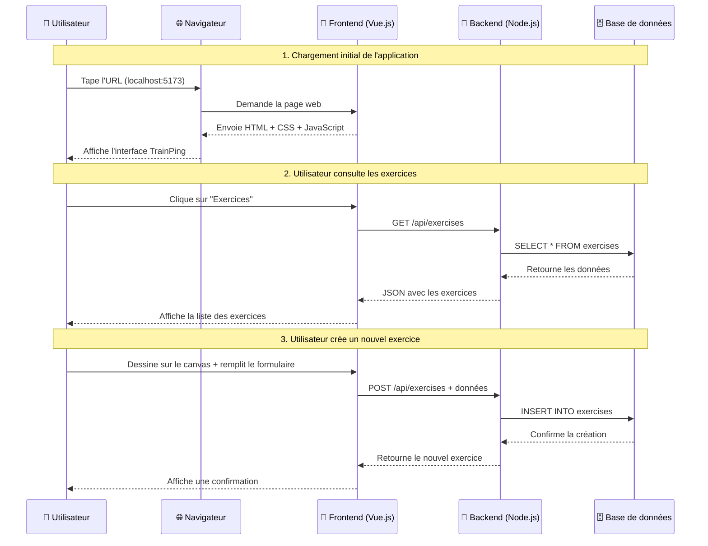

# Les Fondamentaux du Développement Web

## 🎯 Vue d'ensemble : Comment fonctionne le Web ?

Avant de plonger dans Vue.js et Node.js, il est essentiel de comprendre les bases du développement web moderne. Cette section explique les concepts fondamentaux que vous devez maîtriser.

## 🌐 Le Web : Une conversation entre machines

### Analogie du restaurant

Imaginez que vous allez au restaurant :

1. **Vous (Client)** : Vous consultez le menu et passez commande
2. **Le serveur (Serveur Web)** : Il prend votre commande et la transmet en cuisine
3. **La cuisine (Base de données)** : Elle prépare votre plat
4. **Le serveur** : Il vous apporte votre plat

Dans le développement web :
- **Vous = Navigateur** (Chrome, Firefox, Safari)
- **Menu = Frontend** (Vue.js, HTML, CSS)
- **Serveur = Backend** (Node.js, Express)
- **Cuisine = Base de données** (SQLite, PostgreSQL)

### Schéma détaillé



## 💻 Les Technologies : Qui fait quoi ?

### Frontend (Ce que vous voyez)

#### HTML - La Structure
HTML est comme **le squelette** d'une maison :

```html
<!-- Squelette de base -->
<!DOCTYPE html>
<html>
  <head>
    <title>TrainPing</title>
  </head>
  <body>
    <header>
      <h1>TrainPing</h1>
      <nav>
        <a href="/exercises">Exercices</a>
        <a href="/sessions">Sessions</a>
      </nav>
    </header>
    
    <main>
      <div id="app">
        <!-- Vue.js remplace ce contenu -->
      </div>
    </main>
  </body>
</html>
```

#### CSS - L'Apparence
CSS est comme **la décoration** de la maison :

```css
/* Styles basiques */
body {
  font-family: Arial, sans-serif;
  background-color: #f3f4f6;
  margin: 0;
  padding: 0;
}

header {
  background-color: #1f2937;
  color: white;
  padding: 1rem;
}

.exercise-card {
  background: white;
  border-radius: 8px;
  padding: 1rem;
  box-shadow: 0 2px 4px rgba(0,0,0,0.1);
  
  /* Animation au survol */
  transition: transform 0.2s;
}

.exercise-card:hover {
  transform: translateY(-2px);
  box-shadow: 0 4px 8px rgba(0,0,0,0.15);
}
```

#### JavaScript - L'Interactivité
JavaScript est comme **l'électricité** qui fait fonctionner tout :

```javascript
// JavaScript vanilla (avant Vue.js)
document.addEventListener('DOMContentLoaded', () => {
  const button = document.getElementById('create-exercise')
  const exerciseList = document.getElementById('exercise-list')
  
  button.addEventListener('click', () => {
    // Créer un nouvel élément
    const newExercise = document.createElement('div')
    newExercise.className = 'exercise-card'
    newExercise.innerHTML = `
      <h3>Nouvel exercice</h3>
      <p>Description...</p>
    `
    
    // L'ajouter à la liste
    exerciseList.appendChild(newExercise)
  })
})
```

### Backend (Ce que vous ne voyez pas)

#### Serveur Web
Le serveur est comme **le chef d'orchestre** qui coordonne tout :

```javascript
// Serveur HTTP basique avec Node.js
import http from 'http'

const server = http.createServer((request, response) => {
  console.log(`Requête reçue: ${request.method} ${request.url}`)
  
  // Analyser la requête
  if (request.url === '/api/exercises' && request.method === 'GET') {
    // Récupérer les exercices
    response.writeHead(200, { 'Content-Type': 'application/json' })
    response.end(JSON.stringify({ exercises: [] }))
    
  } else if (request.url === '/api/exercises' && request.method === 'POST') {
    // Créer un nouvel exercice
    let body = ''
    
    request.on('data', chunk => {
      body += chunk.toString()
    })
    
    request.on('end', () => {
      const exerciseData = JSON.parse(body)
      // Sauvegarder en base...
      response.writeHead(201, { 'Content-Type': 'application/json' })
      response.end(JSON.stringify({ message: 'Exercice créé' }))
    })
    
  } else {
    // Page non trouvée
    response.writeHead(404)
    response.end('Page non trouvée')
  }
})

server.listen(3000, () => {
  console.log('Serveur démarré sur le port 3000')
})
```

## 🔄 HTTP : Le Langage du Web

### Les Méthodes HTTP

HTTP, c'est comme **un protocole de politesse** entre le client et le serveur :

#### GET - "Donne-moi quelque chose"
```javascript
// Frontend demande la liste des exercices
fetch('/api/exercises')
  .then(response => response.json())
  .then(exercises => {
    console.log('Exercices reçus:', exercises)
  })

// Backend répond avec les données
app.get('/api/exercises', (req, res) => {
  const exercises = database.getAllExercises()
  res.json({ exercises })
})
```

#### POST - "Crée quelque chose de nouveau"
```javascript
// Frontend envoie un nouvel exercice
fetch('/api/exercises', {
  method: 'POST',
  headers: {
    'Content-Type': 'application/json'
  },
  body: JSON.stringify({
    title: 'Service lifté',
    duration: 300,
    difficulty: 'INTERMEDIATE'
  })
})

// Backend crée l'exercice
app.post('/api/exercises', (req, res) => {
  const { title, duration, difficulty } = req.body
  const newExercise = database.createExercise({ title, duration, difficulty })
  res.status(201).json({ exercise: newExercise })
})
```

#### PUT - "Modifie quelque chose d'existant"
```javascript
// Frontend modifie un exercice existant
fetch('/api/exercises/123', {
  method: 'PUT',
  headers: {
    'Content-Type': 'application/json'
  },
  body: JSON.stringify({
    title: 'Service lifté amélioré',
    duration: 450
  })
})

// Backend met à jour l'exercice
app.put('/api/exercises/:id', (req, res) => {
  const exerciseId = req.params.id
  const updates = req.body
  const updatedExercise = database.updateExercise(exerciseId, updates)
  res.json({ exercise: updatedExercise })
})
```

#### DELETE - "Supprime quelque chose"
```javascript
// Frontend supprime un exercice
fetch('/api/exercises/123', {
  method: 'DELETE'
})

// Backend supprime l'exercice
app.delete('/api/exercises/:id', (req, res) => {
  const exerciseId = req.params.id
  database.deleteExercise(exerciseId)
  res.status(204).send() // 204 = No Content
})
```

### Les Codes de Statut HTTP

Les codes de statut sont comme **les expressions du visage** du serveur :

```javascript
// 😊 Tout va bien (2xx)
res.status(200).json({ message: 'OK' })           // 200 = OK
res.status(201).json({ exercise })                // 201 = Created
res.status(204).send()                            // 204 = No Content

// 😕 Erreur du client (4xx)
res.status(400).json({ error: 'Données invalides' })     // 400 = Bad Request
res.status(401).json({ error: 'Non autorisé' })          // 401 = Unauthorized
res.status(404).json({ error: 'Exercice non trouvé' })   // 404 = Not Found

// 😱 Erreur du serveur (5xx)
res.status(500).json({ error: 'Erreur interne' })        // 500 = Internal Server Error
res.status(503).json({ error: 'Service indisponible' })  // 503 = Service Unavailable
```

## 🗃️ JSON : Le Format d'Échange

JSON (JavaScript Object Notation) est comme **la langue commune** entre frontend et backend :

### Structure JSON
```json
{
  "exercise": {
    "id": "clxxx123",
    "title": "Service lifté",
    "description": "Exercice pour améliorer le service avec effet lifté",
    "phase": "WARM_UP",
    "duration": 300,
    "difficulty": "INTERMEDIATE",
    "repetitions": 10,
    "shots": [
      {
        "startPosition": { "x": 0.2, "y": 0.3 },
        "endPosition": { "x": 0.8, "y": 0.7 },
        "type": "SERVE",
        "spin": "TOPSPIN",
        "speed": "MEDIUM",
        "playerSide": "PLAYER"
      }
    ],
    "createdAt": "2024-01-15T10:30:00.000Z",
    "updatedAt": "2024-01-15T10:30:00.000Z"
  }
}
```

### Conversion JavaScript ↔ JSON
```javascript
// Objet JavaScript
const exercise = {
  title: 'Service lifté',
  duration: 300,
  shots: [
    { type: 'SERVE', speed: 'MEDIUM' }
  ]
}

// Convertir en JSON (string)
const jsonString = JSON.stringify(exercise)
console.log(jsonString)
// '{"title":"Service lifté","duration":300,"shots":[{"type":"SERVE","speed":"MEDIUM"}]}'

// Convertir depuis JSON
const parsedExercise = JSON.parse(jsonString)
console.log(parsedExercise.title) // 'Service lifté'
```

## 🔄 Asynchrone : Gérer le Temps

### Pourquoi l'asynchrone ?

Imaginez que vous appelez un restaurant pour passer commande :

#### Synchrone (bloquant) ❌
```javascript
console.log('Début du programme')

// Cette fonction "bloque" pendant 2 secondes
function commandeSynchrone() {
  const start = Date.now()
  while (Date.now() - start < 2000) {
    // Attend 2 secondes... ne fait rien d'autre !
  }
  return 'Pizza livrée'
}

const pizza = commandeSynchrone() // ⏳ Bloque tout pendant 2s
console.log(pizza)                // Seulement affiché après 2s
console.log('Fin du programme')   // Aussi bloqué
```

#### Asynchrone (non-bloquant) ✅
```javascript
console.log('Début du programme')

// Cette fonction ne bloque pas
function commandeAsynchrone() {
  return new Promise((resolve) => {
    setTimeout(() => {
      resolve('Pizza livrée')
    }, 2000)
  })
}

commandeAsynchrone().then(pizza => {
  console.log(pizza) // Affiché après 2s
})

console.log('Fin du programme') // Affiché immédiatement !
```

### Évolution des techniques asynchrones

#### 1. Callbacks (ancien style)
```javascript
// ❌ "Callback Hell" - difficile à lire
fetchExercises((exercises) => {
  fetchSessions(exercises[0].id, (sessions) => {
    fetchUserData(sessions[0].userId, (user) => {
      updateUI(user, sessions, exercises)
    })
  })
})
```

#### 2. Promises (mieux)
```javascript
// ✅ Plus lisible
fetchExercises()
  .then(exercises => fetchSessions(exercises[0].id))
  .then(sessions => fetchUserData(sessions[0].userId))
  .then(user => updateUI(user))
  .catch(error => console.error('Erreur:', error))
```

#### 3. Async/Await (moderne) ✅✅
```javascript
// ✅✅ Le plus lisible - comme du code synchrone !
async function loadData() {
  try {
    const exercises = await fetchExercises()
    const sessions = await fetchSessions(exercises[0].id)
    const user = await fetchUserData(sessions[0].userId)
    updateUI(user, sessions, exercises)
  } catch (error) {
    console.error('Erreur:', error)
  }
}

loadData()
```

### Exemple concret avec TrainPing
```javascript
// api/exercises.js - Client API
class ExerciseAPI {
  async getAllExercises(filters = {}) {
    try {
      // 1. Construire l'URL avec les filtres
      const params = new URLSearchParams(filters)
      const url = `/api/exercises?${params}`
      
      console.log('🔄 Chargement des exercices...')
      
      // 2. Faire la requête HTTP
      const response = await fetch(url)
      
      // 3. Vérifier si la requête a réussi
      if (!response.ok) {
        throw new Error(`Erreur HTTP: ${response.status}`)
      }
      
      // 4. Parser la réponse JSON
      const data = await response.json()
      
      console.log('✅ Exercices chargés:', data.exercises.length)
      return data.exercises
      
    } catch (error) {
      console.error('❌ Erreur lors du chargement:', error)
      throw error // Re-lancer l'erreur pour que le composant puisse la gérer
    }
  }
  
  async createExercise(exerciseData) {
    try {
      console.log('🔄 Création de l\'exercice...', exerciseData)
      
      const response = await fetch('/api/exercises', {
        method: 'POST',
        headers: {
          'Content-Type': 'application/json'
        },
        body: JSON.stringify(exerciseData)
      })
      
      if (!response.ok) {
        const errorData = await response.json()
        throw new Error(errorData.error || 'Erreur lors de la création')
      }
      
      const data = await response.json()
      console.log('✅ Exercice créé:', data.exercise)
      return data.exercise
      
    } catch (error) {
      console.error('❌ Erreur lors de la création:', error)
      throw error
    }
  }
}

// Utilisation dans un composant Vue
export default {
  setup() {
    const exercises = ref([])
    const isLoading = ref(false)
    const error = ref(null)
    
    const api = new ExerciseAPI()
    
    const loadExercises = async () => {
      isLoading.value = true
      error.value = null
      
      try {
        exercises.value = await api.getAllExercises()
      } catch (err) {
        error.value = err.message
      } finally {
        isLoading.value = false
      }
    }
    
    // Charger au montage du composant
    onMounted(loadExercises)
    
    return {
      exercises,
      isLoading,
      error,
      loadExercises
    }
  }
}
```

## 🎨 CSS : De Base à Moderne

### CSS Vanilla vs Framework

#### CSS Traditionnel
```css
/* styles.css - Approche traditionnelle */

/* Reset et base */
* {
  margin: 0;
  padding: 0;
  box-sizing: border-box;
}

body {
  font-family: 'Inter', sans-serif;
  line-height: 1.6;
  color: #333;
}

/* Layout */
.container {
  max-width: 1200px;
  margin: 0 auto;
  padding: 0 1rem;
}

.grid {
  display: grid;
  gap: 1rem;
}

.grid-cols-3 {
  grid-template-columns: repeat(3, 1fr);
}

/* Composants */
.btn {
  display: inline-flex;
  align-items: center;
  padding: 0.5rem 1rem;
  border: none;
  border-radius: 0.375rem;
  font-weight: 500;
  text-decoration: none;
  cursor: pointer;
  transition: all 0.2s;
}

.btn-primary {
  background-color: #3b82f6;
  color: white;
}

.btn-primary:hover {
  background-color: #2563eb;
  transform: translateY(-1px);
}

.card {
  background: white;
  border-radius: 0.5rem;
  padding: 1.5rem;
  box-shadow: 0 1px 3px rgba(0, 0, 0, 0.1);
}

.card:hover {
  box-shadow: 0 4px 6px rgba(0, 0, 0, 0.1);
}

/* Responsive */
@media (max-width: 768px) {
  .grid-cols-3 {
    grid-template-columns: 1fr;
  }
  
  .container {
    padding: 0 0.5rem;
  }
}
```

#### Tailwind CSS (Utility-First)
```html
<!-- Même résultat avec Tailwind -->
<div class="max-w-6xl mx-auto px-4">
  <div class="grid grid-cols-1 md:grid-cols-3 gap-4">
    <div class="bg-white rounded-lg p-6 shadow-sm hover:shadow-md transition-shadow">
      <h3 class="text-lg font-semibold text-gray-900 mb-2">Exercice</h3>
      <p class="text-gray-600 mb-4">Description...</p>
      <button class="inline-flex items-center px-4 py-2 bg-blue-600 text-white font-medium rounded-lg hover:bg-blue-700 hover:-translate-y-0.5 transition-all">
        Démarrer
      </button>
    </div>
  </div>
</div>
```

### Responsive Design
```css
/* Mobile First Approach */

/* Base (mobile) */
.exercise-grid {
  display: grid;
  grid-template-columns: 1fr;
  gap: 1rem;
  padding: 1rem;
}

/* Tablette (768px+) */
@media (min-width: 768px) {
  .exercise-grid {
    grid-template-columns: repeat(2, 1fr);
    gap: 1.5rem;
    padding: 2rem;
  }
}

/* Desktop (1024px+) */
@media (min-width: 1024px) {
  .exercise-grid {
    grid-template-columns: repeat(3, 1fr);
    gap: 2rem;
  }
}

/* Large Desktop (1280px+) */
@media (min-width: 1280px) {
  .exercise-grid {
    grid-template-columns: repeat(4, 1fr);
    max-width: 1200px;
    margin: 0 auto;
  }
}
```

## 🔧 Outils de Développement

### Package Managers

#### npm (Node Package Manager)
```bash
# Initialiser un projet
npm init -y

# Installer une dépendance
npm install express
npm install --save-dev nodemon  # Dépendance de développement

# Scripts dans package.json
{
  "scripts": {
    "start": "node server.js",
    "dev": "nodemon server.js",
    "build": "vite build",
    "test": "jest"
  }
}

# Exécuter les scripts
npm run dev
npm start
npm test
```

### Bundlers et Build Tools

#### Vite (Frontend)
```javascript
// vite.config.js
import { defineConfig } from 'vite'
import vue from '@vitejs/plugin-vue'

export default defineConfig({
  plugins: [vue()],
  server: {
    port: 5173,
    proxy: {
      // Rediriger les appels API vers le backend
      '/api': {
        target: 'http://localhost:3000',
        changeOrigin: true
      }
    }
  },
  build: {
    outDir: 'dist',
    sourcemap: true
  }
})
```

## 📝 Exercices Pratiques

### Exercice 1 : Comprendre les Requêtes HTTP

1. **Ouvrir les DevTools** (F12) dans le navigateur
2. **Aller à l'onglet Network**
3. **Naviguer dans TrainPing** et observer :
   - Quelles requêtes sont envoyées ?
   - Quels sont les codes de statut ?
   - Quel est le contenu des réponses ?

### Exercice 2 : Modifier le CSS

1. **Trouver le fichier** `src/components/SessionCard.vue`
2. **Changer la couleur** du bouton "Démarrer"
3. **Ajouter une animation** au survol
4. **Observer le résultat** dans le navigateur

### Exercice 3 : Créer une Fonction Asynchrone

```javascript
// À compléter dans un composant Vue
async function testAPI() {
  try {
    // 1. Faire un appel GET à /api/exercises
    const response = await fetch('/api/exercises')
    
    // 2. Vérifier si la requête a réussi
    if (!response.ok) {
      throw new Error(`Erreur: ${response.status}`)
    }
    
    // 3. Parser le JSON
    const data = await response.json()
    
    // 4. Afficher le résultat
    console.log('Exercices:', data.exercises)
    
  } catch (error) {
    console.error('Erreur:', error)
  }
}

// Appeler la fonction
testAPI()
```

## 🔗 Ressources pour Approfondir

### Documentation Officielle
- [MDN Web Docs](https://developer.mozilla.org/en-US/) - Référence complète
- [JavaScript.info](https://javascript.info/) - Guide moderne JavaScript
- [CSS-Tricks](https://css-tricks.com/) - Techniques CSS avancées

### Outils Pratiques
- [Postman](https://www.postman.com/) - Tester les APIs
- [JSON Formatter](https://jsonformatter.org/) - Visualiser le JSON
- [Can I Use](https://caniuse.com/) - Compatibilité navigateurs

## 🎯 Points Clés à Retenir

1. **Le web = conversation** entre client et serveur
2. **HTTP = protocole** de communication standardisé
3. **JSON = format** d'échange de données
4. **Asynchrone = essentiel** pour la performance
5. **CSS moderne = utility-first** (Tailwind)
6. **DevTools = meilleur ami** du développeur

Cette base solide vous permettra de mieux comprendre Vue.js et Node.js dans les sections suivantes !

#web-development #fundamentals #http #json #async #css #javascript