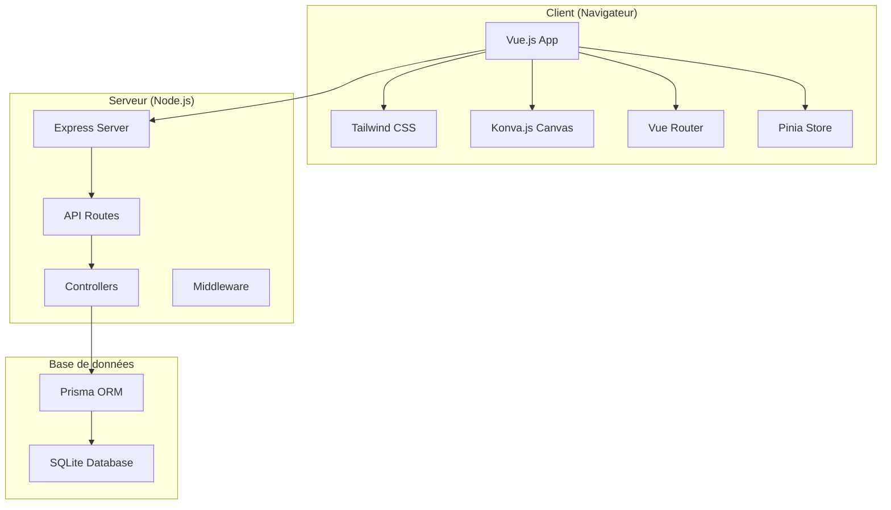
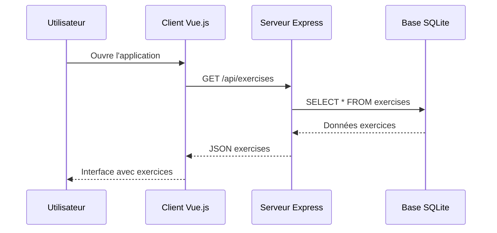
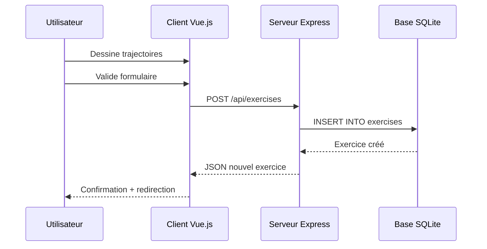

# Vue d'ensemble de l'architecture

## 🎯 Vue d'ensemble

TrainPing suit une architecture **client-serveur** classique avec une séparation claire entre le frontend (interface utilisateur) et le backend (logique métier et données).

## 🏗️ Architecture globale



## 🔧 Concepts clés

### Client-Serveur
- **Client** : L'application Vue.js qui s'exécute dans le navigateur
- **Serveur** : L'application Node.js qui gère les données et la logique métier
- **Communication** : HTTP/REST API entre client et serveur

### Single Page Application (SPA)
- Une seule page HTML chargée initialement
- Navigation sans rechargement de page
- Contenu mis à jour dynamiquement via JavaScript

### API REST
- Interface standardisée pour communiquer avec le serveur
- Méthodes HTTP : GET, POST, PUT, DELETE
- Format JSON pour l'échange de données

## 📁 Structure des projets

```
tennis-table-app/
├── client/                 # Frontend Vue.js
│   ├── src/
│   │   ├── views/         # Pages de l'application
│   │   ├── components/    # Composants réutilisables
│   │   ├── stores/        # Gestion d'état Pinia
│   │   └── api/           # Communication avec l'API
│   └── dist/              # Build de production
│
├── server/                # Backend Node.js
│   ├── src/
│   │   ├── routes/        # Endpoints API
│   │   ├── controllers/   # Logique métier
│   │   └── middleware/    # Fonctions intermédiaires
│   └── prisma/            # Schéma base de données
│
└── docs/                  # Documentation
```

## 🔄 Flux de données

### 1. Chargement initial


### 2. Création d'exercice


## 🎨 Séparation des responsabilités

### Frontend (Client)
- **Responsabilité** : Interface utilisateur et expérience utilisateur
- **Technologies** : Vue.js, Tailwind CSS, Konva.js
- **Fonctions** :
  - Afficher les données
  - Gérer les interactions utilisateur
  - Valider les formulaires côté client
  - Router la navigation

### Backend (Serveur)
- **Responsabilité** : Logique métier et persistance des données
- **Technologies** : Node.js, Express, Prisma
- **Fonctions** :
  - Exposer l'API REST
  - Valider les données côté serveur
  - Gérer la base de données
  - Authentification (future)

### Base de données
- **Responsabilité** : Stockage persistant
- **Technologies** : SQLite + Prisma ORM
- **Fonctions** :
  - Stocker les exercices
  - Stocker les sessions
  - Gérer les relations entre entités

## 🚀 Avantages de cette architecture

### Scalabilité
- Frontend et backend peuvent évoluer indépendamment
- Possibilité d'ajouter plusieurs clients (mobile, desktop)
- Backend peut servir plusieurs frontends

### Maintenabilité
- Code organisé en modules distincts
- Responsabilités clairement définies
- Tests unitaires facilités

### Performance
- Chargement initial rapide (SPA)
- Mise à jour partielle du contenu
- Cache côté client possible

## 🔗 Communication inter-couches

### Client → Serveur
```javascript
// Exemple d'appel API depuis Vue.js
import axios from 'axios'

const createExercise = async (exerciseData) => {
  try {
    const response = await axios.post('/api/exercises', exerciseData)
    return response.data
  } catch (error) {
    console.error('Erreur création exercice:', error)
    throw error
  }
}
```

### Serveur → Base de données
```javascript
// Exemple avec Prisma ORM
const createExercise = async (exerciseData) => {
  const exercise = await prisma.exercise.create({
    data: exerciseData
  })
  return exercise
}
```

## 📝 Points d'attention

⚠️ **CORS** : Configuration nécessaire pour permettre au frontend d'appeler l'API  
⚠️ **Validation** : Toujours valider les données côté serveur même si validation côté client  
⚠️ **Gestion d'erreurs** : Prévoir les cas d'erreur réseau et base de données  

## 🔗 Pour aller plus loin

- [[Stack-Technique|Technologies utilisées en détail]]
- [[Structure-Dossiers|Organisation détaillée des fichiers]]
- [[02-Backend/Express-Basics|Comment fonctionne Express]]
- [[03-Frontend/Introduction-Vue3|Comment fonctionne Vue.js]]

#architecture #vue-ensemble #client-serveur #spa #rest-api