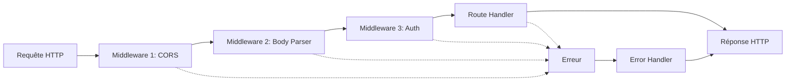

# Express.js : Guide Complet et Approfondi

## 🎯 Qu'est-ce qu'Express.js vraiment ?

Express.js est un **framework web minimaliste** pour Node.js. Pensez-y comme à un **assistant personnel très organisé** qui vous aide à gérer toutes les tâches répétitives d'un serveur web.

### Analogie : Express = Maître d'hôtel d'un restaurant

Dans un restaurant, le maître d'hôtel :
- **Accueille** les clients (middleware d'accueil)
- **Vérifie** les réservations (middleware d'authentification)
- **Guide** vers la bonne table (routage)
- **Prend** les commandes (parsing des requêtes)
- **Coordonne** avec la cuisine (contrôleurs)
- **Sert** les plats (envoi des réponses)

Express fait exactement la même chose avec les requêtes HTTP !

## 🏗️ Architecture d'Express : Middleware Pipeline

### Le Concept Fondamental

Express traite chaque requête comme un **objet qui voyage** à travers une série de fonctions appelées **middleware**. Chaque middleware peut :

1. **Examiner** la requête
2. **Modifier** la requête ou la réponse
3. **Terminer** le processus (envoyer une réponse)
4. **Passer au suivant** (appeler `next()`)



### Exemple Concret : Pipeline de TrainPing

```javascript
import express from 'express'
import cors from 'cors'

const app = express()

// 🌐 Middleware 1 : CORS - Autoriser les requêtes cross-origin
app.use(cors({
  origin: 'http://localhost:5173', // Frontend Vue.js
  credentials: true
}))

// 📝 Middleware 2 : Body Parser - Analyser le JSON
app.use(express.json({ limit: '10mb' }))

// 📁 Middleware 3 : Static Files - Servir les fichiers statiques
app.use('/uploads', express.static('uploads'))

// 🕒 Middleware 4 : Logger personnalisé
app.use((req, res, next) => {
  const timestamp = new Date().toISOString()
  const method = req.method
  const url = req.url
  const ip = req.ip
  
  console.log(`[${timestamp}] ${method} ${url} - IP: ${ip}`)
  
  // Mesurer le temps de réponse
  const start = Date.now()
  
  res.on('finish', () => {
    const duration = Date.now() - start
    const status = res.statusCode
    console.log(`[${timestamp}] ${method} ${url} - ${status} (${duration}ms)`)
  })
  
  next() // CRUCIAL : Passer au middleware suivant
})

// 🔐 Middleware 5 : Authentification (futur)
app.use('/api/protected', (req, res, next) => {
  const authHeader = req.headers.authorization
  
  if (!authHeader) {
    return res.status(401).json({ error: 'Token manquant' })
  }
  
  try {
    // Vérifier le token JWT
    const token = authHeader.split(' ')[1]
    const decoded = jwt.verify(token, process.env.JWT_SECRET)
    req.user = decoded
    next()
  } catch (error) {
    return res.status(401).json({ error: 'Token invalide' })
  }
})

// 📍 Routes principales
app.use('/api/exercises', exerciseRoutes)
app.use('/api/sessions', sessionRoutes)

// ❌ Middleware de gestion d'erreurs (toujours en dernier)
app.use((error, req, res, next) => {
  console.error('💥 Erreur:', error)
  
  if (error.name === 'ValidationError') {
    return res.status(400).json({ 
      error: 'Données invalides',
      details: error.message 
    })
  }
  
  if (error.name === 'CastError') {
    return res.status(400).json({ 
      error: 'ID invalide' 
    })
  }
  
  res.status(500).json({ 
    error: 'Erreur interne du serveur',
    message: process.env.NODE_ENV === 'development' ? error.message : undefined
  })
})
```

## 🛣️ Routage Avancé

### Router modulaire

Au lieu de mettre toutes les routes dans un seul fichier, Express permet de créer des **mini-applications modulaires** :

```javascript
// routes/exercises.js
import express from 'express'
import { 
  getAllExercises, 
  getExerciseById, 
  createExercise,
  updateExercise,
  deleteExercise,
  duplicateExercise 
} from '../controllers/exerciseController.js'
import { validateExercise } from '../middleware/validation.js'
import { cacheMiddleware } from '../middleware/cache.js'

const router = express.Router()

// Middleware spécifique à ce router
router.use((req, res, next) => {
  console.log('🏓 Route Exercise appelée')
  next()
})

// GET /api/exercises - Liste avec pagination et filtres
router.get('/', 
  cacheMiddleware(300), // Cache 5 minutes
  getAllExercises
)

// GET /api/exercises/search - Recherche textuelle
router.get('/search', async (req, res) => {
  try {
    const { q, limit = 10 } = req.query
    
    if (!q) {
      return res.status(400).json({ error: 'Paramètre "q" requis' })
    }
    
    const exercises = await prisma.exercise.findMany({
      where: {
        OR: [
          { title: { contains: q, mode: 'insensitive' } },
          { description: { contains: q, mode: 'insensitive' } }
        ]
      },
      take: parseInt(limit),
      orderBy: { createdAt: 'desc' }
    })
    
    res.json({ exercises, total: exercises.length })
  } catch (error) {
    next(error) // Passer à l'error handler
  }
})

// GET /api/exercises/:id - Détail d'un exercice
router.get('/:id', 
  validateExerciseId, // Middleware de validation
  getExerciseById
)

// POST /api/exercises - Créer un exercice
router.post('/', 
  validateExercise, // Valider les données
  createExercise
)

// PUT /api/exercises/:id - Modifier complètement
router.put('/:id',
  validateExerciseId,
  validateExercise,
  updateExercise
)

// PATCH /api/exercises/:id - Modification partielle
router.patch('/:id', async (req, res, next) => {
  try {
    const { id } = req.params
    const updates = req.body
    
    // Nettoyer les champs vides
    const cleanUpdates = Object.fromEntries(
      Object.entries(updates).filter(([_, value]) => value !== undefined)
    )
    
    const exercise = await prisma.exercise.update({
      where: { id },
      data: cleanUpdates
    })
    
    res.json({ exercise })
  } catch (error) {
    next(error)
  }
})

// POST /api/exercises/:id/duplicate - Dupliquer un exercice
router.post('/:id/duplicate',
  validateExerciseId,
  duplicateExercise
)

// DELETE /api/exercises/:id - Supprimer
router.delete('/:id',
  validateExerciseId,
  deleteExercise
)

export default router
```

### Paramètres de Route

```javascript
// Paramètres simples
app.get('/api/exercises/:id', (req, res) => {
  const exerciseId = req.params.id
  console.log('ID demandé:', exerciseId)
})

// Paramètres multiples
app.get('/api/sessions/:sessionId/exercises/:exerciseId', (req, res) => {
  const { sessionId, exerciseId } = req.params
  console.log('Session:', sessionId, 'Exercise:', exerciseId)
})

// Paramètres optionnels
app.get('/api/exercises/:id/:action?', (req, res) => {
  const { id, action } = req.params
  
  if (action === 'duplicate') {
    // Dupliquer l'exercice
  } else {
    // Afficher l'exercice
  }
})

// Paramètres avec expressions régulières
app.get('/api/exercises/:id(\\d+)', (req, res) => {
  // ID doit être numérique uniquement
})

// Wildcard
app.get('/api/files/*', (req, res) => {
  const filePath = req.params[0] // Capture tout après /files/
  res.sendFile(path.join(__dirname, 'uploads', filePath))
})
```

### Query Parameters et Validation

```javascript
// GET /api/exercises?phase=WARM_UP&difficulty=BEGINNER&page=2&limit=10
app.get('/api/exercises', async (req, res) => {
  try {
    // Extraction avec valeurs par défaut
    const {
      phase,
      difficulty,
      page = 1,
      limit = 20,
      sortBy = 'createdAt',
      sortOrder = 'desc',
      search
    } = req.query
    
    // Validation
    const validPhases = ['WARM_UP', 'REGULARITY', 'UNCERTAINTY', 'MATCH_SITUATION']
    const validDifficulties = ['BEGINNER', 'INTERMEDIATE', 'ADVANCED', 'EXPERT']
    const validSortFields = ['createdAt', 'title', 'duration', 'difficulty']
    
    if (phase && !validPhases.includes(phase)) {
      return res.status(400).json({ 
        error: 'Phase invalide',
        validValues: validPhases 
      })
    }
    
    if (difficulty && !validDifficulties.includes(difficulty)) {
      return res.status(400).json({ 
        error: 'Difficulté invalide',
        validValues: validDifficulties 
      })
    }
    
    if (!validSortFields.includes(sortBy)) {
      return res.status(400).json({ 
        error: 'Champ de tri invalide',
        validValues: validSortFields 
      })
    }
    
    // Construire la requête Prisma
    const where = {}
    if (phase) where.phase = phase
    if (difficulty) where.difficulty = difficulty
    if (search) {
      where.OR = [
        { title: { contains: search, mode: 'insensitive' } },
        { description: { contains: search, mode: 'insensitive' } }
      ]
    }
    
    const [exercises, total] = await Promise.all([
      prisma.exercise.findMany({
        where,
        orderBy: { [sortBy]: sortOrder },
        skip: (parseInt(page) - 1) * parseInt(limit),
        take: parseInt(limit)
      }),
      prisma.exercise.count({ where })
    ])
    
    // Métadonnées de pagination
    const totalPages = Math.ceil(total / parseInt(limit))
    const hasNextPage = parseInt(page) < totalPages
    const hasPrevPage = parseInt(page) > 1
    
    res.json({
      exercises,
      pagination: {
        currentPage: parseInt(page),
        totalPages,
        totalItems: total,
        itemsPerPage: parseInt(limit),
        hasNextPage,
        hasPrevPage
      },
      filters: {
        phase,
        difficulty,
        search
      }
    })
    
  } catch (error) {
    console.error('Erreur getAllExercises:', error)
    res.status(500).json({ error: 'Erreur lors de la récupération' })
  }
})
```

## 🔍 Middleware Personnalisés Avancés

### Middleware de Validation

```javascript
// middleware/validation.js
import { z } from 'zod' // Bibliothèque de validation

// Schéma de validation pour les exercices
const exerciseSchema = z.object({
  title: z.string()
    .min(3, 'Le titre doit faire au moins 3 caractères')
    .max(100, 'Le titre ne peut pas dépasser 100 caractères'),
  
  description: z.string()
    .max(500, 'La description ne peut pas dépasser 500 caractères')
    .optional(),
  
  phase: z.enum(['WARM_UP', 'REGULARITY', 'UNCERTAINTY', 'MATCH_SITUATION']),
  
  duration: z.number()
    .min(30, 'La durée minimum est de 30 secondes')
    .max(3600, 'La durée maximum est de 1 heure'),
  
  difficulty: z.enum(['BEGINNER', 'INTERMEDIATE', 'ADVANCED', 'EXPERT']),
  
  repetitions: z.number()
    .min(1, 'Au moins 1 répétition')
    .max(100, 'Maximum 100 répétitions')
    .default(1),
  
  shots: z.array(z.object({
    startPosition: z.object({
      x: z.number().min(0).max(1),
      y: z.number().min(0).max(1)
    }),
    endPosition: z.object({
      x: z.number().min(0).max(1),
      y: z.number().min(0).max(1)
    }),
    type: z.enum(['SERVE', 'DRIVE', 'TOPSPIN', 'BACKSPIN', 'SIDESPIN', 'SMASH', 'PUSH', 'BLOCK']),
    spin: z.enum(['NONE', 'TOPSPIN', 'BACKSPIN', 'SIDESPIN']),
    speed: z.enum(['SLOW', 'MEDIUM', 'FAST']),
    playerSide: z.enum(['PLAYER', 'OPPONENT'])
  })).default([])
})

export const validateExercise = (req, res, next) => {
  try {
    // Valider et transformer les données
    const validatedData = exerciseSchema.parse(req.body)
    
    // Remplacer req.body par les données validées
    req.body = validatedData
    
    next()
  } catch (error) {
    if (error instanceof z.ZodError) {
      return res.status(400).json({
        error: 'Données invalides',
        details: error.errors.map(err => ({
          field: err.path.join('.'),
          message: err.message,
          received: err.received
        }))
      })
    }
    
    next(error)
  }
}

export const validateExerciseId = (req, res, next) => {
  const { id } = req.params
  
  // Vérifier le format CUID de Prisma
  if (!/^c[a-z0-9]{24}$/.test(id)) {
    return res.status(400).json({ 
      error: 'Format d\'ID invalide' 
    })
  }
  
  next()
}
```

### Middleware de Cache

```javascript
// middleware/cache.js
const cache = new Map()

export const cacheMiddleware = (durationSeconds) => {
  return (req, res, next) => {
    const key = req.originalUrl
    const cached = cache.get(key)
    
    if (cached && Date.now() - cached.timestamp < durationSeconds * 1000) {
      console.log('📦 Cache hit:', key)
      return res.json(cached.data)
    }
    
    // Intercepter res.json pour mettre en cache
    const originalJson = res.json
    res.json = function(data) {
      cache.set(key, {
        data,
        timestamp: Date.now()
      })
      console.log('💾 Cache set:', key)
      return originalJson.call(this, data)
    }
    
    next()
  }
}

// Nettoyer le cache périodiquement
setInterval(() => {
  const now = Date.now()
  for (const [key, value] of cache.entries()) {
    if (now - value.timestamp > 10 * 60 * 1000) { // 10 minutes
      cache.delete(key)
    }
  }
}, 5 * 60 * 1000) // Nettoyer toutes les 5 minutes
```

### Middleware de Rate Limiting

```javascript
// middleware/rateLimit.js
const requests = new Map()

export const rateLimitMiddleware = (maxRequests = 100, windowMs = 15 * 60 * 1000) => {
  return (req, res, next) => {
    const ip = req.ip
    const now = Date.now()
    
    if (!requests.has(ip)) {
      requests.set(ip, [])
    }
    
    const userRequests = requests.get(ip)
    
    // Nettoyer les requêtes anciennes
    const validRequests = userRequests.filter(time => now - time < windowMs)
    
    if (validRequests.length >= maxRequests) {
      return res.status(429).json({
        error: 'Trop de requêtes',
        retryAfter: Math.ceil((validRequests[0] + windowMs - now) / 1000)
      })
    }
    
    validRequests.push(now)
    requests.set(ip, validRequests)
    
    // Ajouter des headers informatifs
    res.set({
      'X-RateLimit-Limit': maxRequests,
      'X-RateLimit-Remaining': maxRequests - validRequests.length,
      'X-RateLimit-Reset': new Date(now + windowMs).toISOString()
    })
    
    next()
  }
}
```

## 📋 Gestion des Réponses

### Réponses Standardisées

```javascript
// utils/responses.js
export class ApiResponse {
  static success(data, message = 'Success', statusCode = 200) {
    return {
      success: true,
      message,
      data,
      timestamp: new Date().toISOString()
    }
  }
  
  static error(message, statusCode = 500, details = null) {
    return {
      success: false,
      error: {
        message,
        statusCode,
        details,
        timestamp: new Date().toISOString()
      }
    }
  }
  
  static paginated(items, pagination, message = 'Success') {
    return {
      success: true,
      message,
      data: {
        items,
        pagination
      },
      timestamp: new Date().toISOString()
    }
  }
}

// Utilisation dans les contrôleurs
export const getAllExercises = async (req, res, next) => {
  try {
    const exercises = await exerciseService.getAll(req.query)
    
    res.json(ApiResponse.success(exercises, 'Exercices récupérés'))
  } catch (error) {
    next(error)
  }
}
```

### Gestion des Uploads de Fichiers

```javascript
// middleware/upload.js
import multer from 'multer'
import path from 'path'
import fs from 'fs'

// Configuration du stockage
const storage = multer.diskStorage({
  destination: (req, file, cb) => {
    const uploadDir = 'uploads/exercises'
    
    // Créer le dossier s'il n'existe pas
    if (!fs.existsSync(uploadDir)) {
      fs.mkdirSync(uploadDir, { recursive: true })
    }
    
    cb(null, uploadDir)
  },
  
  filename: (req, file, cb) => {
    // Générer un nom unique
    const uniqueSuffix = Date.now() + '-' + Math.round(Math.random() * 1E9)
    const extension = path.extname(file.originalname)
    cb(null, `exercise-${uniqueSuffix}${extension}`)
  }
})

// Filtres de fichiers
const fileFilter = (req, file, cb) => {
  const allowedTypes = /jpeg|jpg|png|gif|mp4|webm/
  const extname = allowedTypes.test(path.extname(file.originalname).toLowerCase())
  const mimetype = allowedTypes.test(file.mimetype)
  
  if (mimetype && extname) {
    cb(null, true)
  } else {
    cb(new Error('Type de fichier non autorisé'), false)
  }
}

export const upload = multer({
  storage,
  fileFilter,
  limits: {
    fileSize: 10 * 1024 * 1024, // 10MB
    files: 5 // Maximum 5 fichiers
  }
})

// Route d'upload
app.post('/api/exercises/:id/media', 
  upload.array('files', 5),
  async (req, res, next) => {
    try {
      const { id } = req.params
      const files = req.files
      
      if (!files || files.length === 0) {
        return res.status(400).json({ error: 'Aucun fichier fourni' })
      }
      
      // Sauvegarder les chemins en base
      const mediaPaths = files.map(file => ({
        filename: file.filename,
        originalName: file.originalname,
        mimetype: file.mimetype,
        size: file.size,
        path: file.path
      }))
      
      await prisma.exercise.update({
        where: { id },
        data: {
          media: {
            push: mediaPaths
          }
        }
      })
      
      res.json(ApiResponse.success(mediaPaths, 'Fichiers uploadés'))
      
    } catch (error) {
      // Nettoyer les fichiers en cas d'erreur
      req.files?.forEach(file => {
        fs.unlinkSync(file.path)
      })
      next(error)
    }
  }
)
```

## 🔒 Sécurité Avancée

### Protection CSRF

```javascript
// middleware/security.js
import helmet from 'helmet'
import rateLimit from 'express-rate-limit'

// Headers de sécurité
app.use(helmet({
  contentSecurityPolicy: {
    directives: {
      defaultSrc: ["'self'"],
      styleSrc: ["'self'", "'unsafe-inline'", "https://fonts.googleapis.com"],
      fontSrc: ["'self'", "https://fonts.gstatic.com"],
      imgSrc: ["'self'", "data:", "https:"],
      scriptSrc: ["'self'"],
    },
  },
  crossOriginEmbedderPolicy: false
}))

// Rate limiting global
const limiter = rateLimit({
  windowMs: 15 * 60 * 1000, // 15 minutes
  max: 100, // Limite chaque IP à 100 requêtes par windowMs
  message: {
    error: 'Trop de requêtes depuis cette IP'
  },
  standardHeaders: true,
  legacyHeaders: false,
})

app.use('/api', limiter)

// Rate limiting stricte pour les opérations sensibles
const strictLimiter = rateLimit({
  windowMs: 15 * 60 * 1000,
  max: 5,
  message: {
    error: 'Trop de tentatives, veuillez patienter'
  }
})

app.use('/api/auth/login', strictLimiter)
app.use('/api/exercises', strictLimiter) // Pour les créations
```

### Validation et Sanitisation

```javascript
// middleware/sanitize.js
import { body, validationResult } from 'express-validator'
import DOMPurify from 'isomorphic-dompurify'

export const sanitizeInput = (req, res, next) => {
  // Nettoyer tous les champs string du body
  const sanitizeValue = (value) => {
    if (typeof value === 'string') {
      return DOMPurify.sanitize(value.trim())
    }
    if (typeof value === 'object' && value !== null) {
      for (const key in value) {
        value[key] = sanitizeValue(value[key])
      }
    }
    return value
  }
  
  req.body = sanitizeValue(req.body)
  next()
}

// Validation spécifique pour exercices
export const validateExerciseCreation = [
  body('title')
    .isLength({ min: 3, max: 100 })
    .withMessage('Le titre doit faire entre 3 et 100 caractères')
    .matches(/^[a-zA-Z0-9\s\-_àâäçéèêëïîôùûüÿ]+$/)
    .withMessage('Le titre contient des caractères non autorisés'),
  
  body('description')
    .optional()
    .isLength({ max: 500 })
    .withMessage('La description ne peut pas dépasser 500 caractères'),
  
  body('duration')
    .isInt({ min: 30, max: 3600 })
    .withMessage('La durée doit être entre 30 et 3600 secondes'),
  
  body('phase')
    .isIn(['WARM_UP', 'REGULARITY', 'UNCERTAINTY', 'MATCH_SITUATION'])
    .withMessage('Phase invalide'),
  
  (req, res, next) => {
    const errors = validationResult(req)
    if (!errors.isEmpty()) {
      return res.status(400).json({
        error: 'Données invalides',
        details: errors.array()
      })
    }
    next()
  }
]
```

## 📊 Monitoring et Logging

### Logger Avancé

```javascript
// utils/logger.js
import winston from 'winston'
import path from 'path'

const logger = winston.createLogger({
  level: process.env.LOG_LEVEL || 'info',
  format: winston.format.combine(
    winston.format.timestamp(),
    winston.format.errors({ stack: true }),
    winston.format.json()
  ),
  defaultMeta: { service: 'tennis-table-api' },
  transports: [
    // Fichier pour les erreurs
    new winston.transports.File({ 
      filename: 'logs/error.log', 
      level: 'error' 
    }),
    
    // Fichier pour tous les logs
    new winston.transports.File({ 
      filename: 'logs/combined.log' 
    }),
    
    // Console en développement
    ...(process.env.NODE_ENV !== 'production' ? [
      new winston.transports.Console({
        format: winston.format.combine(
          winston.format.colorize(),
          winston.format.simple()
        )
      })
    ] : [])
  ],
})

// Middleware de logging
export const logMiddleware = (req, res, next) => {
  const start = Date.now()
  
  logger.info('Requête reçue', {
    method: req.method,
    url: req.url,
    ip: req.ip,
    userAgent: req.get('User-Agent')
  })
  
  res.on('finish', () => {
    const duration = Date.now() - start
    
    logger.info('Réponse envoyée', {
      method: req.method,
      url: req.url,
      statusCode: res.statusCode,
      duration: `${duration}ms`
    })
  })
  
  next()
}

export default logger
```

### Métriques de Performance

```javascript
// middleware/metrics.js
const metrics = {
  requests: {
    total: 0,
    byMethod: {},
    byRoute: {},
    byStatus: {}
  },
  performance: {
    averageResponseTime: 0,
    slowestRequests: []
  }
}

export const metricsMiddleware = (req, res, next) => {
  const start = Date.now()
  
  // Incrémenter les compteurs
  metrics.requests.total++
  metrics.requests.byMethod[req.method] = (metrics.requests.byMethod[req.method] || 0) + 1
  
  res.on('finish', () => {
    const duration = Date.now() - start
    
    // Métriques par statut
    const status = res.statusCode
    metrics.requests.byStatus[status] = (metrics.requests.byStatus[status] || 0) + 1
    
    // Métriques par route
    const route = req.route?.path || req.path
    if (!metrics.requests.byRoute[route]) {
      metrics.requests.byRoute[route] = { count: 0, totalTime: 0 }
    }
    metrics.requests.byRoute[route].count++
    metrics.requests.byRoute[route].totalTime += duration
    
    // Temps de réponse moyen
    const totalRequests = metrics.requests.total
    metrics.performance.averageResponseTime = 
      (metrics.performance.averageResponseTime * (totalRequests - 1) + duration) / totalRequests
    
    // Garder les 10 requêtes les plus lentes
    metrics.performance.slowestRequests.push({
      method: req.method,
      url: req.url,
      duration,
      timestamp: new Date()
    })
    
    metrics.performance.slowestRequests = metrics.performance.slowestRequests
      .sort((a, b) => b.duration - a.duration)
      .slice(0, 10)
  })
  
  next()
}

// Endpoint pour consulter les métriques
app.get('/api/metrics', (req, res) => {
  res.json(metrics)
})
```

## 🧪 Tests d'Intégration

### Tests avec Jest et Supertest

```javascript
// tests/exercises.test.js
import request from 'supertest'
import app from '../src/app.js'
import { PrismaClient } from '@prisma/client'

const prisma = new PrismaClient()

describe('Exercises API', () => {
  beforeEach(async () => {
    // Nettoyer la base de test
    await prisma.exercise.deleteMany()
  })
  
  afterAll(async () => {
    await prisma.$disconnect()
  })
  
  describe('GET /api/exercises', () => {
    it('devrait retourner une liste vide', async () => {
      const response = await request(app)
        .get('/api/exercises')
        .expect(200)
      
      expect(response.body.exercises).toEqual([])
    })
    
    it('devrait retourner les exercices avec pagination', async () => {
      // Créer des exercices de test
      await prisma.exercise.createMany({
        data: [
          { title: 'Exercise 1', phase: 'WARM_UP', duration: 300, difficulty: 'BEGINNER' },
          { title: 'Exercise 2', phase: 'REGULARITY', duration: 600, difficulty: 'INTERMEDIATE' }
        ]
      })
      
      const response = await request(app)
        .get('/api/exercises?limit=1')
        .expect(200)
      
      expect(response.body.exercises).toHaveLength(1)
      expect(response.body.pagination.totalItems).toBe(2)
    })
  })
  
  describe('POST /api/exercises', () => {
    it('devrait créer un nouvel exercice', async () => {
      const exerciseData = {
        title: 'Test Exercise',
        description: 'Test description',
        phase: 'WARM_UP',
        duration: 300,
        difficulty: 'BEGINNER',
        shots: []
      }
      
      const response = await request(app)
        .post('/api/exercises')
        .send(exerciseData)
        .expect(201)
      
      expect(response.body.exercise.title).toBe(exerciseData.title)
      expect(response.body.exercise.id).toBeDefined()
    })
    
    it('devrait rejeter des données invalides', async () => {
      const invalidData = {
        title: 'AB', // Trop court
        phase: 'INVALID_PHASE',
        duration: -100 // Négatif
      }
      
      const response = await request(app)
        .post('/api/exercises')
        .send(invalidData)
        .expect(400)
      
      expect(response.body.error).toBe('Données invalides')
      expect(response.body.details).toBeDefined()
    })
  })
})
```

## 🚀 Optimisations de Performance

### Compression et Cache

```javascript
import compression from 'compression'
import etag from 'etag'

// Compression des réponses
app.use(compression({
  filter: (req, res) => {
    if (req.headers['x-no-compression']) {
      return false
    }
    return compression.filter(req, res)
  },
  level: 6,
  threshold: 1024 // Comprimer si > 1KB
}))

// ETags pour le cache navigateur
app.use((req, res, next) => {
  const originalSend = res.send
  
  res.send = function(data) {
    if (req.method === 'GET' && res.statusCode === 200) {
      const hash = etag(data)
      res.set('ETag', hash)
      
      if (req.headers['if-none-match'] === hash) {
        res.status(304).end()
        return
      }
    }
    
    return originalSend.call(this, data)
  }
  
  next()
})
```

## 📝 Points Clés à Retenir

1. **Middleware = Pipeline** : Chaque requête traverse une série de fonctions
2. **Router modulaire** : Séparer les routes par domaine métier
3. **Validation stricte** : Toujours valider et nettoyer les entrées
4. **Gestion d'erreurs** : Middleware d'erreur centralisé
5. **Sécurité** : Rate limiting, headers, sanitisation
6. **Monitoring** : Logs structurés et métriques
7. **Tests** : Couvrir les cas nominaux et d'erreur

Express.js est bien plus qu'un simple serveur web - c'est un écosystème complet pour construire des APIs robustes et sécurisées !

#express #nodejs #backend #middleware #api #rest #security #performance