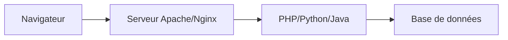

# Introduction à Node.js

## 🎯 Qu'est-ce que Node.js ?

Node.js est un **environnement d'exécution JavaScript** qui permet de faire tourner du JavaScript côté serveur, en dehors du navigateur.

### Avant Node.js
- **JavaScript** : uniquement dans le navigateur (frontend)
- **Serveur** : PHP, Python, Java, C#, etc.
- **Deux langages** différents pour un même projet

### Avec Node.js ✅
- **JavaScript partout** : frontend ET backend
- **Un seul langage** pour tout le projet
- **Partage de code** entre client et serveur

## 🔧 Comment ça fonctionne ?

### Architecture traditionnelle


### Architecture Node.js


## 🚀 Avantages de Node.js

### 1. Performance
Node.js utilise le **moteur V8** de Chrome (très rapide) et un modèle **asynchrone non-bloquant**.

```javascript
// ❌ Code bloquant (traditionnel)
const data1 = readFile('file1.txt')     // ⏳ Attend 100ms
const data2 = readFile('file2.txt')     // ⏳ Attend encore 100ms
console.log('Total: 200ms')

// ✅ Code non-bloquant (Node.js)
readFile('file1.txt', (data1) => {      // 🚀 Lance en parallèle
  console.log('File 1 ready!')
})
readFile('file2.txt', (data2) => {      // 🚀 Lance en parallèle
  console.log('File 2 ready!')
})
console.log('Total: ~100ms')
```

### 2. Écosystème NPM
Plus de 2 millions de packages disponibles :

```bash
npm install express          # Framework web
npm install prisma          # ORM base de données
npm install cors            # Gestion CORS
npm install nodemon         # Rechargement automatique
```

### 3. JavaScript partout
```javascript
// Frontend (Vue.js)
const user = { name: 'John', age: 25 }

// Backend (Node.js) - Même syntaxe !
const user = { name: 'John', age: 25 }
const users = await database.findMany()
```

## 🏗️ Concepts fondamentaux

### 1. Modules (CommonJS & ES6)

#### CommonJS (traditionnel)
```javascript
// math.js
function add(a, b) {
  return a + b
}

function multiply(a, b) {
  return a * b
}

module.exports = { add, multiply }

// app.js
const { add, multiply } = require('./math')
console.log(add(2, 3))     // 5
```

#### ES6 Modules (moderne) ✅
```javascript
// math.js
export function add(a, b) {
  return a + b
}

export function multiply(a, b) {
  return a * b
}

// ou export default
export default { add, multiply }

// app.js
import { add, multiply } from './math.js'
// ou
import math from './math.js'
```

### 2. Asynchrone avec Promises/Async-Await

#### Callbacks (ancien)
```javascript
const fs = require('fs')

fs.readFile('data.txt', 'utf8', (err, data) => {
  if (err) {
    console.error(err)
    return
  }
  
  fs.writeFile('output.txt', data.toUpperCase(), (err) => {
    if (err) {
      console.error(err)
      return
    }
    console.log('Fichier écrit !')
  })
})
```

#### Async/Await (moderne) ✅
```javascript
import { readFile, writeFile } from 'fs/promises'

async function processFile() {
  try {
    const data = await readFile('data.txt', 'utf8')
    await writeFile('output.txt', data.toUpperCase())
    console.log('Fichier écrit !')
  } catch (error) {
    console.error('Erreur:', error)
  }
}

processFile()
```

### 3. Event Loop
Node.js traite les requêtes de manière asynchrone :

```javascript
console.log('1. Start')

setTimeout(() => {
  console.log('3. Timeout')
}, 0)

setImmediate(() => {
  console.log('4. Immediate')
})

process.nextTick(() => {
  console.log('2. Next Tick')
})

console.log('1. End')

// Ordre d'exécution :
// 1. Start
// 1. End
// 2. Next Tick
// 3. Timeout
// 4. Immediate
```

## 🌐 Serveur HTTP basique

### Serveur minimal
```javascript
import http from 'http'

const server = http.createServer((req, res) => {
  res.writeHead(200, { 'Content-Type': 'text/plain' })
  res.end('Hello World!')
})

server.listen(3000, () => {
  console.log('Serveur démarré sur http://localhost:3000')
})
```

### Avec Express (plus pratique) ✅
```javascript
import express from 'express'

const app = express()

// Middleware pour parser JSON
app.use(express.json())

// Route GET
app.get('/', (req, res) => {
  res.json({ message: 'Hello World!' })
})

// Route POST
app.post('/users', (req, res) => {
  const { name, email } = req.body
  
  // Validation simple
  if (!name || !email) {
    return res.status(400).json({ error: 'Name and email required' })
  }
  
  // Créer utilisateur (exemple)
  const user = { id: 1, name, email }
  res.status(201).json(user)
})

app.listen(3000, () => {
  console.log('Serveur Express sur http://localhost:3000')
})
```

## 📦 Package.json

Le fichier `package.json` décrit votre projet :

```json
{
  "name": "tennis-table-api",
  "version": "1.0.0",
  "description": "API pour application tennis de table",
  "type": "module",
  "main": "src/index.js",
  "scripts": {
    "start": "node src/index.js",
    "dev": "nodemon src/index.js",
    "test": "jest"
  },
  "dependencies": {
    "express": "^4.18.2",
    "prisma": "^5.7.0",
    "cors": "^2.8.5"
  },
  "devDependencies": {
    "nodemon": "^3.0.2",
    "@types/node": "^20.10.0"
  }
}
```

### Scripts NPM
```bash
npm run dev      # Lance nodemon (rechargement auto)
npm start        # Lance en production
npm test         # Lance les tests
npm run build    # Build si configuré
```

## 🔐 Variables d'environnement

Fichier `.env` pour la configuration :

```bash
# .env
NODE_ENV=development
PORT=3000
DATABASE_URL="file:./dev.db"
JWT_SECRET="mon-secret-super-secret"
```

```javascript
// Utilisation dans le code
import dotenv from 'dotenv'
dotenv.config()

const port = process.env.PORT || 3000
const dbUrl = process.env.DATABASE_URL

console.log(`Server starting on port ${port}`)
```

## 🗂️ Structure projet Node.js

```
tennis-table-api/
├── package.json              # Configuration projet
├── .env                      # Variables d'environnement
├── .gitignore               # Fichiers à ignorer
├── src/
│   ├── index.js             # Point d'entrée
│   ├── routes/              # Définition des routes
│   │   ├── exercises.js
│   │   └── sessions.js
│   ├── controllers/         # Logique métier
│   │   ├── exerciseController.js
│   │   └── sessionController.js
│   ├── middleware/          # Fonctions intermédiaires
│   │   ├── auth.js
│   │   └── cors.js
│   ├── models/              # Modèles de données
│   └── utils/               # Utilitaires
└── prisma/
    ├── schema.prisma        # Schéma BDD
    └── seed.js              # Données de test
```

## 🔄 Exemple complet : API REST

```javascript
// src/index.js
import express from 'express'
import cors from 'cors'
import dotenv from 'dotenv'
import exerciseRoutes from './routes/exercises.js'
import sessionRoutes from './routes/sessions.js'

dotenv.config()

const app = express()
const PORT = process.env.PORT || 3000

// Middleware globaux
app.use(cors())                    // Autorise les requêtes cross-origin
app.use(express.json())            // Parse le JSON
app.use(express.urlencoded({ extended: true }))

// Middleware de logging
app.use((req, res, next) => {
  console.log(`${new Date().toISOString()} - ${req.method} ${req.path}`)
  next()
})

// Routes
app.use('/api/exercises', exerciseRoutes)
app.use('/api/sessions', sessionRoutes)

// Route de test
app.get('/health', (req, res) => {
  res.json({ 
    status: 'OK', 
    timestamp: new Date().toISOString(),
    uptime: process.uptime()
  })
})

// Gestion erreurs 404
app.use('*', (req, res) => {
  res.status(404).json({ error: 'Route not found' })
})

// Gestion erreurs globales
app.use((error, req, res, next) => {
  console.error('Error:', error)
  res.status(500).json({ 
    error: 'Internal server error',
    message: process.env.NODE_ENV === 'development' ? error.message : undefined
  })
})

// Démarrage serveur
app.listen(PORT, () => {
  console.log(`🚀 Serveur démarré sur http://localhost:${PORT}`)
  console.log(`📊 Health check: http://localhost:${PORT}/health`)
})
```

```javascript
// src/routes/exercises.js
import express from 'express'
import { 
  getAllExercises, 
  getExerciseById, 
  createExercise,
  updateExercise,
  deleteExercise 
} from '../controllers/exerciseController.js'

const router = express.Router()

// GET /api/exercises
router.get('/', getAllExercises)

// GET /api/exercises/:id
router.get('/:id', getExerciseById)

// POST /api/exercises
router.post('/', createExercise)

// PUT /api/exercises/:id
router.put('/:id', updateExercise)

// DELETE /api/exercises/:id
router.delete('/:id', deleteExercise)

export default router
```

```javascript
// src/controllers/exerciseController.js
import { PrismaClient } from '@prisma/client'

const prisma = new PrismaClient()

export const getAllExercises = async (req, res) => {
  try {
    const { phase, difficulty } = req.query
    
    const where = {}
    if (phase) where.phase = phase
    if (difficulty) where.difficulty = difficulty
    
    const exercises = await prisma.exercise.findMany({
      where,
      orderBy: { createdAt: 'desc' }
    })
    
    res.json({ exercises })
  } catch (error) {
    console.error('Erreur getAllExercises:', error)
    res.status(500).json({ error: 'Erreur lors de la récupération des exercices' })
  }
}

export const createExercise = async (req, res) => {
  try {
    const { title, description, phase, duration, difficulty, shots } = req.body
    
    // Validation
    if (!title || !phase || !duration) {
      return res.status(400).json({ 
        error: 'Title, phase et duration sont requis' 
      })
    }
    
    const exercise = await prisma.exercise.create({
      data: {
        title,
        description,
        phase,
        duration: parseInt(duration),
        difficulty,
        shots: shots || []
      }
    })
    
    res.status(201).json({ exercise })
  } catch (error) {
    console.error('Erreur createExercise:', error)
    res.status(500).json({ error: 'Erreur lors de la création de l\'exercice' })
  }
}

// ... autres controllers
```

## 🛠️ Outils de développement

### Nodemon - Rechargement automatique
```bash
npm install -D nodemon

# package.json
{
  "scripts": {
    "dev": "nodemon src/index.js"
  }
}
```

### Debug avec Node.js
```javascript
// Utiliser console.log avec style
console.log('🟢 Serveur démarré')
console.log('🔵 Requête reçue:', req.method, req.path)
console.log('🔴 Erreur:', error.message)

// Ou debugger
debugger // Point d'arrêt

// Ou console.table pour les objets
console.table(exercises)
```

## ⚠️ Points d'attention

### Gestion d'erreurs
```javascript
// ❌ Erreur non catchée = crash du serveur
app.get('/exercises', async (req, res) => {
  const exercises = await prisma.exercise.findMany() // Peut planter !
  res.json(exercises)
})

// ✅ Toujours wraper dans try/catch
app.get('/exercises', async (req, res) => {
  try {
    const exercises = await prisma.exercise.findMany()
    res.json(exercises)
  } catch (error) {
    console.error(error)
    res.status(500).json({ error: 'Internal server error' })
  }
})
```

### Sécurité basique
```javascript
// Validation des entrées
const { title, duration } = req.body

if (!title || typeof title !== 'string' || title.length > 100) {
  return res.status(400).json({ error: 'Invalid title' })
}

if (!duration || isNaN(duration) || duration < 0) {
  return res.status(400).json({ error: 'Invalid duration' })
}
```

## 🔗 Pour aller plus loin

- [[Express-Basics|Framework Express en détail]]
- [[API-Routes|Création d'API REST]]
- [[Prisma-ORM|Base de données avec Prisma]]
- [[Middleware|Middleware et sécurité]]

#nodejs #backend #javascript #express #api #server