# L'Écosystème Vue.js : Guide Complet et Approfondi

## 🎯 Vue d'ensemble : L'Écosystème Complet

Vue.js n'est pas qu'un framework, c'est tout un **écosystème** d'outils qui travaillent ensemble pour créer des applications web modernes. Pensez-y comme à une **boîte à outils complète** où chaque outil a un rôle spécifique.

### Analogie : Vue.js = Atelier de Menuiserie

- **Vue Core** = Les outils de base (marteau, scie, tournevis)
- **Vue Router** = Le plan de la maison (navigation)
- **Pinia** = L'armoire de rangement (stockage des données)
- **Vite** = L'établi électrique (outils de développement)
- **Tailwind** = La palette de couleurs et finitions (styles)

## 🧩 Vue.js Core : Le Cœur Réactif

### Le Système de Réactivité Expliqué

Vue.js utilise un système de **réactivité fine** qui suit automatiquement les dépendances entre vos données et votre interface.

```mermaid
graph TB
    A[Données Réactives] --> B[Système de Réactivité]
    B --> C[Virtual DOM]
    C --> D[DOM Réel]
    
    E[Utilisateur] --> F[Event Handler]
    F --> A
    
    G[Computed] --> B
    H[Watcher] --> B
    
    subgraph "Cycle de Réactivité"
        A
        B
        C
        D
    end
```



#### Sous le Capot : Comment ça Marche ?

```javascript
// Ce qui se passe vraiment avec ref()
import { ref } from 'vue'

// Quand vous écrivez ça :
const count = ref(0)

// Vue crée quelque chose comme ça :
const count = {
  _value: 0,
  get value() {
    // 🎯 TRACK : Vue enregistre que quelqu'un lit cette valeur
    track(this, 'value')
    return this._value
  },
  set value(newValue) {
    this._value = newValue
    // 🚀 TRIGGER : Vue déclenche les mises à jour
    trigger(this, 'value')
  }
}

// Dans votre composant
const App = {
  setup() {
    const count = ref(0)
    
    // 📊 Computed - se recalcule automatiquement
    const doubleCount = computed(() => {
      console.log('🔄 Recalcul de doubleCount')
      return count.value * 2 // Vue track cette dépendance
    })
    
    // 👀 Watcher - réagit aux changements
    watch(count, (newValue, oldValue) => {
      console.log(`Count changé: ${oldValue} → ${newValue}`)
    })
    
    const increment = () => {
      count.value++ // Déclenche automatiquement les mises à jour
    }
    
    return { count, doubleCount, increment }
  }
}
```

### Composition API vs Options API : Comparaison Détaillée

#### Options API (Vue 2 style)
```vue
<template>
  <div class="exercise-manager">
    <h1>{{ title }}</h1>
    
    <!-- Filtres -->
    <div class="filters">
      <input v-model="searchTerm" placeholder="Rechercher...">
      <select v-model="selectedDifficulty">
        <option value="">Toutes difficultés</option>
        <option v-for="diff in difficulties" :key="diff" :value="diff">
          {{ diff }}
        </option>
      </select>
    </div>
    
    <!-- Liste -->
    <div v-if="loading" class="loading">Chargement...</div>
    <div v-else class="exercise-grid">
      <ExerciseCard
        v-for="exercise in filteredExercises"
        :key="exercise.id"
        :exercise="exercise"
        @edit="editExercise"
        @delete="deleteExercise"
      />
    </div>
    
    <!-- Pagination -->
    <Pagination
      :current-page="currentPage"
      :total-pages="totalPages"
      @change="changePage"
    />
  </div>
</template>

<script>
import ExerciseCard from './ExerciseCard.vue'
import Pagination from './Pagination.vue'
import { exerciseAPI } from '../api/exercises'

export default {
  name: 'ExerciseManager',
  components: {
    ExerciseCard,
    Pagination
  },
  
  // 📊 Données réactives
  data() {
    return {
      title: 'Gestion des Exercices',
      exercises: [],
      searchTerm: '',
      selectedDifficulty: '',
      difficulties: ['BEGINNER', 'INTERMEDIATE', 'ADVANCED', 'EXPERT'],
      loading: false,
      currentPage: 1,
      pageSize: 12
    }
  },
  
  // 🧮 Propriétés calculées
  computed: {
    filteredExercises() {
      let result = this.exercises
      
      // Filtre par recherche
      if (this.searchTerm) {
        result = result.filter(ex => 
          ex.title.toLowerCase().includes(this.searchTerm.toLowerCase()) ||
          ex.description.toLowerCase().includes(this.searchTerm.toLowerCase())
        )
      }
      
      // Filtre par difficulté
      if (this.selectedDifficulty) {
        result = result.filter(ex => ex.difficulty === this.selectedDifficulty)
      }
      
      // Pagination
      const start = (this.currentPage - 1) * this.pageSize
      return result.slice(start, start + this.pageSize)
    },
    
    totalPages() {
      return Math.ceil(this.filteredExercises.length / this.pageSize)
    }
  },
  
  // 👀 Observateurs
  watch: {
    searchTerm() {
      this.currentPage = 1 // Reset pagination quand on filtre
    },
    
    selectedDifficulty() {
      this.currentPage = 1
    }
  },
  
  // 🔄 Cycle de vie
  async mounted() {
    await this.loadExercises()
  },
  
  // 🎬 Méthodes
  methods: {
    async loadExercises() {
      this.loading = true
      try {
        this.exercises = await exerciseAPI.getAll()
      } catch (error) {
        console.error('Erreur chargement:', error)
        // Gérer l'erreur
      } finally {
        this.loading = false
      }
    },
    
    editExercise(exerciseId) {
      this.$router.push(`/exercises/${exerciseId}/edit`)
    },
    
    async deleteExercise(exerciseId) {
      if (confirm('Supprimer cet exercice ?')) {
        try {
          await exerciseAPI.delete(exerciseId)
          await this.loadExercises() // Recharger
        } catch (error) {
          console.error('Erreur suppression:', error)
        }
      }
    },
    
    changePage(page) {
      this.currentPage = page
    }
  }
}
</script>
```

#### Composition API (Vue 3 moderne) ✅
```vue
<template>
  <!-- Même template -->
  <div class="exercise-manager">
    <h1>{{ title }}</h1>
    
    <div class="filters">
      <input v-model="searchTerm" placeholder="Rechercher...">
      <select v-model="selectedDifficulty">
        <option value="">Toutes difficultés</option>
        <option v-for="diff in difficulties" :key="diff" :value="diff">
          {{ diff }}
        </option>
      </select>
    </div>
    
    <div v-if="loading" class="loading">Chargement...</div>
    <div v-else class="exercise-grid">
      <ExerciseCard
        v-for="exercise in filteredExercises"
        :key="exercise.id"
        :exercise="exercise"
        @edit="editExercise"
        @delete="deleteExercise"
      />
    </div>
    
    <Pagination
      :current-page="currentPage"
      :total-pages="totalPages"
      @change="changePage"
    />
  </div>
</template>

<script setup>
import { ref, computed, watch, onMounted } from 'vue'
import { useRouter } from 'vue-router'
import ExerciseCard from './ExerciseCard.vue'
import Pagination from './Pagination.vue'
import { exerciseAPI } from '../api/exercises'

// 🎯 Props (si nécessaire)
const props = defineProps({
  initialFilter: String
})

// 🔄 Router
const router = useRouter()

// 📊 État réactif
const title = ref('Gestion des Exercices')
const exercises = ref([])
const searchTerm = ref(props.initialFilter || '')
const selectedDifficulty = ref('')
const difficulties = ref(['BEGINNER', 'INTERMEDIATE', 'ADVANCED', 'EXPERT'])
const loading = ref(false)
const currentPage = ref(1)
const pageSize = ref(12)

// 🧮 Computed
const filteredExercises = computed(() => {
  let result = exercises.value
  
  if (searchTerm.value) {
    result = result.filter(ex => 
      ex.title.toLowerCase().includes(searchTerm.value.toLowerCase()) ||
      ex.description.toLowerCase().includes(searchTerm.value.toLowerCase())
    )
  }
  
  if (selectedDifficulty.value) {
    result = result.filter(ex => ex.difficulty === selectedDifficulty.value)
  }
  
  const start = (currentPage.value - 1) * pageSize.value
  return result.slice(start, start + pageSize.value)
})

const totalPages = computed(() => {
  return Math.ceil(filteredExercises.value.length / pageSize.value)
})

// 👀 Watchers
watch(searchTerm, () => {
  currentPage.value = 1
})

watch(selectedDifficulty, () => {
  currentPage.value = 1
})

// 🎬 Méthodes
const loadExercises = async () => {
  loading.value = true
  try {
    exercises.value = await exerciseAPI.getAll()
  } catch (error) {
    console.error('Erreur chargement:', error)
  } finally {
    loading.value = false
  }
}

const editExercise = (exerciseId) => {
  router.push(`/exercises/${exerciseId}/edit`)
}

const deleteExercise = async (exerciseId) => {
  if (confirm('Supprimer cet exercice ?')) {
    try {
      await exerciseAPI.delete(exerciseId)
      await loadExercises()
    } catch (error) {
      console.error('Erreur suppression:', error)
    }
  }
}

const changePage = (page) => {
  currentPage.value = page
}

// 🔄 Cycle de vie
onMounted(loadExercises)

// 📤 Exposer pour le template (automatique avec script setup)
</script>
```

### Composition API : Avantages et Patterns

#### 1. Réutilisation de Logique avec Composables

```javascript
// composables/useExerciseFilters.js
import { ref, computed } from 'vue'

export function useExerciseFilters(exercises) {
  const searchTerm = ref('')
  const selectedDifficulty = ref('')
  const selectedPhase = ref('')
  const currentPage = ref(1)
  const pageSize = ref(12)
  
  const filteredExercises = computed(() => {
    let result = exercises.value || []
    
    // Filtre texte
    if (searchTerm.value) {
      const search = searchTerm.value.toLowerCase()
      result = result.filter(ex => 
        ex.title.toLowerCase().includes(search) ||
        ex.description.toLowerCase().includes(search)
      )
    }
    
    // Filtre difficulté
    if (selectedDifficulty.value) {
      result = result.filter(ex => ex.difficulty === selectedDifficulty.value)
    }
    
    // Filtre phase
    if (selectedPhase.value) {
      result = result.filter(ex => ex.phase === selectedPhase.value)
    }
    
    return result
  })
  
  const paginatedExercises = computed(() => {
    const start = (currentPage.value - 1) * pageSize.value
    return filteredExercises.value.slice(start, start + pageSize.value)
  })
  
  const totalPages = computed(() => {
    return Math.ceil(filteredExercises.value.length / pageSize.value)
  })
  
  const resetFilters = () => {
    searchTerm.value = ''
    selectedDifficulty.value = ''
    selectedPhase.value = ''
    currentPage.value = 1
  }
  
  const goToPage = (page) => {
    if (page >= 1 && page <= totalPages.value) {
      currentPage.value = page
    }
  }
  
  return {
    // État
    searchTerm,
    selectedDifficulty,
    selectedPhase,
    currentPage,
    pageSize,
    
    // Computed
    filteredExercises,
    paginatedExercises,
    totalPages,
    
    // Méthodes
    resetFilters,
    goToPage
  }
}

// composables/useAPI.js
import { ref } from 'vue'

export function useAPI(apiFunction) {
  const data = ref(null)
  const loading = ref(false)
  const error = ref(null)
  
  const execute = async (...args) => {
    loading.value = true
    error.value = null
    
    try {
      const result = await apiFunction(...args)
      data.value = result
      return result
    } catch (err) {
      error.value = err
      throw err
    } finally {
      loading.value = false
    }
  }
  
  const reset = () => {
    data.value = null
    error.value = null
    loading.value = false
  }
  
  return {
    data,
    loading,
    error,
    execute,
    reset
  }
}

// Utilisation dans un composant
<script setup>
import { useExerciseFilters } from '../composables/useExerciseFilters'
import { useAPI } from '../composables/useAPI'
import { exerciseAPI } from '../api/exercises'

// 🔌 API
const { data: exercises, loading, error, execute: loadExercises } = useAPI(exerciseAPI.getAll)

// 🎛️ Filtres
const {
  searchTerm,
  selectedDifficulty,
  selectedPhase,
  paginatedExercises,
  totalPages,
  currentPage,
  resetFilters,
  goToPage
} = useExerciseFilters(exercises)

// 🔄 Charger au montage
onMounted(loadExercises)
</script>
```

#### 2. Gestion d'État Local Complexe

```javascript
// composables/useExerciseEditor.js
import { ref, computed, watch } from 'vue'
import { useRouter } from 'vue-router'

export function useExerciseEditor(exerciseId = null) {
  const router = useRouter()
  
  // État du formulaire
  const form = ref({
    title: '',
    description: '',
    phase: 'WARM_UP',
    duration: 300,
    difficulty: 'BEGINNER',
    repetitions: 1,
    shots: []
  })
  
  // État de l'éditeur
  const isEditing = computed(() => !!exerciseId)
  const isDirty = ref(false)
  const isSaving = ref(false)
  const validationErrors = ref({})
  
  // Validation en temps réel
  const isValid = computed(() => {
    const errors = {}
    
    if (!form.value.title || form.value.title.length < 3) {
      errors.title = 'Le titre doit faire au moins 3 caractères'
    }
    
    if (form.value.duration < 30 || form.value.duration > 3600) {
      errors.duration = 'La durée doit être entre 30 et 3600 secondes'
    }
    
    if (form.value.repetitions < 1 || form.value.repetitions > 100) {
      errors.repetitions = 'Les répétitions doivent être entre 1 et 100'
    }
    
    validationErrors.value = errors
    return Object.keys(errors).length === 0
  })
  
  // Watcher pour détecter les modifications
  watch(form, () => {
    isDirty.value = true
  }, { deep: true })
  
  // Méthodes
  const loadExercise = async () => {
    if (exerciseId) {
      try {
        const exercise = await exerciseAPI.getById(exerciseId)
        form.value = { ...exercise }
        isDirty.value = false
      } catch (error) {
        console.error('Erreur chargement exercice:', error)
        router.push('/exercises')
      }
    }
  }
  
  const saveExercise = async () => {
    if (!isValid.value) {
      return false
    }
    
    isSaving.value = true
    
    try {
      if (isEditing.value) {
        await exerciseAPI.update(exerciseId, form.value)
      } else {
        await exerciseAPI.create(form.value)
      }
      
      isDirty.value = false
      return true
    } catch (error) {
      console.error('Erreur sauvegarde:', error)
      return false
    } finally {
      isSaving.value = false
    }
  }
  
  const resetForm = () => {
    if (isEditing.value) {
      loadExercise()
    } else {
      form.value = {
        title: '',
        description: '',
        phase: 'WARM_UP',
        duration: 300,
        difficulty: 'BEGINNER',
        repetitions: 1,
        shots: []
      }
    }
    isDirty.value = false
  }
  
  const addShot = (shotData) => {
    form.value.shots.push({
      id: Date.now(),
      ...shotData
    })
    isDirty.value = true
  }
  
  const removeShot = (shotId) => {
    const index = form.value.shots.findIndex(shot => shot.id === shotId)
    if (index !== -1) {
      form.value.shots.splice(index, 1)
      isDirty.value = true
    }
  }
  
  const updateShot = (shotId, updates) => {
    const shot = form.value.shots.find(shot => shot.id === shotId)
    if (shot) {
      Object.assign(shot, updates)
      isDirty.value = true
    }
  }
  
  return {
    // État
    form,
    isEditing,
    isDirty,
    isSaving,
    validationErrors,
    isValid,
    
    // Méthodes
    loadExercise,
    saveExercise,
    resetForm,
    addShot,
    removeShot,
    updateShot
  }
}
```

## 🗺️ Vue Router : Navigation Avancée

### Configuration du Router

```javascript
// router/index.js
import { createRouter, createWebHistory } from 'vue-router'
import { useAuthStore } from '../stores/auth'

// Lazy loading des composants
const HomeView = () => import('../views/HomeView.vue')
const ExercisesView = () => import('../views/ExercisesView.vue')
const ExerciseEditView = () => import('../views/ExerciseEditView.vue')
const SessionsView = () => import('../views/SessionsView.vue')
const TrainingView = () => import('../views/TrainingView.vue')
const NotFoundView = () => import('../views/NotFoundView.vue')

const routes = [
  {
    path: '/',
    name: 'home',
    component: HomeView,
    meta: {
      title: 'Accueil - TrainPing',
      requiresAuth: false
    }
  },
  
  {
    path: '/exercises',
    name: 'exercises',
    component: ExercisesView,
    meta: {
      title: 'Exercices - TrainPing',
      requiresAuth: false
    }
  },
  
  {
    path: '/exercises/new',
    name: 'exercise-create',
    component: ExerciseEditView,
    meta: {
      title: 'Créer un exercice - TrainPing',
      requiresAuth: true,
      mode: 'create'
    }
  },
  
  {
    path: '/exercises/:id/edit',
    name: 'exercise-edit',
    component: ExerciseEditView,
    props: true, // Passer les params comme props
    meta: {
      title: 'Modifier un exercice - TrainPing',
      requiresAuth: true,
      mode: 'edit'
    },
    beforeEnter: async (to, from, next) => {
      // Vérifier que l'exercice existe
      try {
        const exerciseId = to.params.id
        await exerciseAPI.getById(exerciseId)
        next()
      } catch (error) {
        next({ name: 'not-found' })
      }
    }
  },
  
  {
    path: '/sessions',
    name: 'sessions',
    component: SessionsView,
    meta: {
      title: 'Sessions - TrainPing',
      requiresAuth: false
    }
  },
  
  {
    path: '/training/:sessionId',
    name: 'training',
    component: TrainingView,
    props: route => ({
      sessionId: route.params.sessionId,
      mode: route.query.mode || 'normal'
    }),
    meta: {
      title: 'Entraînement - TrainPing',
      requiresAuth: true,
      layout: 'training' // Layout spécial
    }
  },
  
  // Routes imbriquées pour l'admin
  {
    path: '/admin',
    name: 'admin',
    component: () => import('../layouts/AdminLayout.vue'),
    meta: {
      requiresAuth: true,
      requiresRole: 'admin'
    },
    children: [
      {
        path: '',
        name: 'admin-dashboard',
        component: () => import('../views/admin/DashboardView.vue')
      },
      {
        path: 'users',
        name: 'admin-users',
        component: () => import('../views/admin/UsersView.vue')
      },
      {
        path: 'settings',
        name: 'admin-settings',
        component: () => import('../views/admin/SettingsView.vue')
      }
    ]
  },
  
  // Redirection et 404
  {
    path: '/exercise/:pathMatch(.*)*', // Ancienne URL
    redirect: to => {
      return { name: 'exercises', query: to.query }
    }
  },
  
  {
    path: '/:pathMatch(.*)*',
    name: 'not-found',
    component: NotFoundView,
    meta: {
      title: 'Page non trouvée - TrainPing'
    }
  }
]

const router = createRouter({
  history: createWebHistory(),
  routes,
  scrollBehavior(to, from, savedPosition) {
    // Gérer le scroll lors de la navigation
    if (savedPosition) {
      return savedPosition
    } else if (to.hash) {
      return { el: to.hash }
    } else {
      return { top: 0 }
    }
  }
})

// Guards globaux
router.beforeEach(async (to, from, next) => {
  const authStore = useAuthStore()
  
  // Mettre à jour le titre de la page
  document.title = to.meta.title || 'TrainPing'
  
  // Vérifier l'authentification
  if (to.meta.requiresAuth && !authStore.isAuthenticated) {
    next({
      name: 'login',
      query: { redirect: to.fullPath }
    })
    return
  }
  
  // Vérifier les rôles
  if (to.meta.requiresRole && !authStore.hasRole(to.meta.requiresRole)) {
    next({ name: 'forbidden' })
    return
  }
  
  next()
})

router.afterEach((to, from) => {
  // Analytics ou logging
  console.log(`Navigation: ${from.name} → ${to.name}`)
})

export default router
```

### Navigation Programmatique Avancée

```javascript
// composables/useNavigation.js
import { useRouter, useRoute } from 'vue-router'

export function useNavigation() {
  const router = useRouter()
  const route = useRoute()
  
  const goToExercise = (exerciseId, mode = 'view') => {
    const routeName = mode === 'edit' ? 'exercise-edit' : 'exercise-view'
    router.push({ name: routeName, params: { id: exerciseId } })
  }
  
  const goToTraining = (sessionId, options = {}) => {
    router.push({
      name: 'training',
      params: { sessionId },
      query: {
        mode: options.mode || 'normal',
        autoStart: options.autoStart ? 'true' : 'false'
      }
    })
  }
  
  const goBack = () => {
    if (window.history.length > 1) {
      router.go(-1)
    } else {
      router.push({ name: 'home' })
    }
  }
  
  const refreshCurrentRoute = () => {
    const { name, params, query } = route
    router.replace({ name, params, query })
  }
  
  const addQueryParam = (key, value) => {
    router.push({
      ...route,
      query: { ...route.query, [key]: value }
    })
  }
  
  const removeQueryParam = (key) => {
    const { [key]: removed, ...query } = route.query
    router.push({ ...route, query })
  }
  
  return {
    router,
    route,
    goToExercise,
    goToTraining,
    goBack,
    refreshCurrentRoute,
    addQueryParam,
    removeQueryParam
  }
}

// Utilisation dans un composant
<script setup>
import { useNavigation } from '../composables/useNavigation'

const { goToExercise, goToTraining, addQueryParam } = useNavigation()

const handleExerciseClick = (exerciseId) => {
  goToExercise(exerciseId, 'edit')
}

const startTraining = (sessionId) => {
  goToTraining(sessionId, { autoStart: true })
}

const applyFilter = (filterValue) => {
  addQueryParam('filter', filterValue)
}
</script>
```

## 🗃️ Pinia : Gestion d'État Avancée

### Store Complexe avec Actions Async

```javascript
// stores/exercises.js
import { defineStore } from 'pinia'
import { ref, computed } from 'vue'
import { exerciseAPI } from '../api/exercises'

export const useExerciseStore = defineStore('exercises', () => {
  // 📊 État
  const exercises = ref([])
  const currentExercise = ref(null)
  const loading = ref(false)
  const error = ref(null)
  const filters = ref({
    search: '',
    phase: '',
    difficulty: '',
    sortBy: 'createdAt',
    sortOrder: 'desc'
  })
  const pagination = ref({
    page: 1,
    limit: 20,
    total: 0
  })
  
  // 🧮 Getters (computed)
  const filteredExercises = computed(() => {
    let result = exercises.value
    
    if (filters.value.search) {
      const search = filters.value.search.toLowerCase()
      result = result.filter(ex => 
        ex.title.toLowerCase().includes(search) ||
        ex.description.toLowerCase().includes(search)
      )
    }
    
    if (filters.value.phase) {
      result = result.filter(ex => ex.phase === filters.value.phase)
    }
    
    if (filters.value.difficulty) {
      result = result.filter(ex => ex.difficulty === filters.value.difficulty)
    }
    
    // Tri
    result.sort((a, b) => {
      const field = filters.value.sortBy
      const order = filters.value.sortOrder === 'asc' ? 1 : -1
      
      if (field === 'createdAt') {
        return (new Date(a[field]) - new Date(b[field])) * order
      }
      
      if (typeof a[field] === 'string') {
        return a[field].localeCompare(b[field]) * order
      }
      
      return (a[field] - b[field]) * order
    })
    
    return result
  })
  
  const exercisesByPhase = computed(() => {
    return exercises.value.reduce((acc, exercise) => {
      if (!acc[exercise.phase]) {
        acc[exercise.phase] = []
      }
      acc[exercise.phase].push(exercise)
      return acc
    }, {})
  })
  
  const totalPages = computed(() => {
    return Math.ceil(pagination.value.total / pagination.value.limit)
  })
  
  // 🎬 Actions
  const fetchExercises = async (options = {}) => {
    loading.value = true
    error.value = null
    
    try {
      const params = {
        ...filters.value,
        page: pagination.value.page,
        limit: pagination.value.limit,
        ...options
      }
      
      const response = await exerciseAPI.getAll(params)
      
      exercises.value = response.exercises
      pagination.value.total = response.total
      
      return response
    } catch (err) {
      error.value = err.message || 'Erreur lors du chargement'
      throw err
    } finally {
      loading.value = false
    }
  }
  
  const fetchExerciseById = async (id) => {
    loading.value = true
    error.value = null
    
    try {
      // Vérifier d'abord dans le cache local
      let exercise = exercises.value.find(ex => ex.id === id)
      
      if (!exercise) {
        exercise = await exerciseAPI.getById(id)
      }
      
      currentExercise.value = exercise
      return exercise
    } catch (err) {
      error.value = err.message || 'Exercice non trouvé'
      throw err
    } finally {
      loading.value = false
    }
  }
  
  const createExercise = async (exerciseData) => {
    loading.value = true
    error.value = null
    
    try {
      const newExercise = await exerciseAPI.create(exerciseData)
      
      // Ajouter à la liste locale
      exercises.value.unshift(newExercise)
      
      // Mettre à jour la pagination
      pagination.value.total++
      
      return newExercise
    } catch (err) {
      error.value = err.message || 'Erreur lors de la création'
      throw err
    } finally {
      loading.value = false
    }
  }
  
  const updateExercise = async (id, updates) => {
    loading.value = true
    error.value = null
    
    try {
      const updatedExercise = await exerciseAPI.update(id, updates)
      
      // Mettre à jour dans la liste locale
      const index = exercises.value.findIndex(ex => ex.id === id)
      if (index !== -1) {
        exercises.value[index] = updatedExercise
      }
      
      // Mettre à jour l'exercice courant si c'est le bon
      if (currentExercise.value?.id === id) {
        currentExercise.value = updatedExercise
      }
      
      return updatedExercise
    } catch (err) {
      error.value = err.message || 'Erreur lors de la modification'
      throw err
    } finally {
      loading.value = false
    }
  }
  
  const deleteExercise = async (id) => {
    loading.value = true
    error.value = null
    
    try {
      await exerciseAPI.delete(id)
      
      // Supprimer de la liste locale
      const index = exercises.value.findIndex(ex => ex.id === id)
      if (index !== -1) {
        exercises.value.splice(index, 1)
      }
      
      // Réinitialiser l'exercice courant si nécessaire
      if (currentExercise.value?.id === id) {
        currentExercise.value = null
      }
      
      // Mettre à jour la pagination
      pagination.value.total--
      
    } catch (err) {
      error.value = err.message || 'Erreur lors de la suppression'
      throw err
    } finally {
      loading.value = false
    }
  }
  
  const duplicateExercise = async (id) => {
    const originalExercise = await fetchExerciseById(id)
    
    const duplicatedData = {
      ...originalExercise,
      title: `${originalExercise.title} (copie)`,
      id: undefined, // Laisser le serveur générer un nouvel ID
      createdAt: undefined,
      updatedAt: undefined
    }
    
    return await createExercise(duplicatedData)
  }
  
  const setFilters = (newFilters) => {
    filters.value = { ...filters.value, ...newFilters }
    pagination.value.page = 1 // Reset page
  }
  
  const clearFilters = () => {
    filters.value = {
      search: '',
      phase: '',
      difficulty: '',
      sortBy: 'createdAt',
      sortOrder: 'desc'
    }
    pagination.value.page = 1
  }
  
  const setPage = (page) => {
    pagination.value.page = page
  }
  
  const refreshExercises = () => {
    return fetchExercises()
  }
  
  // 🔄 Actions utilitaires
  const $reset = () => {
    exercises.value = []
    currentExercise.value = null
    loading.value = false
    error.value = null
    clearFilters()
    pagination.value = { page: 1, limit: 20, total: 0 }
  }
  
  return {
    // État
    exercises,
    currentExercise,
    loading,
    error,
    filters,
    pagination,
    
    // Getters
    filteredExercises,
    exercisesByPhase,
    totalPages,
    
    // Actions
    fetchExercises,
    fetchExerciseById,
    createExercise,
    updateExercise,
    deleteExercise,
    duplicateExercise,
    setFilters,
    clearFilters,
    setPage,
    refreshExercises,
    $reset
  }
})
```

### Store Composé et Communication

```javascript
// stores/app.js - Store global pour l'état de l'application
import { defineStore } from 'pinia'
import { ref, computed } from 'vue'

export const useAppStore = defineStore('app', () => {
  // État global
  const isOnline = ref(navigator.onLine)
  const isSidebarOpen = ref(false)
  const notifications = ref([])
  const theme = ref(localStorage.getItem('theme') || 'light')
  
  // Computed
  const unreadNotifications = computed(() => {
    return notifications.value.filter(n => !n.read).length
  })
  
  // Actions
  const setOnlineStatus = (status) => {
    isOnline.value = status
  }
  
  const toggleSidebar = () => {
    isSidebarOpen.value = !isSidebarOpen.value
  }
  
  const addNotification = (notification) => {
    notifications.value.unshift({
      id: Date.now(),
      timestamp: new Date(),
      read: false,
      ...notification
    })
  }
  
  const markAsRead = (id) => {
    const notification = notifications.value.find(n => n.id === id)
    if (notification) {
      notification.read = true
    }
  }
  
  const setTheme = (newTheme) => {
    theme.value = newTheme
    localStorage.setItem('theme', newTheme)
    document.documentElement.setAttribute('data-theme', newTheme)
  }
  
  return {
    isOnline,
    isSidebarOpen,
    notifications,
    theme,
    unreadNotifications,
    setOnlineStatus,
    toggleSidebar,
    addNotification,
    markAsRead,
    setTheme
  }
})

// Utilisation croisée des stores
// stores/sessions.js
export const useSessionStore = defineStore('sessions', () => {
  // ... état des sessions
  
  const startSession = async (sessionId) => {
    const appStore = useAppStore()
    const exerciseStore = useExerciseStore()
    
    try {
      // Charger la session
      const session = await sessionAPI.getById(sessionId)
      
      // Précharger les exercices de la session
      for (const exercise of session.exercises) {
        await exerciseStore.fetchExerciseById(exercise.exerciseId)
      }
      
      // Notifier le démarrage
      appStore.addNotification({
        type: 'success',
        title: 'Session démarrée',
        message: `Session "${session.title}" en cours`
      })
      
      currentSession.value = session
      return session
      
    } catch (error) {
      appStore.addNotification({
        type: 'error',
        title: 'Erreur',
        message: 'Impossible de démarrer la session'
      })
      throw error
    }
  }
  
  // ...
})
```

## 🎨 Tailwind CSS : Utility-First Approfondi

### Configuration Avancée

```javascript
// tailwind.config.js
/** @type {import('tailwindcss').Config} */
export default {
  content: [
    "./index.html",
    "./src/**/*.{vue,js,ts,jsx,tsx}",
  ],
  darkMode: 'class', // Activer le mode sombre
  theme: {
    extend: {
      // Couleurs personnalisées
      colors: {
        primary: {
          50: '#eff6ff',
          100: '#dbeafe',
          200: '#bfdbfe',
          300: '#93c5fd',
          400: '#60a5fa',
          500: '#3b82f6',  // Couleur principale
          600: '#2563eb',
          700: '#1d4ed8',
          800: '#1e40af',
          900: '#1e3a8a',
          950: '#172554',
        },
        accent: {
          player: '#3b82f6',
          opponent: '#f59e0b',
          success: '#10b981',
          danger: '#ef4444',
          warning: '#f59e0b',
          info: '#3b82f6',
        },
        gray: {
          750: '#374151', // Gris personnalisé
        }
      },
      
      // Typographie
      fontFamily: {
        sans: ['Inter', 'system-ui', 'sans-serif'],
        mono: ['JetBrains Mono', 'monospace'],
      },
      
      fontSize: {
        '2xs': ['0.625rem', { lineHeight: '0.75rem' }],
        '3xl': ['1.875rem', { lineHeight: '2.25rem' }],
      },
      
      // Espacements
      spacing: {
        '18': '4.5rem',
        '88': '22rem',
      },
      
      // Animations personnalisées
      animation: {
        'fade-in': 'fadeIn 0.2s ease-out',
        'slide-up': 'slideUp 0.2s ease-out',
        'slide-down': 'slideDown 0.2s ease-out',
        'scale-in': 'scaleIn 0.15s ease-out',
        'pulse-soft': 'pulseSoft 2s infinite',
        'bounce-soft': 'bounceSoft 1s infinite',
      },
      
      keyframes: {
        fadeIn: {
          '0%': { opacity: '0' },
          '100%': { opacity: '1' },
        },
        slideUp: {
          '0%': { opacity: '0', transform: 'translateY(10px)' },
          '100%': { opacity: '1', transform: 'translateY(0)' },
        },
        slideDown: {
          '0%': { opacity: '0', transform: 'translateY(-10px)' },
          '100%': { opacity: '1', transform: 'translateY(0)' },
        },
        scaleIn: {
          '0%': { opacity: '0', transform: 'scale(0.95)' },
          '100%': { opacity: '1', transform: 'scale(1)' },
        },
        pulseSoft: {
          '0%, 100%': { opacity: '1' },
          '50%': { opacity: '0.8' },
        },
        bounceSoft: {
          '0%, 100%': { transform: 'translateY(0)' },
          '50%': { transform: 'translateY(-5px)' },
        },
      },
      
      // Breakpoints personnalisés
      screens: {
        'xs': '475px',
        '3xl': '1600px',
      },
      
      // Box shadows
      boxShadow: {
        'soft': '0 2px 15px rgba(0, 0, 0, 0.08)',
        'medium': '0 4px 25px rgba(0, 0, 0, 0.1)',
        'strong': '0 10px 40px rgba(0, 0, 0, 0.15)',
        'colored': '0 4px 14px 0 rgba(59, 130, 246, 0.15)',
      },
      
      // Border radius
      borderRadius: {
        'xl': '0.75rem',
        '2xl': '1rem',
        '3xl': '1.5rem',
      },
    },
  },
  plugins: [
    // Plugin pour les formes
    require('@tailwindcss/forms'),
    
    // Plugin pour la typographie
    require('@tailwindcss/typography'),
    
    // Plugin personnalisé pour les composants
    function({ addComponents, theme }) {
      addComponents({
        '.btn': {
          display: 'inline-flex',
          alignItems: 'center',
          justifyContent: 'center',
          padding: `${theme('spacing.2')} ${theme('spacing.4')}`,
          fontSize: theme('fontSize.sm'),
          fontWeight: theme('fontWeight.medium'),
          borderRadius: theme('borderRadius.lg'),
          border: 'none',
          cursor: 'pointer',
          transition: 'all 0.2s cubic-bezier(0.4, 0, 0.2, 1)',
          
          '&:disabled': {
            opacity: '0.5',
            cursor: 'not-allowed',
          },
        },
        
        '.btn-primary': {
          backgroundColor: theme('colors.primary.600'),
          color: theme('colors.white'),
          
          '&:hover:not(:disabled)': {
            backgroundColor: theme('colors.primary.700'),
            transform: 'translateY(-1px)',
            boxShadow: theme('boxShadow.colored'),
          },
          
          '&:active': {
            transform: 'translateY(0)',
          },
        },
        
        '.btn-secondary': {
          backgroundColor: theme('colors.gray.100'),
          color: theme('colors.gray.900'),
          
          '&:hover:not(:disabled)': {
            backgroundColor: theme('colors.gray.200'),
          },
        },
        
        '.card': {
          backgroundColor: theme('colors.white'),
          borderRadius: theme('borderRadius.xl'),
          padding: theme('spacing.6'),
          boxShadow: theme('boxShadow.soft'),
          border: `1px solid ${theme('colors.gray.200')}`,
        },
        
        '.input': {
          width: '100%',
          padding: `${theme('spacing.2')} ${theme('spacing.3')}`,
          border: `1px solid ${theme('colors.gray.300')}`,
          borderRadius: theme('borderRadius.lg'),
          fontSize: theme('fontSize.sm'),
          
          '&:focus': {
            outline: 'none',
            borderColor: theme('colors.primary.500'),
            boxShadow: `0 0 0 3px ${theme('colors.primary.100')}`,
          },
        },
      })
    },
    
    // Plugin pour le mode sombre
    function({ addUtilities }) {
      addUtilities({
        '.dark-mode': {
          colorScheme: 'dark',
        },
      })
    },
  ],
}
```

### Composants Tailwind Réutilisables

```vue
<!-- components/ui/Button.vue -->
<template>
  <button
    :class="buttonClasses"
    :disabled="disabled || loading"
    @click="$emit('click', $event)"
  >
    <Spinner v-if="loading" class="w-4 h-4 mr-2" />
    <slot />
  </button>
</template>

<script setup>
import { computed } from 'vue'
import Spinner from './Spinner.vue'

const props = defineProps({
  variant: {
    type: String,
    default: 'primary',
    validator: (value) => ['primary', 'secondary', 'danger', 'ghost'].includes(value)
  },
  size: {
    type: String,
    default: 'medium',
    validator: (value) => ['small', 'medium', 'large'].includes(value)
  },
  disabled: Boolean,
  loading: Boolean,
  fullWidth: Boolean
})

defineEmits(['click'])

const buttonClasses = computed(() => {
  const baseClasses = [
    'inline-flex',
    'items-center',
    'justify-center',
    'font-medium',
    'rounded-lg',
    'transition-all',
    'duration-200',
    'focus:outline-none',
    'focus:ring-2',
    'focus:ring-offset-2',
    'disabled:opacity-50',
    'disabled:cursor-not-allowed'
  ]
  
  // Variantes
  const variantClasses = {
    primary: [
      'bg-primary-600',
      'text-white',
      'hover:bg-primary-700',
      'hover:-translate-y-0.5',
      'hover:shadow-colored',
      'focus:ring-primary-500',
      'active:translate-y-0'
    ],
    secondary: [
      'bg-gray-100',
      'text-gray-900',
      'hover:bg-gray-200',
      'focus:ring-gray-500'
    ],
    danger: [
      'bg-red-600',
      'text-white',
      'hover:bg-red-700',
      'focus:ring-red-500'
    ],
    ghost: [
      'bg-transparent',
      'text-gray-700',
      'hover:bg-gray-100',
      'focus:ring-gray-500'
    ]
  }
  
  // Tailles
  const sizeClasses = {
    small: ['px-3', 'py-1.5', 'text-sm'],
    medium: ['px-4', 'py-2', 'text-sm'],
    large: ['px-6', 'py-3', 'text-base']
  }
  
  // Largeur complète
  const widthClasses = props.fullWidth ? ['w-full'] : []
  
  return [
    ...baseClasses,
    ...variantClasses[props.variant],
    ...sizeClasses[props.size],
    ...widthClasses
  ]
})
</script>
```

```vue
<!-- components/ui/Card.vue -->
<template>
  <div :class="cardClasses">
    <div v-if="hasHeader" class="card-header">
      <slot name="header">
        <h3 v-if="title" class="card-title">{{ title }}</h3>
      </slot>
    </div>
    
    <div class="card-body">
      <slot />
    </div>
    
    <div v-if="hasFooter" class="card-footer">
      <slot name="footer" />
    </div>
  </div>
</template>

<script setup>
import { computed, useSlots } from 'vue'

const props = defineProps({
  title: String,
  variant: {
    type: String,
    default: 'default',
    validator: (value) => ['default', 'bordered', 'elevated', 'flat'].includes(value)
  },
  padding: {
    type: String,
    default: 'normal',
    validator: (value) => ['none', 'small', 'normal', 'large'].includes(value)
  }
})

const slots = useSlots()

const hasHeader = computed(() => {
  return !!slots.header || !!props.title
})

const hasFooter = computed(() => {
  return !!slots.footer
})

const cardClasses = computed(() => {
  const baseClasses = ['card', 'overflow-hidden']
  
  const variantClasses = {
    default: ['bg-white', 'border', 'border-gray-200', 'shadow-soft'],
    bordered: ['bg-white', 'border-2', 'border-gray-300'],
    elevated: ['bg-white', 'shadow-medium'],
    flat: ['bg-gray-50']
  }
  
  const paddingClasses = {
    none: [],
    small: ['p-4'],
    normal: ['p-6'],
    large: ['p-8']
  }
  
  return [
    ...baseClasses,
    ...variantClasses[props.variant],
    ...paddingClasses[props.padding]
  ]
})
</script>

<style scoped>
.card-header {
  @apply px-6 py-4 bg-gray-50 border-b border-gray-200;
}

.card-title {
  @apply text-lg font-semibold text-gray-900;
}

.card-body {
  @apply p-6;
}

.card-footer {
  @apply px-6 py-4 bg-gray-50 border-t border-gray-200;
}
</style>
```

## 🎓 Points Clés à Retenir

1. **Composition API** = Plus flexible et réutilisable que Options API
2. **Composables** = Logique réutilisable entre composants
3. **Router** = Navigation avancée avec guards et lazy loading
4. **Pinia** = Store moderne avec TypeScript et DevTools
5. **Tailwind** = Utility-first avec composants personnalisés
6. **Réactivité** = Système automatique de mise à jour
7. **Écosystème** = Outils qui travaillent ensemble

L'écosystème Vue.js offre une expérience de développement cohérente et productive !

#vue3 #composition-api #pinia #vue-router #tailwind #ecosystem #reactive #composables