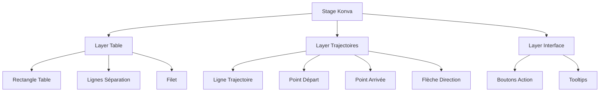

# Éditeur Canvas avec Konva.js

## 🎯 Vue d'ensemble

L'éditeur de canvas permet aux entraîneurs de **dessiner visuellement** les trajectoires de balle sur une table de tennis de table. Il utilise la bibliothèque **Konva.js** pour créer une interface interactive et intuitive.

## 🎨 Pourquoi Konva.js ?

### Avantages de Konva.js
- **Performance** : Rendu accéléré via Canvas 2D
- **Interactivité** : Drag & drop, événements souris/touch
- **Facilité** : API simple pour dessiner des formes
- **Mobile** : Support tactile natif

### Alternatives évaluées
- **SVG** : Plus lourd, moins performant pour animations
- **Canvas natif** : Trop bas niveau, beaucoup de code
- **Three.js** : Overkill pour de la 2D

## 🏗️ Architecture du canvas



### Structure des layers
```javascript
// Konva organise le contenu en layers (calques)
const stage = new Konva.Stage({
  container: 'canvas-container',
  width: 800,
  height: 450
})

// Layer 1 : Table (fond statique)
const tableLayer = new Konva.Layer()

// Layer 2 : Trajectoires (interactif)
const shotsLayer = new Konva.Layer()

// Layer 3 : Interface (boutons, tooltips)
const uiLayer = new Konva.Layer()

stage.add(tableLayer)
stage.add(shotsLayer)
stage.add(uiLayer)
```

## 🎾 Représentation de la table

### Dimensions réelles vs canvas
```javascript
// Dimensions réelles d'une table de tennis de table
const REAL_TABLE = {
  width: 274,   // cm
  height: 152.5 // cm
}

// Dimensions du canvas (ratio conservé)
const CANVAS = {
  width: 800,   // px
  height: 450   // px (800 * 152.5/274 ≈ 450)
}

// Fonctions de conversion
const realToCanvas = (realPos) => ({
  x: (realPos.x / REAL_TABLE.width) * CANVAS.width,
  y: (realPos.y / REAL_TABLE.height) * CANVAS.height
})

const canvasToReal = (canvasPos) => ({
  x: (canvasPos.x / CANVAS.width) * REAL_TABLE.width,
  y: (canvasPos.y / CANVAS.height) * REAL_TABLE.height
})
```

### Dessin de la table
```javascript
// Fonction pour créer la table
const createTable = () => {
  const group = new Konva.Group()
  
  // Fond de la table
  const table = new Konva.Rect({
    x: 0,
    y: 0,
    width: CANVAS.width,
    height: CANVAS.height,
    fill: '#1e3a8a',    // Bleu foncé
    stroke: 'white',
    strokeWidth: 3
  })
  
  // Ligne centrale (filet)
  const net = new Konva.Line({
    points: [CANVAS.width / 2, 0, CANVAS.width / 2, CANVAS.height],
    stroke: 'white',
    strokeWidth: 2,
    dash: [10, 5] // Ligne pointillée
  })
  
  // Lignes de côté
  const centerLine = new Konva.Line({
    points: [0, CANVAS.height / 2, CANVAS.width, CANVAS.height / 2],
    stroke: 'white',
    strokeWidth: 1,
    opacity: 0.5
  })
  
  group.add(table, net, centerLine)
  return group
}
```

## 🎯 Création de trajectoires

### Flux utilisateur
1. **Clic initial** → Début de trajectoire
2. **Drag** → Preview en temps réel  
3. **Release** → Ouverture modal propriétés
4. **Validation** → Sauvegarde du coup

### Code de gestion des événements
```javascript
// État pour la création de trajectoire
let isDrawing = false
let currentShot = null
let tempLine = null

// Initialisation des événements
const initCanvasEvents = () => {
  stage.on('mousedown', handleMouseDown)
  stage.on('mousemove', handleMouseMove)
  stage.on('mouseup', handleMouseUp)
}

// Début de création
const handleMouseDown = (e) => {
  if (e.target === stage || e.target.getClassName() === 'Rect') {
    isDrawing = true
    
    const pos = stage.getPointerPosition()
    
    // Créer une ligne temporaire
    tempLine = new Konva.Line({
      points: [pos.x, pos.y, pos.x, pos.y],
      stroke: '#3b82f6',
      strokeWidth: 3,
      dash: [10, 5]
    })
    
    shotsLayer.add(tempLine)
    shotsLayer.draw()
    
    // Initialiser le coup
    currentShot = {
      startPosition: canvasToReal(pos),
      endPosition: canvasToReal(pos),
      type: 'DRIVE', // Par défaut
      spin: 'NONE',
      speed: 'MEDIUM',
      playerSide: 'PLAYER'
    }
  }
}

// Prévisualisation pendant le drag
const handleMouseMove = (e) => {
  if (!isDrawing || !tempLine) return
  
  const pos = stage.getPointerPosition()
  const points = tempLine.points()
  
  // Mettre à jour le point final
  tempLine.points([points[0], points[1], pos.x, pos.y])
  shotsLayer.draw()
  
  // Mettre à jour l'objet coup
  currentShot.endPosition = canvasToReal(pos)
}

// Finalisation
const handleMouseUp = (e) => {
  if (!isDrawing) return
  
  isDrawing = false
  
  // Supprimer la ligne temporaire
  tempLine.destroy()
  shotsLayer.draw()
  
  // Vérifier la distance minimale
  const distance = calculateDistance(
    currentShot.startPosition, 
    currentShot.endPosition
  )
  
  if (distance < 10) { // Distance minimale en cm
    console.log('Trajectoire trop courte')
    return
  }
  
  // Ouvrir la modal de configuration
  openShotConfigModal(currentShot)
}
```

## 🏓 Types de coups

### Énumérations
```javascript
// Types de coups
export const SHOT_TYPES = {
  SERVE: { label: 'Service', color: '#10b981' },
  DRIVE: { label: 'Drive', color: '#3b82f6' },
  TOPSPIN: { label: 'Topspin', color: '#f59e0b' },
  BACKSPIN: { label: 'Backspin', color: '#ef4444' },
  SIDESPIN: { label: 'Sidespin', color: '#8b5cf6' },
  SMASH: { label: 'Smash', color: '#dc2626' },
  PUSH: { label: 'Poussette', color: '#6b7280' },
  BLOCK: { label: 'Bloc', color: '#374151' }
}

// Effets
export const SPIN_TYPES = {
  NONE: { label: 'Aucun', icon: '⚪' },
  TOPSPIN: { label: 'Lifté', icon: '🔄' },
  BACKSPIN: { label: 'Coupé', icon: '🔃' },
  SIDESPIN: { label: 'Latéral', icon: '↔️' }
}

// Vitesses
export const SPEED_LEVELS = {
  SLOW: { label: 'Lent', color: '#10b981', value: 1 },
  MEDIUM: { label: 'Moyen', color: '#f59e0b', value: 2 },
  FAST: { label: 'Rapide', color: '#ef4444', value: 3 }
}
```

### Rendu visuel des coups
```javascript
// Créer une trajectoire visuelle
const createShotVisual = (shot) => {
  const group = new Konva.Group()
  
  // Positions canvas
  const start = realToCanvas(shot.startPosition)
  const end = realToCanvas(shot.endPosition)
  
  // Ligne principale
  const line = new Konva.Line({
    points: [start.x, start.y, end.x, end.y],
    stroke: SHOT_TYPES[shot.type].color,
    strokeWidth: getStrokeWidth(shot.speed),
    lineCap: 'round'
  })
  
  // Point de départ
  const startPoint = new Konva.Circle({
    x: start.x,
    y: start.y,
    radius: 6,
    fill: '#ffffff',
    stroke: SHOT_TYPES[shot.type].color,
    strokeWidth: 2
  })
  
  // Flèche de direction
  const arrow = createArrow(start, end, shot)
  
  // Point d'arrivée avec effet
  const endPoint = new Konva.Circle({
    x: end.x,
    y: end.y,
    radius: 8,
    fill: SHOT_TYPES[shot.type].color,
    opacity: 0.8
  })
  
  // Indicateur d'effet (si présent)
  if (shot.spin !== 'NONE') {
    const spinIcon = new Konva.Text({
      x: end.x - 10,
      y: end.y - 25,
      text: SPIN_TYPES[shot.spin].icon,
      fontSize: 16,
      fill: '#ffffff'
    })
    group.add(spinIcon)
  }
  
  group.add(line, startPoint, endPoint, arrow)
  
  // Rendre interactif
  makeInteractive(group, shot)
  
  return group
}

// Calculer l'épaisseur selon la vitesse
const getStrokeWidth = (speed) => {
  switch (speed) {
    case 'SLOW': return 2
    case 'MEDIUM': return 3
    case 'FAST': return 4
    default: return 3
  }
}

// Créer une flèche
const createArrow = (start, end, shot) => {
  const angle = Math.atan2(end.y - start.y, end.x - start.x)
  const arrowLength = 15
  const arrowAngle = Math.PI / 6
  
  // Position de la flèche (au milieu de la ligne)
  const arrowX = start.x + (end.x - start.x) * 0.7
  const arrowY = start.y + (end.y - start.y) * 0.7
  
  // Points de la flèche
  const points = [
    arrowX, arrowY,
    arrowX - arrowLength * Math.cos(angle - arrowAngle),
    arrowY - arrowLength * Math.sin(angle - arrowAngle),
    arrowX, arrowY,
    arrowX - arrowLength * Math.cos(angle + arrowAngle),
    arrowY - arrowLength * Math.sin(angle + arrowAngle)
  ]
  
  return new Konva.Line({
    points,
    stroke: SHOT_TYPES[shot.type].color,
    strokeWidth: 2,
    lineCap: 'round',
    lineJoin: 'round'
  })
}
```

## ⚙️ Interactions avancées

### Sélection et modification
```javascript
// Rendre un coup interactif
const makeInteractive = (group, shot) => {
  group.on('click', () => {
    selectShot(shot)
  })
  
  group.on('dblclick', () => {
    editShot(shot)
  })
  
  // Hover effects
  group.on('mouseenter', () => {
    document.body.style.cursor = 'pointer'
    group.opacity(0.8)
    shotsLayer.draw()
  })
  
  group.on('mouseleave', () => {
    document.body.style.cursor = 'default'
    group.opacity(1)
    shotsLayer.draw()
  })
}

// Sélection visuelle
const selectShot = (shot) => {
  // Désélectionner les autres
  selectedShot.value = null
  
  // Sélectionner ce coup
  selectedShot.value = shot
  
  // Ajouter un indicateur visuel
  const positions = [
    realToCanvas(shot.startPosition),
    realToCanvas(shot.endPosition)
  ]
  
  // Créer un rectangle de sélection
  const bounds = getBounds(positions)
  const selection = new Konva.Rect({
    x: bounds.x - 10,
    y: bounds.y - 10,
    width: bounds.width + 20,
    height: bounds.height + 20,
    stroke: '#3b82f6',
    strokeWidth: 2,
    dash: [5, 5],
    fill: 'transparent'
  })
  
  // Ajouter au layer UI
  uiLayer.add(selection)
  uiLayer.draw()
  
  // Afficher les outils d'édition
  showEditingTools(shot)
}
```

### Drag & Drop de trajectoires
```javascript
// Permettre de déplacer une trajectoire
const makeDraggable = (group, shot) => {
  group.draggable(true)
  
  group.on('dragmove', () => {
    const pos = group.position()
    
    // Mettre à jour les positions du coup
    shot.startPosition = canvasToReal({
      x: shot.startPosition.x + pos.x,
      y: shot.startPosition.y + pos.y
    })
    
    shot.endPosition = canvasToReal({
      x: shot.endPosition.x + pos.x,
      y: shot.endPosition.y + pos.y
    })
    
    // Valider les limites
    constrainToTable(shot)
  })
  
  group.on('dragend', () => {
    // Sauvegarder les changements
    saveShot(shot)
  })
}

// S'assurer que la trajectoire reste sur la table
const constrainToTable = (shot) => {
  const maxX = REAL_TABLE.width
  const maxY = REAL_TABLE.height
  
  shot.startPosition.x = Math.max(0, Math.min(maxX, shot.startPosition.x))
  shot.startPosition.y = Math.max(0, Math.min(maxY, shot.startPosition.y))
  shot.endPosition.x = Math.max(0, Math.min(maxX, shot.endPosition.x))
  shot.endPosition.y = Math.max(0, Math.min(maxY, shot.endPosition.y))
}
```

## 🎛️ Interface utilisateur

### Barre d'outils
```vue
<template>
  <div class="canvas-toolbar">
    <!-- Mode de dessin -->
    <div class="tool-group">
      <button 
        v-for="mode in drawingModes"
        :key="mode.value"
        :class="{ active: currentMode === mode.value }"
        @click="setDrawingMode(mode.value)"
      >
        <i :class="mode.icon"></i>
        {{ mode.label }}
      </button>
    </div>
    
    <!-- Type de coup par défaut -->
    <div class="tool-group">
      <label>Type de coup :</label>
      <select v-model="defaultShotType">
        <option 
          v-for="(type, key) in SHOT_TYPES" 
          :key="key" 
          :value="key"
        >
          {{ type.label }}
        </option>
      </select>
    </div>
    
    <!-- Actions -->
    <div class="tool-group">
      <button @click="clearCanvas" class="btn-danger">
        <i class="icon-trash"></i>
        Effacer tout
      </button>
      
      <button @click="undoLastShot" :disabled="shots.length === 0">
        <i class="icon-undo"></i>
        Annuler
      </button>
      
      <button @click="saveExercise" class="btn-primary">
        <i class="icon-save"></i>
        Sauvegarder
      </button>
    </div>
  </div>
</template>
```

### Modal de configuration
```vue
<template>
  <div v-if="showShotConfig" class="modal-overlay">
    <div class="modal-content">
      <h3>Configuration du coup</h3>
      
      <!-- Type de coup -->
      <div class="form-group">
        <label>Type de coup</label>
        <div class="shot-type-grid">
          <button
            v-for="(type, key) in SHOT_TYPES"
            :key="key"
            :class="{ active: currentShot.type === key }"
            @click="currentShot.type = key"
            :style="{ borderColor: type.color }"
          >
            {{ type.label }}
          </button>
        </div>
      </div>
      
      <!-- Effet -->
      <div class="form-group">
        <label>Effet</label>
        <select v-model="currentShot.spin">
          <option v-for="(spin, key) in SPIN_TYPES" :key="key" :value="key">
            {{ spin.icon }} {{ spin.label }}
          </option>
        </select>
      </div>
      
      <!-- Vitesse -->
      <div class="form-group">
        <label>Vitesse</label>
        <div class="speed-slider">
          <input 
            type="range" 
            min="1" 
            max="3" 
            v-model="speedValue"
            @input="updateSpeed"
          >
          <span>{{ SPEED_LEVELS[currentShot.speed].label }}</span>
        </div>
      </div>
      
      <!-- Côté joueur -->
      <div class="form-group">
        <label>Côté</label>
        <div class="radio-group">
          <label>
            <input type="radio" v-model="currentShot.playerSide" value="PLAYER">
            Joueur
          </label>
          <label>
            <input type="radio" v-model="currentShot.playerSide" value="OPPONENT">
            Adversaire
          </label>
        </div>
      </div>
      
      <!-- Actions -->
      <div class="modal-actions">
        <button @click="cancelShot" class="btn-secondary">
          Annuler
        </button>
        <button @click="confirmShot" class="btn-primary">
          Valider
        </button>
      </div>
    </div>
  </div>
</template>
```

## 📱 Support mobile

### Événements tactiles
```javascript
// Ajouter le support tactile
const initTouchEvents = () => {
  // Remplacer mouse par touch
  stage.on('touchstart', handleMouseDown)
  stage.on('touchmove', handleMouseMove)
  stage.on('touchend', handleMouseUp)
  
  // Gérer le zoom pinch
  stage.on('touchmove', handlePinchZoom)
}

// Gérer le zoom sur mobile
const handlePinchZoom = (e) => {
  e.evt.preventDefault()
  
  if (e.evt.touches.length === 2) {
    const touch1 = e.evt.touches[0]
    const touch2 = e.evt.touches[1]
    
    const distance = Math.sqrt(
      Math.pow(touch2.clientX - touch1.clientX, 2) +
      Math.pow(touch2.clientY - touch1.clientY, 2)
    )
    
    // Calculer le zoom basé sur la distance
    const scale = distance / initialDistance
    stage.scale({ x: scale, y: scale })
    stage.draw()
  }
}
```

## 🔧 Optimisations

### Performance
```javascript
// Utiliser les transformations pour de meilleures performances
const optimizeLayer = (layer) => {
  // Cache le layer comme bitmap
  layer.cache()
  
  // Optimiser le rendu
  layer.listening(false) // Désactiver les événements si pas nécessaire
  
  // Utiliser des groupes pour organiser
  const staticGroup = new Konva.Group()
  const dynamicGroup = new Konva.Group()
  
  layer.add(staticGroup, dynamicGroup)
}

// Throttle des événements mousemove
const throttledMouseMove = throttle(handleMouseMove, 16) // 60fps

// Utiliser requestAnimationFrame pour les animations
const animateShot = (shot) => {
  const animate = () => {
    // Animation logic
    requestAnimationFrame(animate)
  }
  requestAnimationFrame(animate)
}
```

### Sauvegarde et chargement
```javascript
// Sérialiser l'état du canvas
const saveCanvas = () => {
  const canvasData = {
    shots: shots.value.map(shot => ({
      id: shot.id,
      startPosition: shot.startPosition,
      endPosition: shot.endPosition,
      type: shot.type,
      spin: shot.spin,
      speed: shot.speed,
      playerSide: shot.playerSide
    })),
    metadata: {
      version: '1.0',
      created: new Date().toISOString()
    }
  }
  
  return JSON.stringify(canvasData)
}

// Restaurer l'état du canvas
const loadCanvas = (jsonData) => {
  const data = JSON.parse(jsonData)
  
  // Vider le canvas
  shotsLayer.destroyChildren()
  
  // Recréer les coups
  data.shots.forEach(shotData => {
    const shot = createShotFromData(shotData)
    const visual = createShotVisual(shot)
    shotsLayer.add(visual)
  })
  
  shotsLayer.draw()
}
```

## ⚠️ Points d'attention

### Gestion mémoire
```javascript
// ⚠️ Toujours détruire les objets Konva non utilisés
const cleanupCanvas = () => {
  shotsLayer.destroyChildren()
  uiLayer.destroyChildren()
  stage.draw()
}

// ⚠️ Éviter les fuites mémoire avec les événements
const removeEventListeners = () => {
  stage.off('mousedown mousemove mouseup')
  stage.off('touchstart touchmove touchend')
}
```

### Validation des données
```javascript
// Valider les positions
const validateShot = (shot) => {
  const errors = []
  
  if (!shot.startPosition || !shot.endPosition) {
    errors.push('Positions manquantes')
  }
  
  if (shot.startPosition.x < 0 || shot.startPosition.x > REAL_TABLE.width) {
    errors.push('Position de départ hors table')
  }
  
  const distance = calculateDistance(shot.startPosition, shot.endPosition)
  if (distance < 5) {
    errors.push('Trajectoire trop courte')
  }
  
  return errors
}
```

## 🔗 Pour aller plus loin

- [[Creation-Exercice|Flux complet de création d'exercice]]
- [[CRUD-Operations|Opérations CRUD sur les exercices]]
- [Documentation Konva.js](https://konvajs.org/docs/)
- [Canvas API MDN](https://developer.mozilla.org/en-US/docs/Web/API/Canvas_API)

#konva #canvas #editor #interactive #tennis-table #2d-graphics