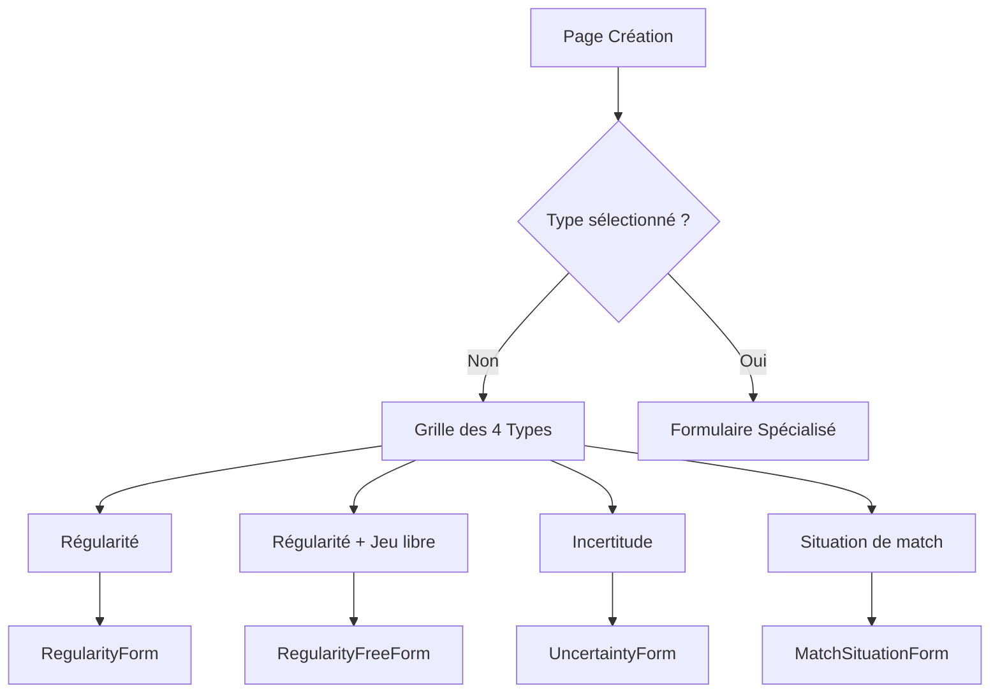

# Création d'Exercices par Type : Guide Complet

## 🎯 Vue d'ensemble

La création d'exercices TrainPing a été complètement refactorisée avec une approche **par type d'exercice**. Cette nouvelle approche simplifie drastiquement la création d'exercices en proposant des formulaires adaptés à chaque type spécifique.

## 🆚 Ancienne vs Nouvelle Approche

### ❌ Ancienne Approche (Complexe)
- Éditeur canvas unique pour tous types
- Dessin manuel obligatoire des trajectoires
- Interface complexe avec 2 colonnes
- Courbe d'apprentissage élevée pour les entraîneurs

### ✅ Nouvelle Approche (Simplifiée)
- **Sélection du type d'abord** : Choix guidé selon le besoin pédagogique
- **Formulaires spécialisés** : Interface adaptée à chaque type
- **Patterns prédéfinis** : Pas besoin de dessiner pour la plupart des cas
- **Création rapide** : Focus sur l'objectif pédagogique, pas la technique

## 🏗️ Architecture de la Nouvelle Interface

### Étape 1 : Sélection du Type



### Étape 2 : Formulaires Spécialisés

Chaque type d'exercice dispose de son propre composant de formulaire avec des champs spécifiques :

```vue
<!-- Structure générale -->
<template>
  <div class="space-y-6">
    <!-- Card informations de base -->
    <BaseInfoCard />
    
    <!-- Card spécifique au type -->
    <TypeSpecificCard />
    
    <!-- Card points techniques -->
    <KeyPointsCard />
    
    <!-- Résumé et validation -->
    <SummaryCard />
  </div>
</template>
```

## 📋 Types d'Exercices Disponibles

### 1. 🔄 Régularité

**Objectif** : Exercices avec schéma répétitif fixe

**Caractéristiques** :
- Pattern prédéfini (diagonal, parallèle, pivot, axe central)
- Nombre de balles par série
- Nombre de séries
- Vitesse de jeu configurable

**Formulaire spécialisé** :
```vue
<RegularityForm 
  @save="saveExercise"
  @cancel="selectedType = null"
/>
```

**Patterns disponibles** :
- **Diagonal** : CD sur CD ou R sur R
- **Parallèle** : CD sur R ou R sur CD  
- **Pivot** : Alterner CD et R du même côté
- **Axe central** : Jouer dans l'axe du corps

### 2. ✨ Régularité + Jeu libre

**Objectif** : Schéma de base + phase libre

**Caractéristiques** :
- Phase régulière (X balles)
- Puis jeu libre jusqu'au point
- Transition configurable

**Status** : En développement

### 3. ❓ Incertitude

**Objectif** : Adaptation du joueur selon la situation

**Caractéristiques** :
- Choix multiples selon la balle reçue
- Réactions variables
- Prise de décision

**Status** : En développement

### 4. 🏆 Situation de match

**Objectif** : Simulation de points réels

**Caractéristiques** :
- Services
- Retours
- Stratégies de jeu
- Scenarios tactiques

**Status** : En développement

## 🔧 Implémentation Technique

### Structure des Composants

```
src/views/
├── ExerciseEditorView.vue          # Page principale avec sélection
└── components/exercises/
    ├── RegularityForm.vue          # Formulaire régularité
    ├── RegularityPreview.vue       # Aperçu visuel
    ├── RegularityFreeForm.vue      # TODO: Régularité + libre
    ├── UncertaintyForm.vue         # TODO: Incertitude  
    └── MatchSituationForm.vue      # TODO: Situation match
```

### Page Principale (ExerciseEditorView.vue)

```vue
<template>
  <div class="min-h-screen bg-gray-50">
    <!-- Si aucun type sélectionné -->
    <div v-if="!selectedType" class="grid grid-cols-1 md:grid-cols-2 gap-6">
      <!-- Cards pour chaque type -->
      <TypeCard 
        v-for="type in exerciseTypes"
        :key="type.id"
        :type="type"
        @select="selectType"
      />
    </div>

    <!-- Si type sélectionné -->
    <div v-else>
      <!-- Breadcrumb de navigation -->
      <Breadcrumb @back="selectedType = null" />
      
      <!-- Formulaire selon le type -->
      <component 
        :is="getFormComponent(selectedType)"
        @save="saveExercise"
        @cancel="selectedType = null"
      />
    </div>
  </div>
</template>
```

### Formulaire Régularité Détaillé

#### Sections du Formulaire

1. **Informations de base**
   - Titre de l'exercice (obligatoire)
   - Objectif pédagogique
   - Nombre de balles par série
   - Nombre de séries
   - Niveau de difficulté

2. **Schéma de régularité**
   - Sélection du pattern visuel
   - Personnalisation selon le pattern
   - Aperçu en temps réel

3. **Points techniques**
   - Points clés à retenir
   - Suggestions contextuelles
   - Ajout/suppression dynamique

4. **Résumé automatique**
   - Total de balles
   - Durée estimée
   - Récapitulatif du schéma

#### Patterns avec Aperçu Visuel

```vue
<!-- RegularityPreview.vue -->
<template>
  <div class="relative w-full h-48 bg-gradient-to-br from-green-800 to-green-900 rounded-lg">
    <!-- Table simplifiée -->
    <svg class="absolute inset-0 w-full h-full" viewBox="0 0 100 100">
      <!-- Trajectoires animées selon le pattern -->
      <template v-if="pattern?.id === 'diagonal'">
        <line x1="20" y1="80" x2="80" y2="20" 
              stroke="#3b82f6" stroke-width="3" 
              marker-end="url(#arrowPlayer)" />
        <line x1="80" y1="20" x2="20" y2="80" 
              stroke="#f59e0b" stroke-width="2" 
              stroke-dasharray="4,2" />
      </template>
    </svg>
    
    <!-- Labels et informations -->
    <div class="absolute bottom-0 left-0 right-0 bg-gradient-to-t from-black">
      <!-- Détails du pattern -->
    </div>
  </div>
</template>
```

#### Validation et Sauvegarde

```javascript
// Validation en temps réel
const isValid = computed(() => 
  exercise.value.title && 
  exercise.value.patternId && 
  exercise.value.ballsPerSeries && 
  exercise.value.seriesCount &&
  exercise.value.difficulty
)

// Calcul automatique de durée
const estimatedDuration = computed(() => {
  const balls = totalBalls.value
  const speedMultiplier = {
    'SLOW': 2.5,
    'MEDIUM': 2,
    'FAST': 1.5
  }[exercise.value.speed] || 2
  
  const minutes = Math.ceil((balls * speedMultiplier) / 60)
  return `${minutes} min`
})

// Génération des shots pour compatibilité API
function generateShotsFromPattern() {
  const patterns = {
    'diagonal': [
      { startPosition: { x: 0.2, y: 0.8 }, endPosition: { x: 0.8, y: 0.2 }, type: 'DRIVE', playerSide: 'PLAYER' },
      { startPosition: { x: 0.8, y: 0.2 }, endPosition: { x: 0.2, y: 0.8 }, type: 'DRIVE', playerSide: 'OPPONENT' }
    ],
    // ... autres patterns
  }
  
  return patterns[exercise.value.patternId] || []
}
```

## 🎨 Design et UX

### Principes de Design

1. **Progressive Disclosure** : Afficher seulement ce qui est nécessaire à chaque étape
2. **Guided Experience** : Guider l'utilisateur étape par étape
3. **Visual Feedback** : Aperçu en temps réel des choix
4. **Smart Defaults** : Valeurs par défaut intelligentes

### Cards de Sélection des Types

```vue
<button class="p-6 bg-white rounded-xl border-2 border-gray-200 hover:border-blue-500 hover:shadow-lg transition-all text-left group">
  <div class="flex items-center justify-between mb-4">
    <div class="w-12 h-12 bg-blue-100 rounded-lg flex items-center justify-center">
      <ArrowPathIcon class="w-6 h-6 text-blue-600" />
    </div>
    <ArrowRightIcon class="w-5 h-5 text-gray-400 group-hover:text-blue-600" />
  </div>
  <h3 class="text-lg font-semibold text-gray-900 mb-2">Régularité</h3>
  <p class="text-sm text-gray-600">
    Exercice avec schéma répétitif fixe. Les joueurs répètent toujours les mêmes coups.
  </p>
  <p class="text-xs text-gray-500 mt-2">
    Ex: Coup droit diagonal en continu
  </p>
</button>
```

### Aperçu Visuel Animé

Les aperçus utilisent des **animations CSS** pour montrer le mouvement des balles :

```css
svg line {
  animation: drawLine 2s ease-in-out infinite;
}

@keyframes drawLine {
  0% {
    stroke-dasharray: 1000;
    stroke-dashoffset: 1000;
  }
  50% {
    stroke-dasharray: 1000;
    stroke-dashoffset: 0;
  }
  100% {
    stroke-dasharray: 1000;
    stroke-dashoffset: 0;
  }
}
```

## 📊 Avantages de cette Approche

### Pour les Entraîneurs

1. **Simplicité** : Pas besoin de maîtriser un éditeur complexe
2. **Rapidité** : Création d'exercice en 2-3 minutes
3. **Guidance** : Suggestions contextuelles et points techniques
4. **Professionnalisme** : Exercices bien structurés automatiquement

### Pour le Développement

1. **Modularité** : Chaque type = composant indépendant
2. **Extensibilité** : Facile d'ajouter de nouveaux types
3. **Maintenabilité** : Code plus simple et organisé
4. **Performance** : Chargement lazy des composants

### Pour les Joueurs

1. **Clarté** : Exercices bien définis avec objectifs clairs
2. **Progression** : Niveaux de difficulté adaptés
3. **Compréhension** : Points techniques explicites

## 🔄 Migration et Compatibilité

### Compatibilité avec l'API Existante

Les nouveaux exercices restent **100% compatibles** avec l'API existante grâce à la génération automatique des `shots` :

```javascript
// Ancien format conservé pour l'API
const exerciseData = {
  title: "Coup droit diagonal",
  description: "Exercice de régularité...",
  duration: 360, // calculé automatiquement
  shots: [
    { startPosition: {...}, endPosition: {...}, type: 'DRIVE', ... },
    // ... généré depuis le pattern
  ],
  // Nouvelles propriétés
  patternId: 'diagonal',
  ballsPerSeries: 30,
  seriesCount: 3
}
```

### Migration des Exercices Existants

Les exercices créés avec l'ancien système continuent de fonctionner normalement. Un système de migration pourra être ajouté ultérieurement pour les convertir au nouveau format.

## 🚀 Prochaines Étapes

### Types à Implémenter

1. **Régularité + Jeu libre** 
   - Formulaire avec transition configurable
   - Aperçu en 2 phases

2. **Incertitude**
   - Système de conditions/réactions
   - Arbre de décision visuel

3. **Situation de match**
   - Création de scénarios tactiques
   - Gestion des services/retours

### Améliorations Prévues

1. **Bibliothèque de patterns** : Plus de schémas prédéfinis
2. **Import/Export** : Partage d'exercices entre entraîneurs
3. **Templates collaboratifs** : Base de données communautaire
4. **Analytics** : Statistiques d'utilisation des patterns

## 🎯 Conclusion

Cette refonte transforme complètement l'expérience de création d'exercices :

- **Avant** : Interface complexe nécessitant formation
- **Maintenant** : Création intuitive en quelques clics

L'approche par type d'exercice correspond mieux aux **besoins réels des entraîneurs** et simplifie drastiquement le processus de création tout en maintenant la flexibilité nécessaire pour des exercices de qualité.

#vue #ux #tennis-table #exercices #patterns #régularité #simplification