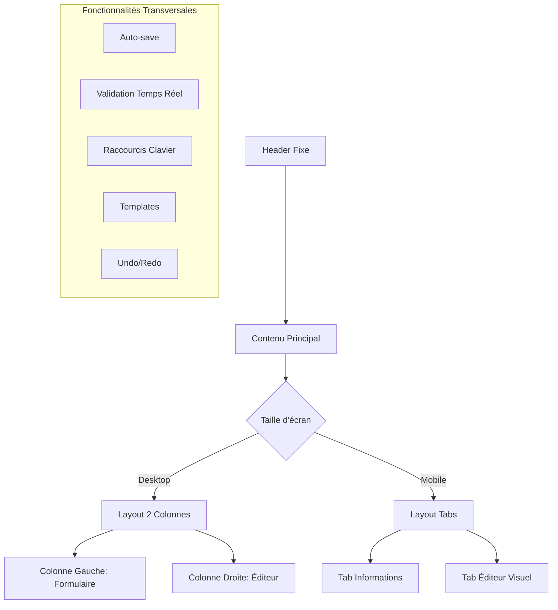

# Créateur d'Exercices Avancé : Guide Complet

## 🎯 Vue d'ensemble

Le créateur d'exercices de TrainPing a été complètement refondu pour offrir une expérience utilisateur moderne et intuitive. Cette page présente un design professionnel en 2 colonnes avec de nombreuses fonctionnalités avancées.

## 🏗️ Architecture de l'Interface

### Layout Responsive



### Composants Principaux

#### 1. Header Sticky avec Actions
```vue
<!-- Header toujours visible avec actions contextuelles -->
<div class="bg-white border-b border-gray-200 sticky top-16 z-40">
  <div class="flex items-center justify-between">
    <!-- Titre et description -->
    <div>
      <h1>{{ isEdit ? 'Modifier l'exercice' : 'Nouvel exercice' }}</h1>
      <p>Créez un exercice d'entraînement personnalisé</p>
    </div>
    
    <!-- Actions principales -->
    <div class="flex items-center space-x-3">
      <button @click="saveDraft">Sauvegarder brouillon</button>
      <button @click="saveExercise" :disabled="!isFormValid">
        Créer l'exercice
      </button>
    </div>
  </div>
</div>
```

#### 2. Formulaire Intelligent avec Validation
```vue
<!-- Validation en temps réel avec feedback visuel -->
<input
  v-model="form.title"
  :class="getTitleValidationClass()"
  maxlength="60"
/>
<div class="flex justify-between mt-1">
  <p class="text-xs text-gray-500">Soyez précis et descriptif</p>
  <span class="text-xs text-gray-400">{{ form.title.length }}/60</span>
</div>
```

#### 3. Éditeur Visuel Interactif
```vue
<!-- Canvas SVG avec table de ping-pong -->
<TableCanvas
  :shots="form.shots"
  @shot-added="addShot"
  @shot-updated="updateShot"
  @shot-removed="removeShot"
/>
```

## 🎨 Fonctionnalités UX Avancées

### 1. Validation en Temps Réel

La validation fournit un feedback immédiat pour chaque champ :

```javascript
// Validation intelligente du titre
const getTitleValidationClass = () => {
  if (!form.value.title) return showErrors.value ? 'border-red-500' : 'border-gray-300'
  if (form.value.title.length < 3) return 'border-red-500'
  return 'border-green-500' // ✅ Valide
}

// Validation globale du formulaire
const isFormValid = computed(() => {
  return form.value.title && 
         form.value.title.length >= 3 &&
         form.value.phase && 
         form.value.difficulty && 
         form.value.duration >= 30
})
```

### 2. Templates Prédéfinis

Accélérez la création avec des templates préconfigurés :

```javascript
const templates = ref([
  {
    id: 1,
    title: "Échauffement diagonal",
    phase: "WARM_UP",
    difficulty: "BEGINNER",
    duration: 180,
    description: "Échanges croisés pour échauffer les muscles",
    shots: [
      {
        startPosition: { x: 0.2, y: 0.7 },
        endPosition: { x: 0.8, y: 0.3 },
        type: 'DRIVE',
        spin: 'NONE',
        speed: 'MEDIUM'
      }
    ]
  }
])

// Application d'un template
const applyTemplate = (template) => {
  saveToHistory() // Sauvegarder pour undo
  form.value = { ...form.value, ...template }
  
  // Basculer vers l'éditeur sur mobile
  if (window.innerWidth < 1024) {
    activeTab.value = 'editor'
  }
}
```

### 3. Système Undo/Redo

Historique complet des modifications :

```javascript
// Gestion de l'historique
const history = ref([])
const historyIndex = ref(-1)

const saveToHistory = () => {
  const state = JSON.parse(JSON.stringify(form.value))
  history.value = history.value.slice(0, historyIndex.value + 1)
  history.value.push(state)
  historyIndex.value = history.value.length - 1
  
  // Limiter à 50 états
  if (history.value.length > 50) {
    history.value = history.value.slice(-50)
    historyIndex.value = history.value.length - 1
  }
}

const undo = () => {
  if (canUndo.value) {
    historyIndex.value--
    form.value = JSON.parse(JSON.stringify(history.value[historyIndex.value]))
  }
}
```

### 4. Auto-Save Intelligent

Sauvegarde automatique des brouillons :

```javascript
// Auto-save toutes les 30 secondes
const setupAutoSave = () => {
  autoSaveTimer = setInterval(() => {
    if (hasChanges.value && isFormValid.value) {
      saveDraft()
      hasChanges.value = false
    }
  }, 30000)
}

// Sauvegarde en localStorage
const saveDraft = async () => {
  const draftKey = isEdit.value ? `exercise_draft_${route.params.id}` : 'exercise_draft_new'
  localStorage.setItem(draftKey, JSON.stringify({
    ...form.value,
    savedAt: new Date().toISOString()
  }))
  
  showSuccess('Brouillon sauvegardé !')
}
```

### 5. Raccourcis Clavier

Navigation efficace avec raccourcis :

```javascript
const handleKeyboardShortcuts = (event) => {
  if (event.ctrlKey || event.metaKey) {
    switch (event.key) {
      case 'z':
        event.preventDefault()
        event.shiftKey ? redo() : undo()
        break
      case 'y':
        event.preventDefault()
        redo()
        break
      case 's':
        event.preventDefault()
        event.shiftKey ? saveDraft() : saveExercise()
        break
    }
  }
  
  if (event.key === 'Escape') {
    // Fermer tous les overlays
    showHelp.value = false
    showKeyboardShortcuts.value = false
  }
}
```

## 🎯 Éditeur Visuel Canvas avec Konva.js

### Nouveau Composant TableCanvas

L'éditeur a été **complètement refactorisé** avec Konva.js pour offrir une expérience de dessin fluide et interactive :

```vue
<template>
  <div class="relative">
    <!-- Canvas SVG responsive -->
    <svg
      class="w-full h-full cursor-crosshair"
      @mousedown="startDrawing"
      @mousemove="continueDrawing"
      @mouseup="endDrawing"
      style="aspect-ratio: 3/2;"
    >
      <!-- Table de ping-pong -->
      <rect width="100%" height="100%" fill="url(#tableGradient)" />
      
      <!-- Lignes de table -->
      <g stroke="#059669" stroke-width="2">
        <rect x="5%" y="15%" width="90%" height="70%" />
        <line x1="50%" y1="15%" x2="50%" y2="85%" />
        <line x1="5%" y1="50%" x2="95%" y2="50%" stroke-width="3" />
      </g>
      
      <!-- Trajectoires de tir -->
      <g v-for="(shot, index) in shots" :key="index">
        <path
          :d="generateShotPath(shot)"
          stroke="url(#shotGradient)"
          stroke-width="3"
          marker-end="url(#arrowhead)"
          @click="selectShot(index)"
        />
      </g>
    </svg>
    
    <!-- Panneau de détails des tirs -->
    <div v-if="selectedShot !== null" class="shot-details-panel">
      <!-- Configuration du tir sélectionné -->
    </div>
  </div>
</template>
```

### Gestion des Trajectoires

```javascript
// Créer une trajectoire de balle
const startDrawing = (event) => {
  const pos = getRelativePosition(event)
  
  // Vérifier les limites de la table
  if (pos.x < 0.05 || pos.x > 0.95 || pos.y < 0.15 || pos.y > 0.85) return
  
  isDrawing.value = true
  drawingStart.value = pos
}

const endDrawing = (event) => {
  if (!isDrawing.value) return
  
  const pos = getRelativePosition(event)
  const distance = Math.sqrt(
    Math.pow(pos.x - drawingStart.value.x, 2) + 
    Math.pow(pos.y - drawingStart.value.y, 2)
  )
  
  if (distance > 0.05) { // Distance minimum
    const newShot = {
      startPosition: { ...drawingStart.value },
      endPosition: { ...pos },
      type: 'DRIVE',
      spin: 'NONE',
      speed: 'MEDIUM',
      playerSide: 'PLAYER'
    }
    
    emit('shot-added', newShot)
  }
}

// Générer chemin SVG courbe
const generateShotPath = (shot) => {
  const startX = shot.startPosition.x * 100
  const startY = shot.startPosition.y * 100
  const endX = shot.endPosition.x * 100
  const endY = shot.endPosition.y * 100
  
  const midX = (startX + endX) / 2
  let midY = (startY + endY) / 2
  
  // Ajuster la courbe selon le type de tir
  switch (shot.type) {
    case 'TOPSPIN': midY -= 8; break
    case 'SMASH': midY += 3; break
    case 'SERVE': midY -= 5; break
    default: midY -= 3
  }
  
  return `M ${startX}% ${startY}% Q ${midX}% ${midY}% ${endX}% ${endY}%`
}
```

## 📱 Responsive Design

### Adaptation Mobile

```vue
<!-- Navigation par tabs sur mobile -->
<div class="lg:hidden mb-6">
  <div class="flex border-b border-gray-200">
    <button
      @click="activeTab = 'form'"
      :class="activeTab === 'form' ? 'border-blue-600 text-blue-600' : 'text-gray-600'"
    >
      📝 Informations
    </button>
    <button
      @click="activeTab = 'editor'"
      :class="activeTab === 'editor' ? 'border-blue-600 text-blue-600' : 'text-gray-600'"
    >
      🎨 Éditeur visuel
    </button>
  </div>
</div>

<!-- Barre d'actions flottante mobile -->
<div class="lg:hidden fixed bottom-0 left-0 right-0 bg-white border-t p-4">
  <div class="flex space-x-3">
    <button class="flex-1">Sauvegarder brouillon</button>
    <button class="flex-1">Créer l'exercice</button>
  </div>
</div>
```

## 🎛️ Composant ExercisePreview

Aperçu en temps réel de l'exercice :

```vue
<template>
  <div class="bg-gray-50 rounded-lg p-4">
    <!-- Header avec badges -->
    <div class="flex items-center justify-between mb-4">
      <h4>{{ exercise.title || 'Titre de l\'exercice' }}</h4>
      <div class="flex items-center space-x-2">
        <span :class="phaseColorClass">{{ phaseLabel }}</span>
        <span :class="difficultyColorClass">{{ difficultyLabel }}</span>
      </div>
    </div>
    
    <!-- Statistiques -->
    <div class="grid grid-cols-3 gap-4">
      <div class="bg-white rounded-lg p-3">
        <div class="text-lg font-semibold">{{ formatDuration(exercise.duration) }}</div>
        <div class="text-xs text-gray-500">Durée</div>
      </div>
      <div class="bg-white rounded-lg p-3">
        <div class="text-lg font-semibold">{{ exercise.repetitions || 1 }}</div>
        <div class="text-xs text-gray-500">Répétitions</div>
      </div>
      <div class="bg-white rounded-lg p-3">
        <div class="text-lg font-semibold">{{ exercise.shots?.length || 0 }}</div>
        <div class="text-xs text-gray-500">Trajectoires</div>
      </div>
    </div>
    
    <!-- Résumé des trajectoires -->
    <div v-if="exercise.shots?.length > 0">
      <h5>Trajectoires</h5>
      <div class="space-y-1">
        <div v-for="(shot, index) in exercise.shots" :key="index">
          {{ index + 1 }}. {{ getShotTypeLabel(shot.type) }}
          <span>{{ getShotSpinLabel(shot.spin) }} • {{ getShotSpeedLabel(shot.speed) }}</span>
        </div>
      </div>
    </div>
  </div>
</template>
```

## 🎯 États et Feedback

### Messages de Succès

```vue
<!-- Toast de confirmation animé -->
<Transition name="slide-up">
  <div v-if="showSuccess" class="fixed bottom-4 right-4 bg-green-50 border border-green-200 rounded-lg p-4 shadow-lg">
    <div class="flex items-center">
      <CheckCircleIcon class="w-5 h-5 text-green-600 mr-2" />
      <p class="text-sm text-green-800">{{ successMessage }}</p>
    </div>
  </div>
</Transition>
```

### Aide Contextuelle

```vue
<!-- Bulle d'aide avec raccourcis clavier -->
<div v-if="showHelp" class="fixed bottom-4 left-4 bg-white rounded-lg shadow-xl p-4 w-80">
  <h4 class="font-semibold mb-3">Aide rapide</h4>
  <ul class="text-sm text-gray-600 space-y-1">
    <li>• Cliquez et glissez pour créer une trajectoire</li>
    <li>• Double-clic pour éditer une trajectoire</li>
    <li>• Suppr pour effacer la sélection</li>
    <li>• Ctrl+Z pour annuler</li>
    <li>• Ctrl+S pour sauvegarder</li>
  </ul>
</div>
```

## 🔧 Intégration avec l'Écosystème

### Store Pinia

```javascript
// Store exercises avec nouvelles méthodes
export const useExerciseStore = defineStore('exercises', () => {
  // ... état existant
  
  // Nouvelles méthodes pour les brouillons
  const saveDraft = async (exerciseData) => {
    // Sauvegarder en local et optionnellement sur serveur
  }
  
  const loadDraft = (draftKey) => {
    // Charger depuis localStorage
  }
  
  const validateExercise = (exercise) => {
    // Validation côté client
  }
})
```

### Router Integration

```javascript
// Navigation avec protection contre la perte de données
beforeRouteLeave((to, from, next) => {
  if (hasChanges.value) {
    const answer = window.confirm('Vous avez des modifications non sauvegardées. Voulez-vous vraiment quitter ?')
    if (answer) {
      next()
    } else {
      next(false)
    }
  } else {
    next()
  }
})
```

## 📊 Performance et Optimisations

### Lazy Loading des Composants

```javascript
// Chargement différé des composants lourds
const TableCanvas = defineAsyncComponent(() => import('../components/exercises/TableCanvas.vue'))
const ExercisePreview = defineAsyncComponent(() => import('../components/exercises/ExercisePreview.vue'))
```

### Debounce pour Auto-Save

```javascript
import { debounce } from 'lodash-es'

// Auto-save optimisé avec debounce
const debouncedSave = debounce(() => {
  if (hasChanges.value && isFormValid.value) {
    saveDraft()
  }
}, 5000) // 5 secondes après la dernière modification

watch(form, debouncedSave, { deep: true })
```

## 🎯 Points Clés de l'Amélioration

1. **UX Moderne** : Interface en 2 colonnes, validation temps réel, feedback visuel
2. **Productivité** : Templates, auto-save, raccourcis clavier, undo/redo
3. **Responsive** : Adaptation parfaite mobile avec navigation par tabs
4. **Performance** : SVG pour le canvas, lazy loading, debounce
5. **Accessibilité** : Navigation clavier, ARIA labels, contrastes
6. **Polish** : Animations fluides, transitions, micro-interactions

Cette refonte transforme complètement l'expérience de création d'exercices, la rendant intuitive, efficace et agréable à utiliser ! 🚀

#vue #ux #canvas #svg #responsive #templates #autosave #validation