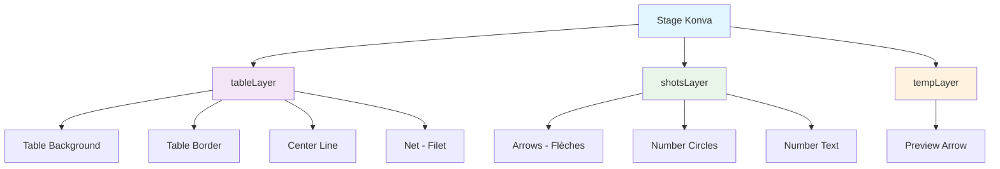

# Éditeur Canvas Konva.js : Guide Complet

## 🎯 Vue d'ensemble

L'éditeur de trajectoires TrainPing utilise **Konva.js**, une puissante bibliothèque 2D Canvas pour créer des interfaces interactives performantes. Ce guide explique l'architecture et l'utilisation de l'éditeur.

## 🏗️ Architecture Konva

### Structure en Couches



### Initialisation du Canvas

```javascript
// Structure du composant TableCanvas.vue
const initCanvas = () => {
  // 1. Créer le stage principal
  stage = new Konva.Stage({
    container: canvasContainer.value,
    width: containerWidth,
    height: 450
  })

  // 2. Créer les 3 couches
  tableLayer = new Konva.Layer()   // Table statique
  shotsLayer = new Konva.Layer()   // Trajectoires
  tempLayer = new Konva.Layer()    // Preview temporaire

  // 3. Ajouter les couches au stage
  stage.add(tableLayer)
  stage.add(shotsLayer) 
  stage.add(tempLayer)

  // 4. Dessiner la table
  drawTable()

  // 5. Configurer les événements
  setupEventListeners()
}
```

## 🎨 Dessin de la Table

### Table de Ping-Pong Réaliste

```javascript
const drawTable = () => {
  const width = stage.width()
  const height = stage.height()
  
  // 🟢 Fond de table (vert)
  const tableBackground = new Konva.Rect({
    x: 0, y: 0,
    width: width, height: height,
    fill: '#10b981', // emerald-500
    stroke: '#047857', // emerald-700
    strokeWidth: 4
  })
  
  // 📦 Bordures de table
  const tableBorder = new Konva.Rect({
    x: width * 0.05,     // 5% de marge
    y: height * 0.15,    // 15% de marge haut/bas
    width: width * 0.9,  // 90% de largeur
    height: height * 0.7, // 70% de hauteur
    fill: 'transparent',
    stroke: '#065f46',   // emerald-800
    strokeWidth: 3
  })

  // ➗ Ligne centrale
  const centerLine = new Konva.Line({
    points: [width * 0.5, height * 0.15, width * 0.5, height * 0.85],
    stroke: '#065f46',
    strokeWidth: 2
  })

  // 🏐 Filet amélioré (plus visible)
  const net = new Konva.Line({
    points: [width * 0.05, height * 0.5, width * 0.95, height * 0.5],
    stroke: '#ffffff',    // ✨ Blanc pour la visibilité
    strokeWidth: 6,       // ✨ Plus épais
    dash: [10, 5]        // ✨ Style pointillé
  })

  // Ajouter à la couche table
  tableLayer.add(tableBackground)
  tableLayer.add(tableBorder)
  tableLayer.add(centerLine)
  tableLayer.add(net)
  tableLayer.draw()
}
```

## 🖱️ Interaction de Dessin

### Système Drag & Drop

```javascript
// État du dessin
const isDrawing = ref(false)
const startPoint = ref(null)
const previewArrow = ref(null)

const setupEventListeners = () => {
  // 🖱️ MouseDown - Début de trajectoire
  stage.on('mousedown touchstart', (e) => {
    if (e.target !== stage) return // Seulement sur espace vide
    
    const pos = stage.getPointerPosition()
    const normalizedPos = {
      x: pos.x / stage.width(),   // Position normalisée 0-1
      y: pos.y / stage.height()
    }
    
    // Vérifier les limites de table
    if (normalizedPos.x < 0.05 || normalizedPos.x > 0.95 || 
        normalizedPos.y < 0.15 || normalizedPos.y > 0.85) return
    
    isDrawing.value = true
    startPoint.value = normalizedPos
  })

  // 🖱️ MouseMove - Preview en temps réel
  stage.on('mousemove touchmove', (e) => {
    if (!isDrawing.value || !startPoint.value) return
    
    const pos = stage.getPointerPosition()
    const normalizedPos = {
      x: pos.x / stage.width(),
      y: pos.y / stage.height()
    }
    
    // Mettre à jour la flèche de preview
    updatePreviewArrow(startPoint.value, normalizedPos)
  })

  // 🖱️ MouseUp - Créer la trajectoire
  stage.on('mouseup touchend', (e) => {
    if (!isDrawing.value || !startPoint.value) return
    
    const pos = stage.getPointerPosition()
    const normalizedPos = {
      x: pos.x / stage.width(),
      y: pos.y / stage.height()
    }
    
    // Vérifier distance minimum
    const distance = Math.sqrt(
      Math.pow(normalizedPos.x - startPoint.value.x, 2) + 
      Math.pow(normalizedPos.y - startPoint.value.y, 2)
    )
    
    if (distance > 0.05) { // Distance minimum
      // ✅ Créer nouveau coup
      const newShot = {
        startPosition: { ...startPoint.value },
        endPosition: { ...normalizedPos },
        type: 'DRIVE',
        spin: 'NONE',
        speed: 'MEDIUM',
        playerSide: 'PLAYER'
      }
      
      emit('shot-added', newShot)
    }
    
    // Nettoyer
    isDrawing.value = false
    startPoint.value = null
    clearPreview()
  })
}
```

## 🏹 Création des Flèches

### Flèches avec Pointes

```javascript
// Créer une flèche avec pointe
const createArrow = (start, end, color, strokeWidth = 4, isDashed = false) => {
  const width = stage.width()
  const height = stage.height()
  
  // Convertir coordonnées normalisées en pixels
  const startX = start.x * width
  const startY = start.y * height
  const endX = end.x * width
  const endY = end.y * height
  
  // 📐 Calculer l'angle et la pointe
  const headlen = 15 // Longueur de la pointe
  const angle = Math.atan2(endY - startY, endX - startX)
  
  // 🎯 Points de la flèche (ligne + pointe)
  const arrowPoints = [
    startX, startY,                                                    // Début
    endX, endY,                                                       // Fin
    endX - headlen * Math.cos(angle - Math.PI / 6), endY - headlen * Math.sin(angle - Math.PI / 6), // Pointe gauche
    endX, endY,                                                       // Retour fin
    endX - headlen * Math.cos(angle + Math.PI / 6), endY - headlen * Math.sin(angle + Math.PI / 6)  // Pointe droite
  ]
  
  return new Konva.Line({
    points: arrowPoints,
    fill: color,
    stroke: color,
    strokeWidth: strokeWidth,
    lineCap: 'round',
    lineJoin: 'round',
    dash: isDashed ? [8, 4] : undefined // Preview pointillé
  })
}
```

## 🔢 Numéros sur Trajectoires

### Cercles Numérotés

```javascript
const renderShots = () => {
  shotsLayer.removeChildren()
  
  props.shots.forEach((shot, index) => {
    // 🎨 Couleur selon le joueur
    const color = shot.playerSide === 'PLAYER' ? '#3b82f6' : '#ea580c' // bleu ou orange
    
    // 🏹 Créer la flèche
    const arrow = createArrow(shot.startPosition, shot.endPosition, color)
    
    // ✨ Effets au survol
    arrow.on('mouseenter', () => {
      arrow.strokeWidth(6) // Plus épais au survol
      stage.container().style.cursor = 'pointer'
      shotsLayer.draw()
    })
    
    arrow.on('mouseleave', () => {
      arrow.strokeWidth(4) // Retour normal
      stage.container().style.cursor = 'default'
      shotsLayer.draw()
    })
    
    // 🖱️ Clic pour sélectionner
    arrow.on('click tap', () => selectShot(index))
    
    shotsLayer.add(arrow)
    
    // 🔢 Cercle numéroté au MILIEU de la trajectoire
    const midX = (shot.startPosition.x + shot.endPosition.x) / 2 * stage.width()
    const midY = (shot.startPosition.y + shot.endPosition.y) / 2 * stage.height()
    
    // ⚪ Cercle blanc avec bordure colorée
    const circle = new Konva.Circle({
      x: midX,
      y: midY,
      radius: 16,
      fill: '#ffffff',      // Fond blanc
      stroke: color,        // Bordure colorée (bleu/orange)
      strokeWidth: 3
    })
    
    // 🔤 Texte du numéro
    const text = new Konva.Text({
      x: midX,
      y: midY,
      text: (index + 1).toString(), // Numéro 1, 2, 3...
      fontSize: 14,
      fontFamily: 'Arial',
      fontStyle: 'bold',    // ✨ Gras
      fill: color,          // Couleur du joueur
      align: 'center',
      verticalAlign: 'middle',
      offsetX: 6,           // Centrage horizontal
      offsetY: 7            // Centrage vertical
    })
    
    // 🖱️ Clic sur le numéro aussi
    circle.on('click tap', () => selectShot(index))
    text.on('click tap', () => selectShot(index))
    
    shotsLayer.add(circle)
    shotsLayer.add(text)
  })
  
  shotsLayer.draw()
}
```

## 📝 Panneau Latéral

### Liste des Trajectoires

```vue
<!-- Liste interactive des coups -->
<div class="space-y-2 max-h-96 overflow-y-auto">
  <div 
    v-for="(shot, index) in shots" 
    :key="index"
    @click="selectShot(index)"
    :class="[
      'flex items-center space-x-3 p-3 rounded-lg cursor-pointer transition-colors',
      selectedShotIndex === index ? 'bg-blue-50 border border-blue-200' : 'hover:bg-gray-50'
    ]"
  >
    <!-- 🔢 Cercle numéroté (même style que canvas) -->
    <div 
      :class="[
        'w-8 h-8 rounded-full flex items-center justify-center text-sm font-bold',
        shot.playerSide === 'PLAYER' 
          ? 'bg-blue-100 text-blue-600 border-2 border-blue-300' 
          : 'bg-orange-100 text-orange-600 border-2 border-orange-300'
      ]"
    >
      {{ index + 1 }}
    </div>

    <!-- 📋 Détails du coup -->
    <div class="flex-1 min-w-0">
      <p class="text-sm font-medium text-gray-900 truncate">
        {{ getShotTypeLabel(shot.type) }} • {{ getShotSpinLabel(shot.spin) }} • {{ getShotSpeedLabel(shot.speed) }}
      </p>
      <p class="text-xs text-gray-500">
        {{ shot.playerSide === 'PLAYER' ? '🟦 Joueur' : '🟧 Adversaire' }}
      </p>
    </div>

    <!-- 🗑️ Bouton supprimer -->
    <button 
      @click.stop="removeShot(index)"
      class="p-1 text-red-500 hover:text-red-700 hover:bg-red-50 rounded"
    >
      🗑️
    </button>
  </div>
</div>
```

## ➕ Ajout Manuel de Trajectoires

### Logique Réaliste Tennis de Table

#### 9 Directions Réalistes (3x3 Grille)

```javascript
// 9 directions réalistes : 3 zones (Revers/Milieu/Coup droit) × 3 profondeurs (court/normal/long)
const tableDirections = [
  // REVERS (côté gauche - x: 0.2 à 0.4)
  { id: 'backhand-short', label: 'R Court', zone: 'revers', x: 0.3, depth: 0.3 },
  { id: 'backhand-normal', label: 'R Normal', zone: 'revers', x: 0.3, depth: 0.5 },
  { id: 'backhand-long', label: 'R Long', zone: 'revers', x: 0.3, depth: 0.7 },
  
  // MILIEU (centre - x: 0.4 à 0.6)
  { id: 'middle-short', label: 'M Court', zone: 'milieu', x: 0.5, depth: 0.3 },
  { id: 'middle-normal', label: 'M Normal', zone: 'milieu', x: 0.5, depth: 0.5 },
  { id: 'middle-long', label: 'M Long', zone: 'milieu', x: 0.5, depth: 0.7 },
  
  // COUP DROIT (côté droit - x: 0.6 à 0.8)
  { id: 'forehand-short', label: 'CD Court', zone: 'coup-droit', x: 0.7, depth: 0.3 },
  { id: 'forehand-normal', label: 'CD Normal', zone: 'coup-droit', x: 0.7, depth: 0.5 },
  { id: 'forehand-long', label: 'CD Long', zone: 'coup-droit', x: 0.7, depth: 0.7 }
]
```

#### Interface 3x3 dans le Template

```vue
<!-- Grille 3x3 pour les directions -->
<div class="grid grid-cols-3 gap-1 p-2 bg-gray-50 rounded">
  <!-- Ligne 1: Court -->
  <button @click="selectTableDirection('backhand-short')">R Court</button>
  <button @click="selectTableDirection('middle-short')">M Court</button>
  <button @click="selectTableDirection('forehand-short')">CD Court</button>
  
  <!-- Ligne 2: Normal -->
  <button @click="selectTableDirection('backhand-normal')">R Normal</button>
  <button @click="selectTableDirection('middle-normal')">M Normal</button>
  <button @click="selectTableDirection('forehand-normal')">CD Normal</button>
  
  <!-- Ligne 3: Long -->
  <button @click="selectTableDirection('backhand-long')">R Long</button>
  <button @click="selectTableDirection('middle-long')">M Long</button>
  <button @click="selectTableDirection('forehand-long')">CD Long</button>
</div>
<div class="text-xs text-gray-500 mt-1 px-1">
  R=Revers, M=Milieu, CD=Coup droit
</div>
```

#### Logique Réaliste des Trajectoires

```javascript
// Créer un coup réaliste selon la logique tennis de table
const createRealisticShot = (start, end, isPlayerTurn) => {
  // Ajuster les positions selon le joueur
  let startPos, endPos
  
  if (isPlayerTurn) {
    // Joueur frappe : du bas vers le haut
    startPos = { x: start.x, y: Math.max(start.y, 0.6) } // Assurer qu'on part du bas
    endPos = { x: end.x, y: Math.min(end.y, 0.4) } // Assurer qu'on arrive en haut
  } else {
    // Adversaire frappe : du haut vers le bas
    startPos = { x: start.x, y: Math.min(start.y, 0.4) } // Assurer qu'on part du haut
    endPos = { x: end.x, y: Math.max(end.y, 0.6) } // Assurer qu'on arrive en bas
  }
  
  return {
    startPosition: startPos,
    endPosition: endPos,
    type: 'DRIVE',
    spin: 'NONE',
    speed: 'MEDIUM',
    playerSide: isPlayerTurn ? 'PLAYER' : 'OPPONENT'
  }
}

// Enchaînement logique des coups
const calculateShotPositions = (directionId, playerSide, previousShot = null) => {
  const direction = tableDirections.find(d => d.id === directionId)
  if (!direction) return null
  
  let startPos, endPos
  
  // Position de départ
  if (previousShot) {
    // ✨ Continuer depuis la fin du coup précédent
    startPos = { ...previousShot.endPosition }
  } else {
    // Premier coup : milieu de notre côté
    startPos = { x: 0.5, y: playerSide === 'PLAYER' ? 0.8 : 0.2 }
  }
  
  // Position d'arrivée selon la direction et le joueur
  if (playerSide === 'PLAYER') {
    // Joueur frappe vers le haut (adversaire)
    endPos = {
      x: direction.x,
      y: 0.15 + (1 - direction.depth) * 0.35 // Plus c'est profond, plus c'est vers le haut
    }
  } else {
    // Adversaire frappe vers le bas (joueur)
    endPos = {
      x: direction.x,
      y: 0.5 + direction.depth * 0.35 // Plus c'est profond, plus c'est vers le bas
    }
  }
  
  return { startPos, endPos }
}

// Alternance automatique
const addManualShot = () => {
  if (!selectedDirectionId.value) return
  
  // ✨ Déterminer le joueur selon l'alternance
  const isPlayerTurn = props.shots.length % 2 === 0
  const playerSide = isPlayerTurn ? 'PLAYER' : 'OPPONENT'
  
  // ✨ Calculer les positions avec enchaînement logique
  const previousShot = props.shots.length > 0 ? props.shots[props.shots.length - 1] : null
  const positions = calculateShotPositions(selectedDirectionId.value, playerSide, previousShot)
  
  if (!positions) return
  
  const newShot = {
    startPosition: positions.startPos,
    endPosition: positions.endPos,
    type: manualShot.value.type,
    spin: manualShot.value.spin,
    speed: manualShot.value.speed,
    playerSide: playerSide // ✨ Alternance automatique
  }
  
  emit('shot-added', newShot)
  resetManualForm()
}
```

#### Indicateur d'Alternance

```vue
<!-- Info alternance automatique -->
<div class="p-3 bg-blue-50 rounded-lg border border-blue-200">
  <div class="flex items-center space-x-2">
    <div class="w-3 h-3 bg-blue-500 rounded-full animate-pulse"></div>
    <p class="text-xs text-blue-700">
      <strong>Alternance automatique :</strong> 
      {{ props.shots.length % 2 === 0 ? '🟦 Joueur' : '🟧 Adversaire' }} à jouer
    </p>
  </div>
</div>
```

## ⌨️ Raccourcis Clavier

### Navigation Efficace

```javascript
const handleKeyDown = (event) => {
  // 🗑️ Delete - Supprimer trajectoire sélectionnée
  if (event.key === 'Delete' && selectedShotIndex.value !== null) {
    removeShot(selectedShotIndex.value)
  }
  
  // ❌ Escape - Désélectionner / Fermer formulaires
  if (event.key === 'Escape') {
    selectedShotIndex.value = null
    showManualForm.value = false
  }
}
```

## 🎯 Fonctionnalités Principales

### ✅ Ce qui Fonctionne

1. **✏️ Dessin fluide** : Cliquez et glissez pour créer des trajectoires
2. **👀 Preview temps réel** : Flèche pointillée pendant le dessin
3. **🔢 Numérotation automatique** : Cercles blancs avec numéros colorés
4. **🎨 Couleurs par joueur** : Bleu pour joueur, orange pour adversaire
5. **📝 Panneau latéral** : Liste interactive des coups avec détails
6. **🎯 Logique réaliste** : Trajectoires respectant la physique du tennis de table
7. **🔄 Enchaînement logique** : Position de fin = position de début du coup suivant
8. **🏓 9 directions réalistes** : Grille 3x3 (Revers/Milieu/Coup droit × Court/Normal/Long)
9. **⚡ Alternance automatique** : Joueur/Adversaire automatique selon l'ordre
10. **✨ Interactivité** : Hover, sélection, édition des propriétés
11. **🗑️ Suppression** : Clic sur poubelle ou touche Delete
12. **📱 Responsive** : Layout adaptatif desktop/mobile
13. **⌨️ Raccourcis** : Delete, Escape pour navigation rapide

### 🎛️ Propriétés Configurables

- **Type de coup** : Service, Drive, Revers, Top spin, Back spin, Smash, Poussette, Bloc
- **Effet** : Sans effet, Lifté, Coupé, Latéral  
- **Vitesse** : Lent, Moyen, Rapide
- **Joueur** : Joueur (bleu) ou Adversaire (orange)

## 🚀 Performance et Optimisations

### Konva.js Avantages

1. **🎯 Rendu optimisé** : Canvas natif performant
2. **📱 Touch support** : Fonctionne sur mobile/tablette
3. **🎨 Layers séparées** : Redessins optimisés par couche
4. **⚡ Event handling** : Système d'événements robuste
5. **📏 Responsive** : Redimensionnement automatique

### Gestion Mémoire

```javascript
// Nettoyage à la destruction du composant
onUnmounted(() => {
  document.removeEventListener('keydown', handleKeyDown)
  if (stage) {
    stage.destroy() // ✨ Libérer les ressources Konva
  }
})
```

## 📊 Structure des Données

### Format des Trajectoires

```javascript
// Structure d'un shot/trajectoire
const shot = {
  startPosition: { x: 0.2, y: 0.7 },    // Position normalisée 0-1
  endPosition: { x: 0.8, y: 0.3 },      // Position normalisée 0-1
  type: 'DRIVE',                         // Type de coup
  spin: 'TOPSPIN',                       // Type d'effet
  speed: 'MEDIUM',                       // Vitesse
  playerSide: 'PLAYER'                   // Joueur ou adversaire
}
```

L'éditeur Canvas est maintenant **entièrement fonctionnel** avec une expérience utilisateur fluide et intuitive ! 🎉

#konva #canvas #vue #tennis-table #interactive #drawing