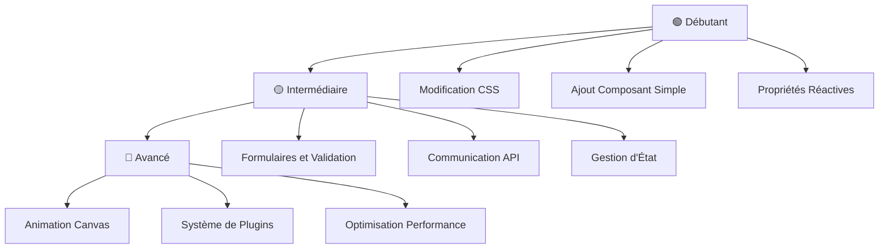

# Exercices Pratiques pour Apprendre

## 🎯 Objectif de cette Section

Cette section contient des **exercices pratiques progressifs** pour maîtriser Vue.js et Node.js en travaillant sur TrainPing. Chaque exercice est conçu pour vous faire manipuler du code réel et comprendre les concepts en profondeur.

## 📚 Avant de Commencer

### Prérequis
- [ ] Avoir lu [[00-Fundamentals/Web-Development-Basics|Les Fondamentaux]]
- [ ] Application TrainPing installée et fonctionnelle
- [ ] VS Code avec les extensions Vue et Tailwind

### Organisation des Exercices



---

## 🟢 Niveau Débutant

### Exercice 1 : Personnaliser l'Apparence

**Objectif** : Comprendre CSS, Tailwind et la structure des composants

#### 1.1 Changer les Couleurs du Thème

**Mission** : Transformer TrainPing en thème vert au lieu de bleu

```vue
<!-- Fichier à modifier : src/components/sessions/SessionCard.vue -->

<!-- 🎯 AVANT (bleu) -->
<button class="bg-blue-600 text-white hover:bg-blue-700">
  Démarrer
</button>

<!-- ✅ APRÈS (vert) - À vous de jouer ! -->
<button class="bg-green-600 text-white hover:bg-green-700">
  Démarrer
</button>
```

**Étapes** :
1. Ouvrir `tailwind.config.js`
2. Remplacer les couleurs primary par du vert :
```javascript
// tailwind.config.js
colors: {
  primary: {
    50: '#f0fdf4',
    100: '#dcfce7', 
    500: '#22c55e',  // Vert principal
    600: '#16a34a',
    700: '#15803d',
    // ...
  }
}
```

3. Redémarrer l'application et observer les changements

**Questions de Réflexion** :
- Où sont utilisées les classes `bg-blue-*` dans l'application ?
- Comment Tailwind compile-t-il les couleurs personnalisées ?
- Quelle est la différence entre `bg-green-600` et `bg-primary-600` ?

#### 1.2 Créer un Mode Sombre

**Mission** : Ajouter un toggle pour basculer en mode sombre

```vue
<!-- Composant à créer : src/components/ThemeToggle.vue -->
<template>
  <button 
    @click="toggleTheme"
    class="p-2 rounded-lg transition-colors"
    :class="isDark ? 'bg-gray-800 text-yellow-400' : 'bg-gray-100 text-gray-600'"
  >
    <SunIcon v-if="isDark" class="w-5 h-5" />
    <MoonIcon v-else class="w-5 h-5" />
  </button>
</template>

<script setup>
import { ref, onMounted } from 'vue'
import { SunIcon, MoonIcon } from '@heroicons/vue/24/outline'

const isDark = ref(false)

const toggleTheme = () => {
  isDark.value = !isDark.value
  
  if (isDark.value) {
    document.documentElement.classList.add('dark')
    localStorage.setItem('theme', 'dark')
  } else {
    document.documentElement.classList.remove('dark')
    localStorage.setItem('theme', 'light')
  }
}

onMounted(() => {
  const savedTheme = localStorage.getItem('theme')
  isDark.value = savedTheme === 'dark'
  
  if (isDark.value) {
    document.documentElement.classList.add('dark')
  }
})
</script>
```

**À Compléter** :
1. Ajouter le composant dans `App.vue`
2. Ajouter les classes dark: dans `SessionCard.vue`
3. Tester le basculement de thème

#### 1.3 Animation de Chargement

**Mission** : Créer un spinner de chargement réutilisable

```vue
<!-- Composant à créer : src/components/ui/LoadingSpinner.vue -->
<template>
  <div class="flex items-center justify-center" :class="containerClass">
    <div 
      class="animate-spin rounded-full border-2 border-gray-300"
      :class="spinnerClass"
      :style="{ 
        borderTopColor: color,
        width: size + 'px', 
        height: size + 'px' 
      }"
    ></div>
    <span v-if="text" class="ml-3 text-gray-600">{{ text }}</span>
  </div>
</template>

<script setup>
import { computed } from 'vue'

const props = defineProps({
  size: {
    type: Number,
    default: 32
  },
  color: {
    type: String,
    default: '#3b82f6'
  },
  text: String,
  overlay: Boolean
})

const containerClass = computed(() => {
  return props.overlay ? 'fixed inset-0 bg-white bg-opacity-75 z-50' : ''
})

const spinnerClass = computed(() => {
  // TODO: Calculer les classes selon la taille
  // Petit: w-4 h-4, Moyen: w-8 h-8, Grand: w-12 h-12
  
  // VOTRE CODE ICI
})
</script>
```

**Défis** :
- [ ] Compléter la logique de `spinnerClass`
- [ ] Ajouter des variantes de couleur (success, error, warning)
- [ ] Utiliser le spinner dans ExercisesView pendant le chargement

---

### Exercice 2 : Créer un Nouveau Composant

**Objectif** : Comprendre les props, events et slots

#### 2.1 Composant Badge

**Mission** : Créer un composant Badge réutilisable pour les tags

```vue
<!-- Composant à créer : src/components/ui/Badge.vue -->
<template>
  <span :class="badgeClasses">
    <slot />
  </span>
</template>

<script setup>
import { computed } from 'vue'

const props = defineProps({
  variant: {
    type: String,
    default: 'default',
    // TODO: Ajouter validation pour 'default', 'success', 'warning', 'error'
  },
  size: {
    type: String,
    default: 'medium',
    // TODO: Ajouter validation pour 'small', 'medium', 'large'
  },
  outline: Boolean
})

const badgeClasses = computed(() => {
  const base = [
    'inline-flex',
    'items-center',
    'font-medium',
    'rounded-full'
  ]
  
  // TODO: Compléter la logique des classes
  // Variantes de couleurs
  const variants = {
    default: outline ? 'border border-gray-300 text-gray-700' : 'bg-gray-100 text-gray-800',
    success: outline ? 'border border-green-300 text-green-700' : 'bg-green-100 text-green-800',
    // ... autres variantes
  }
  
  // Tailles
  const sizes = {
    small: 'px-2 py-0.5 text-xs',
    medium: 'px-2.5 py-0.5 text-sm',
    large: 'px-3 py-1 text-base'
  }
  
  return [
    ...base,
    variants[props.variant],
    sizes[props.size]
  ]
})
</script>
```

**Utilisation** :
```vue
<!-- Dans ExerciseCard.vue -->
<Badge variant="success" size="small">{{ exercise.difficulty }}</Badge>
<Badge variant="warning" outline>{{ exercise.phase }}</Badge>
```

#### 2.2 Composant Stats Card

**Mission** : Créer une carte de statistique réutilisable

```vue
<!-- Composant à créer : src/components/ui/StatsCard.vue -->
<template>
  <div class="bg-white rounded-lg shadow border p-6">
    <div class="flex items-center justify-between">
      <div>
        <p class="text-sm text-gray-500">{{ title }}</p>
        <p class="text-2xl font-bold text-gray-900">
          {{ formatValue(value) }}
        </p>
        <p v-if="change" class="text-sm" :class="changeClass">
          {{ change }}% par rapport au mois dernier
        </p>
      </div>
      
      <div class="p-3 rounded-lg" :class="iconBg">
        <component :is="icon" class="w-6 h-6" :class="iconColor" />
      </div>
    </div>
  </div>
</template>

<script setup>
import { computed } from 'vue'

const props = defineProps({
  title: {
    type: String,
    required: true
  },
  value: {
    type: [Number, String],
    required: true
  },
  icon: {
    type: Object, // Composant d'icône
    required: true
  },
  change: Number, // Pourcentage de changement
  color: {
    type: String,
    default: 'blue'
  }
})

const formatValue = (value) => {
  // TODO: Formater les nombres (1000 -> 1K, 1000000 -> 1M)
  if (typeof value === 'number' && value >= 1000) {
    // VOTRE LOGIQUE ICI
  }
  return value
}

const iconBg = computed(() => {
  // TODO: Retourner la classe de background selon la couleur
  const colors = {
    blue: 'bg-blue-100',
    green: 'bg-green-100',
    orange: 'bg-orange-100',
    purple: 'bg-purple-100'
  }
  return colors[props.color] || colors.blue
})

const iconColor = computed(() => {
  // TODO: Retourner la classe de couleur d'icône
})

const changeClass = computed(() => {
  if (!props.change) return ''
  return props.change > 0 ? 'text-green-600' : 'text-red-600'
})
</script>
```

**Défis** :
- [ ] Compléter la fonction `formatValue`
- [ ] Implémenter `iconColor`
- [ ] Remplacer les cartes stats de HomeView par ce composant
- [ ] Ajouter une animation au hover

---

### Exercice 3 : Réactivité et État

**Objectif** : Maîtriser ref, computed et watch

#### 3.1 Compteur Interactif

**Mission** : Créer un compteur avec différentes fonctionnalités

```vue
<!-- Composant à créer : src/components/exercises/ExerciseCounter.vue -->
<template>
  <div class="bg-white rounded-lg shadow p-6">
    <h3 class="text-lg font-semibold mb-4">Compteur d'Exercices</h3>
    
    <!-- Affichage du compteur -->
    <div class="text-center mb-6">
      <div class="text-4xl font-bold mb-2" :class="counterColor">
        {{ count }}
      </div>
      <div class="text-sm text-gray-500">
        {{ statusMessage }}
      </div>
    </div>
    
    <!-- Contrôles -->
    <div class="flex items-center justify-center space-x-4 mb-4">
      <button 
        @click="decrement"
        :disabled="count <= 0"
        class="btn-secondary"
      >
        -
      </button>
      
      <button 
        @click="increment"
        class="btn-primary"
      >
        +
      </button>
      
      <button 
        @click="reset"
        class="btn btn-secondary"
      >
        Reset
      </button>
    </div>
    
    <!-- Configuration -->
    <div class="border-t pt-4">
      <label class="block text-sm font-medium mb-2">
        Pas d'incrémentation: {{ step }}
      </label>
      <input 
        type="range" 
        min="1" 
        max="10" 
        v-model="step"
        class="w-full"
      >
      
      <label class="block text-sm font-medium mt-4 mb-2">
        Objectif: {{ target }}
      </label>
      <input 
        type="number" 
        v-model.number="target"
        class="input"
      >
    </div>
    
    <!-- Historique -->
    <div class="mt-4">
      <h4 class="text-sm font-medium mb-2">Historique</h4>
      <div class="text-xs text-gray-500 max-h-32 overflow-y-auto">
        <div v-for="entry in history" :key="entry.id" class="mb-1">
          {{ entry.timestamp }}: {{ entry.action }} ({{ entry.value }})
        </div>
      </div>
    </div>
  </div>
</template>

<script setup>
import { ref, computed, watch } from 'vue'

// État réactif
const count = ref(0)
const step = ref(1)
const target = ref(10)
const history = ref([])

// Computed properties
const counterColor = computed(() => {
  // TODO: Retourner une classe de couleur selon l'état
  // Rouge si 0, Orange si < 50% target, Vert si >= target
  
  // VOTRE LOGIQUE ICI
})

const statusMessage = computed(() => {
  // TODO: Retourner un message selon l'état
  // "Objectif atteint !" si count >= target
  // "Plus que X pour l'objectif" sinon
  
  // VOTRE LOGIQUE ICI
})

const progressPercentage = computed(() => {
  // TODO: Calculer le pourcentage de progression vers l'objectif
})

// Méthodes
const increment = () => {
  // TODO: Incrémenter de `step`
  // Ajouter à l'historique
}

const decrement = () => {
  // TODO: Décrémenter de `step` (minimum 0)
  // Ajouter à l'historique
}

const reset = () => {
  // TODO: Remettre à 0
  // Ajouter à l'historique
}

const addToHistory = (action, value) => {
  history.value.unshift({
    id: Date.now(),
    timestamp: new Date().toLocaleTimeString(),
    action,
    value
  })
  
  // Garder seulement les 10 dernières entrées
  if (history.value.length > 10) {
    history.value = history.value.slice(0, 10)
  }
}

// Watchers
watch(count, (newValue, oldValue) => {
  // TODO: Logger les changements dans la console
  console.log(`Count changed: ${oldValue} → ${newValue}`)
  
  // TODO: Si objectif atteint, afficher une alerte
})

watch(target, (newTarget) => {
  // TODO: Valider que target > 0
})

// Props et events si nécessaire
const props = defineProps({
  initialValue: {
    type: Number,
    default: 0
  }
})

const emit = defineEmits(['goal-reached', 'reset'])

// Initialisation
count.value = props.initialValue
</script>
```

**Défis** :
- [ ] Compléter toutes les fonctions TODO
- [ ] Ajouter une barre de progression visuelle
- [ ] Sauvegarder l'état dans localStorage
- [ ] Émettre des events vers le parent

---

## 🟡 Niveau Intermédiaire

### Exercice 4 : Formulaires et Validation

**Objectif** : Maîtriser v-model, validation et gestion d'état complexe

#### 4.1 Formulaire d'Exercice Avancé

**Mission** : Créer un formulaire complet avec validation en temps réel

```vue
<!-- Composant à créer : src/components/forms/ExerciseForm.vue -->
<template>
  <form @submit.prevent="handleSubmit" class="space-y-6">
    <!-- Informations de base -->
    <div class="bg-white rounded-lg shadow p-6">
      <h3 class="text-lg font-semibold mb-4">Informations de base</h3>
      
      <!-- Titre -->
      <FormField
        label="Titre de l'exercice"
        :error="errors.title"
        required
      >
        <input
          v-model="form.title"
          type="text"
          class="input"
          :class="{ 'border-red-500': errors.title }"
          placeholder="Ex: Service lifté croisé"
          @blur="validateField('title')"
        >
      </FormField>
      
      <!-- Description -->
      <FormField
        label="Description"
        :error="errors.description"
      >
        <textarea
          v-model="form.description"
          class="input min-h-[100px]"
          :class="{ 'border-red-500': errors.description }"
          placeholder="Décrivez l'objectif et le déroulement de l'exercice..."
          @blur="validateField('description')"
        ></textarea>
        <div class="text-sm text-gray-500 mt-1">
          {{ form.description.length }}/500 caractères
        </div>
      </FormField>
      
      <!-- Phase et Difficulté -->
      <div class="grid grid-cols-1 md:grid-cols-2 gap-4">
        <FormField
          label="Phase d'entraînement"
          :error="errors.phase"
          required
        >
          <select
            v-model="form.phase"
            class="input"
            :class="{ 'border-red-500': errors.phase }"
            @change="validateField('phase')"
          >
            <option value="">Sélectionner une phase</option>
            <option 
              v-for="phase in phases" 
              :key="phase.value" 
              :value="phase.value"
            >
              {{ phase.label }}
            </option>
          </select>
        </FormField>
        
        <FormField
          label="Difficulté"
          :error="errors.difficulty"
          required
        >
          <div class="space-y-2">
            <label 
              v-for="difficulty in difficulties"
              :key="difficulty.value"
              class="flex items-center space-x-2 cursor-pointer"
            >
              <input
                type="radio"
                :value="difficulty.value"
                v-model="form.difficulty"
                class="text-primary-600"
                @change="validateField('difficulty')"
              >
              <span class="text-sm">{{ difficulty.label }}</span>
              <Badge :variant="difficulty.color" size="small">
                {{ difficulty.level }}
              </Badge>
            </label>
          </div>
        </FormField>
      </div>
    </div>
    
    <!-- Paramètres temporels -->
    <div class="bg-white rounded-lg shadow p-6">
      <h3 class="text-lg font-semibold mb-4">Paramètres temporels</h3>
      
      <div class="grid grid-cols-1 md:grid-cols-2 gap-4">
        <!-- Durée -->
        <FormField
          label="Durée (secondes)"
          :error="errors.duration"
          required
        >
          <div class="space-y-2">
            <input
              v-model.number="form.duration"
              type="range"
              min="30"
              max="3600"
              step="30"
              class="w-full"
              @input="validateField('duration')"
            >
            <div class="flex justify-between text-sm text-gray-500">
              <span>30s</span>
              <span class="font-medium">{{ formatDuration(form.duration) }}</span>
              <span>1h</span>
            </div>
          </div>
        </FormField>
        
        <!-- Répétitions -->
        <FormField
          label="Répétitions"
          :error="errors.repetitions"
          required
        >
          <div class="flex items-center space-x-2">
            <button
              type="button"
              @click="form.repetitions = Math.max(1, form.repetitions - 1)"
              class="w-8 h-8 rounded bg-gray-100 hover:bg-gray-200"
            >
              -
            </button>
            <input
              v-model.number="form.repetitions"
              type="number"
              min="1"
              max="100"
              class="input text-center flex-1"
              @blur="validateField('repetitions')"
            >
            <button
              type="button"
              @click="form.repetitions = Math.min(100, form.repetitions + 1)"
              class="w-8 h-8 rounded bg-gray-100 hover:bg-gray-200"
            >
              +
            </button>
          </div>
        </FormField>
      </div>
    </div>
    
    <!-- Actions -->
    <div class="flex items-center justify-between">
      <button
        type="button"
        @click="resetForm"
        class="btn btn-secondary"
      >
        Réinitialiser
      </button>
      
      <div class="flex items-center space-x-4">
        <div v-if="isDirty" class="text-sm text-amber-600">
          Modifications non sauvegardées
        </div>
        
        <button
          type="submit"
          :disabled="!isValid || isSubmitting"
          class="btn-primary"
        >
          <LoadingSpinner v-if="isSubmitting" size="16" class="mr-2" />
          {{ isEditing ? 'Mettre à jour' : 'Créer l\'exercice' }}
        </button>
      </div>
    </div>
  </form>
</template>

<script setup>
import { ref, computed, watch, onMounted } from 'vue'
import FormField from './FormField.vue'
import Badge from '../ui/Badge.vue'
import LoadingSpinner from '../ui/LoadingSpinner.vue'

const props = defineProps({
  exercise: Object, // Pour l'édition
  isEditing: Boolean
})

const emit = defineEmits(['submit', 'cancel'])

// État du formulaire
const form = ref({
  title: '',
  description: '',
  phase: '',
  difficulty: '',
  duration: 300,
  repetitions: 1,
  shots: []
})

const errors = ref({})
const isSubmitting = ref(false)
const isDirty = ref(false)

// Options
const phases = [
  { value: 'WARM_UP', label: 'Échauffement' },
  { value: 'REGULARITY', label: 'Régularité' },
  { value: 'UNCERTAINTY', label: 'Incertitude' },
  { value: 'MATCH_SITUATION', label: 'Situation de match' }
]

const difficulties = [
  { value: 'BEGINNER', label: 'Débutant', level: '★☆☆☆', color: 'success' },
  { value: 'INTERMEDIATE', label: 'Intermédiaire', level: '★★☆☆', color: 'warning' },
  { value: 'ADVANCED', label: 'Avancé', level: '★★★☆', color: 'error' },
  { value: 'EXPERT', label: 'Expert', level: '★★★★', color: 'error' }
]

// Validation
const validationRules = {
  title: {
    required: true,
    minLength: 3,
    maxLength: 100,
    pattern: /^[a-zA-Z0-9\s\-_àâäçéèêëïîôùûüÿ]+$/
  },
  description: {
    maxLength: 500
  },
  phase: {
    required: true,
    oneOf: phases.map(p => p.value)
  },
  difficulty: {
    required: true,
    oneOf: difficulties.map(d => d.value)
  },
  duration: {
    required: true,
    min: 30,
    max: 3600
  },
  repetitions: {
    required: true,
    min: 1,
    max: 100
  }
}

const validateField = (fieldName) => {
  const value = form.value[fieldName]
  const rules = validationRules[fieldName]
  const fieldErrors = []
  
  // TODO: Implémenter la validation selon les règles
  // Required
  if (rules.required && (!value || value === '')) {
    fieldErrors.push('Ce champ est requis')
  }
  
  // MinLength
  if (rules.minLength && value && value.length < rules.minLength) {
    fieldErrors.push(`Minimum ${rules.minLength} caractères`)
  }
  
  // MaxLength  
  if (rules.maxLength && value && value.length > rules.maxLength) {
    fieldErrors.push(`Maximum ${rules.maxLength} caractères`)
  }
  
  // TODO: Ajouter les autres validations (min, max, pattern, oneOf)
  
  // Mettre à jour les erreurs
  if (fieldErrors.length > 0) {
    errors.value[fieldName] = fieldErrors[0]
  } else {
    delete errors.value[fieldName]
  }
}

const validateForm = () => {
  // Valider tous les champs
  Object.keys(validationRules).forEach(validateField)
  return Object.keys(errors.value).length === 0
}

const isValid = computed(() => {
  return Object.keys(errors.value).length === 0 && 
         form.value.title && 
         form.value.phase && 
         form.value.difficulty
})

// Utilitaires
const formatDuration = (seconds) => {
  const minutes = Math.floor(seconds / 60)
  const remainingSeconds = seconds % 60
  
  if (minutes === 0) {
    return `${remainingSeconds}s`
  } else if (remainingSeconds === 0) {
    return `${minutes}min`
  } else {
    return `${minutes}min ${remainingSeconds}s`
  }
}

const resetForm = () => {
  form.value = {
    title: '',
    description: '',
    phase: '',
    difficulty: '',
    duration: 300,
    repetitions: 1,
    shots: []
  }
  errors.value = {}
  isDirty.value = false
}

const handleSubmit = async () => {
  if (!validateForm()) {
    return
  }
  
  isSubmitting.value = true
  
  try {
    await new Promise(resolve => setTimeout(resolve, 1000)) // Simulation
    emit('submit', { ...form.value })
    isDirty.value = false
  } catch (error) {
    console.error('Erreur soumission:', error)
  } finally {
    isSubmitting.value = false
  }
}

// Watchers
watch(form, () => {
  isDirty.value = true
}, { deep: true })

// Initialisation
onMounted(() => {
  if (props.exercise) {
    form.value = { ...props.exercise }
  }
})
</script>
```

**Défis** :
- [ ] Compléter la validation pour tous les types de règles
- [ ] Ajouter une confirmation avant de quitter si isDirty
- [ ] Implémenter l'auto-sauvegarde en brouillon
- [ ] Ajouter la validation côté serveur

#### 4.2 Composant FormField Réutilisable

```vue
<!-- Composant à créer : src/components/forms/FormField.vue -->
<template>
  <div class="form-field" :class="{ 'has-error': error }">
    <label v-if="label" class="form-label">
      {{ label }}
      <span v-if="required" class="text-red-500 ml-1">*</span>
    </label>
    
    <div class="form-input-wrapper">
      <slot />
      
      <!-- Icône de validation -->
      <div v-if="showValidation" class="form-validation-icon">
        <CheckCircleIcon v-if="isValid" class="w-5 h-5 text-green-500" />
        <ExclamationCircleIcon v-else-if="error" class="w-5 h-5 text-red-500" />
      </div>
    </div>
    
    <!-- Message d'erreur -->
    <transition name="slide-down">
      <div v-if="error" class="form-error">
        {{ error }}
      </div>
    </transition>
    
    <!-- Message d'aide -->
    <div v-if="help && !error" class="form-help">
      {{ help }}
    </div>
  </div>
</template>

<script setup>
import { computed } from 'vue'
import { CheckCircleIcon, ExclamationCircleIcon } from '@heroicons/vue/24/outline'

const props = defineProps({
  label: String,
  error: String,
  help: String,
  required: Boolean,
  showValidation: {
    type: Boolean,
    default: true
  }
})

const isValid = computed(() => {
  return !props.error && props.showValidation
})
</script>

<style scoped>
.form-field {
  @apply space-y-2;
}

.form-label {
  @apply block text-sm font-medium text-gray-700;
}

.form-input-wrapper {
  @apply relative;
}

.form-validation-icon {
  @apply absolute right-3 top-1/2 transform -translate-y-1/2 pointer-events-none;
}

.form-error {
  @apply text-sm text-red-600;
}

.form-help {
  @apply text-sm text-gray-500;
}

.has-error .form-label {
  @apply text-red-700;
}

/* Animations */
.slide-down-enter-active,
.slide-down-leave-active {
  transition: all 0.2s ease-out;
}

.slide-down-enter-from {
  opacity: 0;
  transform: translateY(-10px);
}

.slide-down-leave-to {
  opacity: 0;
  transform: translateY(-10px);
}
</style>
```

---

### Exercice 5 : Communication avec l'API

**Objectif** : Maîtriser les appels HTTP, gestion d'erreurs et état de chargement

#### 5.1 Service API Robuste

**Mission** : Créer un service API avec retry, cache et gestion d'erreurs

```javascript
// api/base.js - Client API robuste
class APIClient {
  constructor(baseURL, options = {}) {
    this.baseURL = baseURL
    this.timeout = options.timeout || 10000
    this.retryAttempts = options.retryAttempts || 3
    this.retryDelay = options.retryDelay || 1000
    this.cache = new Map()
    this.cacheDuration = options.cacheDuration || 5 * 60 * 1000 // 5 minutes
  }
  
  async request(endpoint, options = {}) {
    const url = `${this.baseURL}${endpoint}`
    const cacheKey = `${options.method || 'GET'}:${url}:${JSON.stringify(options.body)}`
    
    // Vérifier le cache pour les requêtes GET
    if ((!options.method || options.method === 'GET') && !options.skipCache) {
      const cached = this.cache.get(cacheKey)
      if (cached && Date.now() - cached.timestamp < this.cacheDuration) {
        console.log('📦 Cache hit:', endpoint)
        return cached.data
      }
    }
    
    const requestOptions = {
      method: 'GET',
      headers: {
        'Content-Type': 'application/json',
        ...options.headers
      },
      ...options
    }
    
    if (options.body && typeof options.body === 'object') {
      requestOptions.body = JSON.stringify(options.body)
    }
    
    // Implémentation du retry avec exponential backoff
    for (let attempt = 1; attempt <= this.retryAttempts; attempt++) {
      try {
        console.log(`🌐 API Request (attempt ${attempt}):`, options.method || 'GET', endpoint)
        
        const controller = new AbortController()
        const timeoutId = setTimeout(() => controller.abort(), this.timeout)
        
        const response = await fetch(url, {
          ...requestOptions,
          signal: controller.signal
        })
        
        clearTimeout(timeoutId)
        
        if (!response.ok) {
          throw new APIError(
            `HTTP ${response.status}: ${response.statusText}`,
            response.status,
            response
          )
        }
        
        const data = await response.json()
        
        // Mettre en cache si c'est un GET réussi
        if ((!options.method || options.method === 'GET') && !options.skipCache) {
          this.cache.set(cacheKey, {
            data,
            timestamp: Date.now()
          })
        }
        
        console.log('✅ API Success:', endpoint)
        return data
        
      } catch (error) {
        console.error(`❌ API Error (attempt ${attempt}):`, error)
        
        // Ne pas retry pour certaines erreurs
        if (error instanceof APIError && error.status >= 400 && error.status < 500) {
          throw error
        }
        
        // Dernier attempt
        if (attempt === this.retryAttempts) {
          throw error
        }
        
        // Attendre avant de retry (exponential backoff)
        const delay = this.retryDelay * Math.pow(2, attempt - 1)
        console.log(`⏳ Retry in ${delay}ms...`)
        await new Promise(resolve => setTimeout(resolve, delay))
      }
    }
  }
  
  // Méthodes de convenance
  get(endpoint, options = {}) {
    return this.request(endpoint, { ...options, method: 'GET' })
  }
  
  post(endpoint, data, options = {}) {
    return this.request(endpoint, { ...options, method: 'POST', body: data })
  }
  
  put(endpoint, data, options = {}) {
    return this.request(endpoint, { ...options, method: 'PUT', body: data })
  }
  
  patch(endpoint, data, options = {}) {
    return this.request(endpoint, { ...options, method: 'PATCH', body: data })
  }
  
  delete(endpoint, options = {}) {
    return this.request(endpoint, { ...options, method: 'DELETE' })
  }
  
  // Vider le cache
  clearCache(pattern = null) {
    if (pattern) {
      for (const key of this.cache.keys()) {
        if (key.includes(pattern)) {
          this.cache.delete(key)
        }
      }
    } else {
      this.cache.clear()
    }
  }
}

class APIError extends Error {
  constructor(message, status, response) {
    super(message)
    this.name = 'APIError'
    this.status = status
    this.response = response
  }
}

// Instance globale
export const apiClient = new APIClient('/api', {
  timeout: 15000,
  retryAttempts: 3,
  cacheDuration: 5 * 60 * 1000
})

export { APIError }
```

#### 5.2 Service Exercices Avancé

```javascript
// api/exercises.js
import { apiClient } from './base.js'

export class ExerciseService {
  async getAll(filters = {}) {
    // TODO: Construire les query parameters
    const queryParams = new URLSearchParams()
    
    Object.entries(filters).forEach(([key, value]) => {
      if (value !== null && value !== undefined && value !== '') {
        queryParams.append(key, value)
      }
    })
    
    const endpoint = `/exercises${queryParams.toString() ? '?' + queryParams.toString() : ''}`
    
    try {
      const response = await apiClient.get(endpoint)
      
      // Transformer les données si nécessaire
      return {
        exercises: response.exercises.map(this.transformExercise),
        pagination: response.pagination || {},
        total: response.total || response.exercises.length
      }
    } catch (error) {
      console.error('Erreur getAll exercises:', error)
      throw new Error('Impossible de charger les exercices')
    }
  }
  
  async getById(id) {
    try {
      const response = await apiClient.get(`/exercises/${id}`)
      return this.transformExercise(response.exercise)
    } catch (error) {
      if (error.status === 404) {
        throw new Error('Exercice non trouvé')
      }
      throw new Error('Impossible de charger l\'exercice')
    }
  }
  
  async create(exerciseData) {
    try {
      // Valider les données avant envoi
      this.validateExerciseData(exerciseData)
      
      const response = await apiClient.post('/exercises', exerciseData)
      
      // Vider le cache des listes
      apiClient.clearCache('/exercises')
      
      return this.transformExercise(response.exercise)
    } catch (error) {
      console.error('Erreur create exercise:', error)
      
      if (error.status === 400) {
        throw new Error(error.response?.error || 'Données invalides')
      }
      
      throw new Error('Impossible de créer l\'exercice')
    }
  }
  
  async update(id, updates) {
    try {
      this.validateExerciseData(updates, false) // Validation partielle
      
      const response = await apiClient.put(`/exercises/${id}`, updates)
      
      // Vider le cache
      apiClient.clearCache('/exercises')
      apiClient.clearCache(`/exercises/${id}`)
      
      return this.transformExercise(response.exercise)
    } catch (error) {
      console.error('Erreur update exercise:', error)
      
      if (error.status === 404) {
        throw new Error('Exercice non trouvé')
      }
      if (error.status === 400) {
        throw new Error(error.response?.error || 'Données invalides')
      }
      
      throw new Error('Impossible de modifier l\'exercice')
    }
  }
  
  async delete(id) {
    try {
      await apiClient.delete(`/exercises/${id}`)
      
      // Vider le cache
      apiClient.clearCache('/exercises')
      apiClient.clearCache(`/exercises/${id}`)
      
      return true
    } catch (error) {
      console.error('Erreur delete exercise:', error)
      
      if (error.status === 404) {
        throw new Error('Exercice non trouvé')
      }
      
      throw new Error('Impossible de supprimer l\'exercice')
    }
  }
  
  async duplicate(id) {
    try {
      const originalExercise = await this.getById(id)
      
      const duplicatedData = {
        ...originalExercise,
        title: `${originalExercise.title} (copie)`,
        id: undefined,
        createdAt: undefined,
        updatedAt: undefined
      }
      
      return await this.create(duplicatedData)
    } catch (error) {
      console.error('Erreur duplicate exercise:', error)
      throw new Error('Impossible de dupliquer l\'exercice')
    }
  }
  
  // Transformation des données
  transformExercise(exercise) {
    return {
      ...exercise,
      // Convertir les dates
      createdAt: new Date(exercise.createdAt),
      updatedAt: new Date(exercise.updatedAt),
      
      // Ajouter des propriétés calculées
      durationFormatted: this.formatDuration(exercise.duration),
      difficultyLevel: this.getDifficultyLevel(exercise.difficulty),
      phaseColor: this.getPhaseColor(exercise.phase)
    }
  }
  
  // Validation côté client
  validateExerciseData(data, isComplete = true) {
    const errors = []
    
    if (isComplete || data.title !== undefined) {
      if (!data.title || data.title.length < 3) {
        errors.push('Le titre doit faire au moins 3 caractères')
      }
      if (data.title && data.title.length > 100) {
        errors.push('Le titre ne peut pas dépasser 100 caractères')
      }
    }
    
    if (isComplete || data.duration !== undefined) {
      if (!data.duration || data.duration < 30 || data.duration > 3600) {
        errors.push('La durée doit être entre 30 et 3600 secondes')
      }
    }
    
    // TODO: Ajouter les autres validations
    
    if (errors.length > 0) {
      throw new Error(errors.join(', '))
    }
  }
  
  // Utilitaires
  formatDuration(seconds) {
    const minutes = Math.floor(seconds / 60)
    const remainingSeconds = seconds % 60
    
    if (minutes === 0) {
      return `${remainingSeconds}s`
    } else if (remainingSeconds === 0) {
      return `${minutes}min`
    } else {
      return `${minutes}min ${remainingSeconds}s`
    }
  }
  
  getDifficultyLevel(difficulty) {
    const levels = {
      BEGINNER: 1,
      INTERMEDIATE: 2,
      ADVANCED: 3,
      EXPERT: 4
    }
    return levels[difficulty] || 1
  }
  
  getPhaseColor(phase) {
    const colors = {
      WARM_UP: 'blue',
      REGULARITY: 'green',
      UNCERTAINTY: 'yellow',
      MATCH_SITUATION: 'red'
    }
    return colors[phase] || 'gray'
  }
}

// Instance exportée
export const exerciseService = new ExerciseService()
```

#### 5.3 Composable useAPI

```javascript
// composables/useAPI.js
import { ref, reactive } from 'vue'

export function useAPI(apiFunction, options = {}) {
  const data = ref(options.initialData || null)
  const loading = ref(false)
  const error = ref(null)
  
  const state = reactive({
    lastFetch: null,
    retryCount: 0,
    abortController: null
  })
  
  const execute = async (...args) => {
    // Annuler la requête précédente si elle existe
    if (state.abortController) {
      state.abortController.abort()
    }
    
    state.abortController = new AbortController()
    loading.value = true
    error.value = null
    
    try {
      const result = await apiFunction(...args, {
        signal: state.abortController.signal
      })
      
      data.value = result
      state.lastFetch = new Date()
      state.retryCount = 0
      
      return result
      
    } catch (err) {
      if (err.name === 'AbortError') {
        console.log('Requête annulée')
        return
      }
      
      error.value = err.message || 'Une erreur est survenue'
      state.retryCount++
      
      console.error('Erreur API:', err)
      throw err
      
    } finally {
      loading.value = false
      state.abortController = null
    }
  }
  
  const retry = () => {
    if (state.lastArgs) {
      return execute(...state.lastArgs)
    }
  }
  
  const reset = () => {
    data.value = options.initialData || null
    error.value = null
    loading.value = false
    state.retryCount = 0
    
    if (state.abortController) {
      state.abortController.abort()
      state.abortController = null
    }
  }
  
  const refresh = () => {
    return execute(...(state.lastArgs || []))
  }
  
  // Auto-execute si configuré
  if (options.immediate) {
    execute(...(options.immediateArgs || []))
  }
  
  return {
    data,
    loading,
    error,
    execute,
    retry,
    reset,
    refresh,
    state: readonly(state)
  }
}

// Composable spécialisé pour les listes
export function useAPIList(apiFunction, options = {}) {
  const {
    data: items,
    loading,
    error,
    execute,
    retry,
    reset,
    refresh
  } = useAPI(apiFunction, {
    ...options,
    initialData: []
  })
  
  const pagination = ref({
    page: 1,
    limit: 20,
    total: 0,
    totalPages: 0
  })
  
  const filters = ref(options.initialFilters || {})
  
  const loadPage = async (page) => {
    pagination.value.page = page
    return await execute({
      ...filters.value,
      page,
      limit: pagination.value.limit
    })
  }
  
  const applyFilters = async (newFilters) => {
    filters.value = { ...filters.value, ...newFilters }
    pagination.value.page = 1
    return await execute({
      ...filters.value,
      page: 1,
      limit: pagination.value.limit
    })
  }
  
  const clearFilters = async () => {
    filters.value = options.initialFilters || {}
    pagination.value.page = 1
    return await execute({
      page: 1,
      limit: pagination.value.limit
    })
  }
  
  return {
    items,
    loading,
    error,
    pagination,
    filters,
    execute,
    retry,
    reset,
    refresh,
    loadPage,
    applyFilters,
    clearFilters
  }
}
```

**Défis** :
- [ ] Ajouter la gestion des websockets pour les updates en temps réel
- [ ] Implémenter l'upload de fichiers avec progress
- [ ] Créer un système de notifications toast
- [ ] Ajouter la synchronisation offline/online

---

## 🔴 Niveau Avancé

### Exercice 6 : Animation et Canvas Avancé

**Objectif** : Maîtriser Konva.js, animations et interactions complexes

#### 6.1 Éditeur de Trajectoires Interactif

**Mission** : Créer un éditeur canvas complet avec animations

```vue
<!-- Composant : src/components/canvas/TrajectoryEditor.vue -->
<template>
  <div class="trajectory-editor">
    <!-- Toolbar -->
    <div class="toolbar">
      <div class="tool-group">
        <h3>Outils</h3>
        <button
          v-for="tool in tools"
          :key="tool.name"
          @click="setActiveTool(tool.name)"
          :class="{ active: activeTool === tool.name }"
          class="tool-btn"
        >
          <component :is="tool.icon" class="w-4 h-4" />
          {{ tool.label }}
        </button>
      </div>
      
      <div class="tool-group">
        <h3>Coups</h3>
        <div class="shot-types">
          <button
            v-for="(shotType, key) in shotTypes"
            :key="key"
            @click="setActiveShotType(key)"
            :class="{ active: activeShotType === key }"
            class="shot-type-btn"
            :style="{ borderColor: shotType.color }"
          >
            {{ shotType.label }}
          </button>
        </div>
      </div>
      
      <div class="tool-group">
        <h3>Actions</h3>
        <button @click="clearAll" class="btn-danger">
          Effacer tout
        </button>
        <button @click="undo" :disabled="!canUndo" class="btn-secondary">
          Annuler
        </button>
        <button @click="redo" :disabled="!canRedo" class="btn-secondary">
          Refaire
        </button>
      </div>
    </div>
    
    <!-- Canvas Container -->
    <div class="canvas-container">
      <div 
        ref="canvasContainer" 
        class="canvas-wrapper"
        @drop="handleDrop"
        @dragover.prevent
      ></div>
      
      <!-- Overlays -->
      <div v-if="showGrid" class="grid-overlay"></div>
      <div v-if="showMeasurements" class="measurements-overlay">
        <!-- Règles et mesures -->
      </div>
    </div>
    
    <!-- Properties Panel -->
    <div v-if="selectedShot" class="properties-panel">
      <h3>Propriétés du coup</h3>
      
      <div class="property-group">
        <label>Type de coup</label>
        <select v-model="selectedShot.type">
          <option v-for="(type, key) in shotTypes" :key="key" :value="key">
            {{ type.label }}
          </option>
        </select>
      </div>
      
      <div class="property-group">
        <label>Effet</label>
        <div class="spin-selector">
          <button
            v-for="(spin, key) in spinTypes"
            :key="key"
            @click="selectedShot.spin = key"
            :class="{ active: selectedShot.spin === key }"
            class="spin-btn"
          >
            {{ spin.icon }} {{ spin.label }}
          </button>
        </div>
      </div>
      
      <div class="property-group">
        <label>Vitesse: {{ speedLabels[selectedShot.speed] }}</label>
        <input
          type="range"
          min="1"
          max="3"
          v-model.number="selectedShot.speed"
          class="speed-slider"
        >
      </div>
      
      <!-- Position précise -->
      <div class="property-group">
        <label>Position de départ</label>
        <div class="position-inputs">
          <input
            type="number"
            v-model.number="selectedShot.startPosition.x"
            step="0.01"
            min="0"
            max="1"
            @change="updateShotPosition"
          >
          <input
            type="number"
            v-model.number="selectedShot.startPosition.y"
            step="0.01"
            min="0"
            max="1"
            @change="updateShotPosition"
          >
        </div>
      </div>
    </div>
  </div>
</template>

<script setup>
import { ref, onMounted, onUnmounted, watch, nextTick } from 'vue'
import Konva from 'konva'
import { 
  CursorArrowRaysIcon, 
  PencilIcon, 
  TrashIcon 
} from '@heroicons/vue/24/outline'

const props = defineProps({
  shots: {
    type: Array,
    default: () => []
  },
  readonly: Boolean
})

const emit = defineEmits(['update:shots', 'shot-selected', 'shot-created'])

// Refs
const canvasContainer = ref(null)

// Canvas state
const stage = ref(null)
const tableLayer = ref(null)
const shotsLayer = ref(null)
const uiLayer = ref(null)

// Editor state
const activeTool = ref('select')
const activeShotType = ref('DRIVE')
const selectedShot = ref(null)
const isDrawing = ref(false)
const tempLine = ref(null)
const showGrid = ref(false)
const showMeasurements = ref(false)

// History for undo/redo
const history = ref([])
const historyIndex = ref(-1)

// Constants
const CANVAS_WIDTH = 800
const CANVAS_HEIGHT = 450
const TABLE_RATIO = 274 / 152.5

const tools = [
  { name: 'select', label: 'Sélectionner', icon: CursorArrowRaysIcon },
  { name: 'draw', label: 'Dessiner', icon: PencilIcon },
  { name: 'erase', label: 'Effacer', icon: TrashIcon }
]

const shotTypes = {
  SERVE: { label: 'Service', color: '#10b981' },
  DRIVE: { label: 'Drive', color: '#3b82f6' },
  TOPSPIN: { label: 'Topspin', color: '#f59e0b' },
  BACKSPIN: { label: 'Backspin', color: '#ef4444' },
  SIDESPIN: { label: 'Sidespin', color: '#8b5cf6' },
  SMASH: { label: 'Smash', color: '#dc2626' }
}

const spinTypes = {
  NONE: { label: 'Aucun', icon: '⚪' },
  TOPSPIN: { label: 'Lifté', icon: '🔄' },
  BACKSPIN: { label: 'Coupé', icon: '🔃' },
  SIDESPIN: { label: 'Latéral', icon: '↔️' }
}

const speedLabels = {
  1: 'Lent',
  2: 'Moyen', 
  3: 'Rapide'
}

// Computed
const canUndo = computed(() => historyIndex.value > 0)
const canRedo = computed(() => historyIndex.value < history.value.length - 1)

// Methods
const initCanvas = () => {
  if (!canvasContainer.value) return
  
  // Créer le stage
  stage.value = new Konva.Stage({
    container: canvasContainer.value,
    width: CANVAS_WIDTH,
    height: CANVAS_HEIGHT
  })
  
  // Créer les layers
  tableLayer.value = new Konva.Layer()
  shotsLayer.value = new Konva.Layer()
  uiLayer.value = new Konva.Layer()
  
  stage.value.add(tableLayer.value)
  stage.value.add(shotsLayer.value)
  stage.value.add(uiLayer.value)
  
  // Dessiner la table
  drawTable()
  
  // Ajouter les event listeners
  setupEventListeners()
  
  // Charger les coups existants
  loadShots()
}

const drawTable = () => {
  // Fond de la table
  const table = new Konva.Rect({
    x: 0,
    y: 0,
    width: CANVAS_WIDTH,
    height: CANVAS_HEIGHT,
    fill: '#1e3a8a',
    stroke: 'white',
    strokeWidth: 3
  })
  
  // Filet central
  const net = new Konva.Line({
    points: [CANVAS_WIDTH / 2, 0, CANVAS_WIDTH / 2, CANVAS_HEIGHT],
    stroke: 'white',
    strokeWidth: 3
  })
  
  // Lignes de service
  const serviceLine1 = new Konva.Line({
    points: [0, CANVAS_HEIGHT / 2, CANVAS_WIDTH, CANVAS_HEIGHT / 2],
    stroke: 'white',
    strokeWidth: 1,
    opacity: 0.5
  })
  
  tableLayer.value.add(table, net, serviceLine1)
  tableLayer.value.draw()
}

const setupEventListeners = () => {
  if (props.readonly) return
  
  stage.value.on('mousedown', handleMouseDown)
  stage.value.on('mousemove', handleMouseMove)
  stage.value.on('mouseup', handleMouseUp)
  stage.value.on('click', handleClick)
}

const handleMouseDown = (e) => {
  if (activeTool.value !== 'draw') return
  
  const pos = stage.value.getPointerPosition()
  isDrawing.value = true
  
  // Créer une ligne temporaire
  tempLine.value = new Konva.Line({
    points: [pos.x, pos.y, pos.x, pos.y],
    stroke: shotTypes[activeShotType.value].color,
    strokeWidth: 3,
    lineCap: 'round',
    dash: [10, 5],
    opacity: 0.7
  })
  
  shotsLayer.value.add(tempLine.value)
  shotsLayer.value.draw()
}

const handleMouseMove = (e) => {
  if (!isDrawing.value || !tempLine.value) return
  
  const pos = stage.value.getPointerPosition()
  const points = tempLine.value.points()
  
  // Mettre à jour le point final
  tempLine.value.points([points[0], points[1], pos.x, pos.y])
  shotsLayer.value.draw()
}

const handleMouseUp = (e) => {
  if (!isDrawing.value || !tempLine.value) return
  
  isDrawing.value = false
  const points = tempLine.value.points()
  
  // Vérifier la distance minimale
  const distance = Math.sqrt(
    Math.pow(points[2] - points[0], 2) + 
    Math.pow(points[3] - points[1], 2)
  )
  
  if (distance < 30) {
    // Trop court, supprimer
    tempLine.value.destroy()
    shotsLayer.value.draw()
    tempLine.value = null
    return
  }
  
  // Créer le coup
  const newShot = {
    id: Date.now(),
    type: activeShotType.value,
    spin: 'NONE',
    speed: 2,
    startPosition: {
      x: points[0] / CANVAS_WIDTH,
      y: points[1] / CANVAS_HEIGHT
    },
    endPosition: {
      x: points[2] / CANVAS_WIDTH,
      y: points[3] / CANVAS_HEIGHT
    },
    playerSide: points[1] > CANVAS_HEIGHT / 2 ? 'PLAYER' : 'OPPONENT'
  }
  
  // Supprimer la ligne temporaire
  tempLine.value.destroy()
  tempLine.value = null
  
  // Ajouter le coup
  addShot(newShot)
}

const handleClick = (e) => {
  if (activeTool.value === 'select') {
    // Sélection d'un coup
    const clickedShot = findShotAt(stage.value.getPointerPosition())
    selectShot(clickedShot)
  } else if (activeTool.value === 'erase') {
    // Suppression d'un coup
    const clickedShot = findShotAt(stage.value.getPointerPosition())
    if (clickedShot) {
      removeShot(clickedShot.id)
    }
  }
}

const createShotVisual = (shot) => {
  const group = new Konva.Group({
    shotId: shot.id,
    draggable: !props.readonly
  })
  
  // Positions canvas
  const startX = shot.startPosition.x * CANVAS_WIDTH
  const startY = shot.startPosition.y * CANVAS_HEIGHT
  const endX = shot.endPosition.x * CANVAS_WIDTH
  const endY = shot.endPosition.y * CANVAS_HEIGHT
  
  // Ligne principale avec animation
  const line = new Konva.Line({
    points: [startX, startY, endX, endY],
    stroke: shotTypes[shot.type].color,
    strokeWidth: shot.speed + 1,
    lineCap: 'round',
    shadowColor: 'rgba(0,0,0,0.3)',
    shadowBlur: 5,
    shadowOffset: { x: 2, y: 2 }
  })
  
  // Point de départ
  const startPoint = new Konva.Circle({
    x: startX,
    y: startY,
    radius: 6,
    fill: 'white',
    stroke: shotTypes[shot.type].color,
    strokeWidth: 2
  })
  
  // Point d'arrivée avec animation de pulsation
  const endPoint = new Konva.Circle({
    x: endX,
    y: endY,
    radius: 8,
    fill: shotTypes[shot.type].color,
    opacity: 0.8
  })
  
  // Animation de pulsation
  const pulseAnimation = new Konva.Animation((frame) => {
    const scale = 1 + 0.2 * Math.sin(frame.time * 0.005)
    endPoint.scale({ x: scale, y: scale })
  }, shotsLayer.value)
  
  // Flèche de direction
  const arrow = createArrow(startX, startY, endX, endY, shot)
  
  // Indicateur d'effet
  if (shot.spin !== 'NONE') {
    const spinIndicator = new Konva.Text({
      x: endX - 10,
      y: endY - 25,
      text: spinTypes[shot.spin].icon,
      fontSize: 16,
      fill: 'white',
      shadowColor: 'rgba(0,0,0,0.5)',
      shadowBlur: 3
    })
    group.add(spinIndicator)
  }
  
  group.add(line, startPoint, endPoint, arrow)
  
  // Événements
  group.on('click', () => {
    if (activeTool.value === 'select') {
      selectShot(shot)
    }
  })
  
  group.on('mouseenter', () => {
    document.body.style.cursor = 'pointer'
    group.opacity(0.8)
    shotsLayer.value.draw()
  })
  
  group.on('mouseleave', () => {
    document.body.style.cursor = 'default'
    group.opacity(1)
    shotsLayer.value.draw()
  })
  
  // Drag & drop
  if (!props.readonly) {
    group.on('dragend', () => {
      updateShotFromDrag(shot, group)
    })
  }
  
  // Démarrer l'animation
  pulseAnimation.start()
  
  return group
}

const createArrow = (startX, startY, endX, endY, shot) => {
  const angle = Math.atan2(endY - startY, endX - startX)
  const arrowLength = 15
  const arrowAngle = Math.PI / 6
  
  // Position de la flèche (70% du chemin)
  const arrowX = startX + (endX - startX) * 0.7
  const arrowY = startY + (endY - startY) * 0.7
  
  const points = [
    arrowX, arrowY,
    arrowX - arrowLength * Math.cos(angle - arrowAngle),
    arrowY - arrowLength * Math.sin(angle - arrowAngle),
    arrowX, arrowY,
    arrowX - arrowLength * Math.cos(angle + arrowAngle),
    arrowY - arrowLength * Math.sin(angle + arrowAngle)
  ]
  
  return new Konva.Line({
    points,
    stroke: shotTypes[shot.type].color,
    strokeWidth: 2,
    lineCap: 'round',
    lineJoin: 'round'
  })
}

// TODO: Compléter les autres méthodes...

const loadShots = () => {
  shotsLayer.value.destroyChildren()
  
  props.shots.forEach(shot => {
    const visual = createShotVisual(shot)
    shotsLayer.value.add(visual)
  })
  
  shotsLayer.value.draw()
}

const addShot = (shot) => {
  // Ajouter à l'historique
  saveToHistory()
  
  // Créer le visuel
  const visual = createShotVisual(shot)
  shotsLayer.value.add(visual)
  shotsLayer.value.draw()
  
  // Émettre l'événement
  const newShots = [...props.shots, shot]
  emit('update:shots', newShots)
  emit('shot-created', shot)
  
  // Sélectionner automatiquement
  selectShot(shot)
}

const removeShot = (shotId) => {
  saveToHistory()
  
  // Supprimer du canvas
  const shotGroup = shotsLayer.value.findOne(node => node.attrs.shotId === shotId)
  if (shotGroup) {
    shotGroup.destroy()
    shotsLayer.value.draw()
  }
  
  // Supprimer des données
  const newShots = props.shots.filter(shot => shot.id !== shotId)
  emit('update:shots', newShots)
  
  // Désélectionner si c'était le coup sélectionné
  if (selectedShot.value?.id === shotId) {
    selectedShot.value = null
  }
}

const selectShot = (shot) => {
  selectedShot.value = shot
  emit('shot-selected', shot)
  
  // Mettre en évidence visuellement
  highlightShot(shot)
}

const highlightShot = (shot) => {
  // Supprimer les anciens highlights
  uiLayer.value.destroyChildren()
  
  if (!shot) {
    uiLayer.value.draw()
    return
  }
  
  // Créer un rectangle de sélection
  const startX = shot.startPosition.x * CANVAS_WIDTH
  const startY = shot.startPosition.y * CANVAS_HEIGHT
  const endX = shot.endPosition.x * CANVAS_WIDTH
  const endY = shot.endPosition.y * CANVAS_HEIGHT
  
  const minX = Math.min(startX, endX) - 10
  const minY = Math.min(startY, endY) - 10
  const width = Math.abs(endX - startX) + 20
  const height = Math.abs(endY - startY) + 20
  
  const selection = new Konva.Rect({
    x: minX,
    y: minY,
    width,
    height,
    stroke: '#3b82f6',
    strokeWidth: 2,
    dash: [5, 5],
    fill: 'transparent'
  })
  
  uiLayer.value.add(selection)
  uiLayer.value.draw()
}

// History management
const saveToHistory = () => {
  // Supprimer l'historique après l'index actuel
  history.value = history.value.slice(0, historyIndex.value + 1)
  
  // Ajouter l'état actuel
  history.value.push(JSON.parse(JSON.stringify(props.shots)))
  historyIndex.value = history.value.length - 1
  
  // Limiter la taille de l'historique
  if (history.value.length > 50) {
    history.value = history.value.slice(-50)
    historyIndex.value = history.value.length - 1
  }
}

const undo = () => {
  if (!canUndo.value) return
  
  historyIndex.value--
  const previousState = history.value[historyIndex.value]
  emit('update:shots', JSON.parse(JSON.stringify(previousState)))
  
  nextTick(() => {
    loadShots()
  })
}

const redo = () => {
  if (!canRedo.value) return
  
  historyIndex.value++
  const nextState = history.value[historyIndex.value]
  emit('update:shots', JSON.parse(JSON.stringify(nextState)))
  
  nextTick(() => {
    loadShots()
  })
}

// Tool management
const setActiveTool = (tool) => {
  activeTool.value = tool
  
  // Changer le curseur
  if (tool === 'draw') {
    stage.value.container().style.cursor = 'crosshair'
  } else if (tool === 'erase') {
    stage.value.container().style.cursor = 'pointer'
  } else {
    stage.value.container().style.cursor = 'default'
  }
}

const setActiveShotType = (shotType) => {
  activeShotType.value = shotType
}

const clearAll = () => {
  if (confirm('Supprimer tous les coups ?')) {
    saveToHistory()
    emit('update:shots', [])
    selectedShot.value = null
    nextTick(() => {
      loadShots()
    })
  }
}

// Lifecycle
onMounted(() => {
  nextTick(() => {
    initCanvas()
    // Initialiser l'historique
    history.value = [JSON.parse(JSON.stringify(props.shots))]
    historyIndex.value = 0
  })
})

onUnmounted(() => {
  if (stage.value) {
    stage.value.destroy()
  }
})

// Watchers
watch(() => props.shots, () => {
  loadShots()
}, { deep: true })
</script>

<style scoped>
.trajectory-editor {
  @apply flex h-full;
}

.toolbar {
  @apply w-64 bg-white border-r border-gray-200 p-4 space-y-6 overflow-y-auto;
}

.tool-group h3 {
  @apply text-sm font-semibold text-gray-900 mb-3;
}

.tool-btn {
  @apply w-full flex items-center space-x-2 px-3 py-2 text-sm text-gray-700 rounded-lg hover:bg-gray-100 transition-colors;
}

.tool-btn.active {
  @apply bg-blue-100 text-blue-700;
}

.shot-types {
  @apply grid grid-cols-2 gap-2;
}

.shot-type-btn {
  @apply px-2 py-1 text-xs border-2 rounded-lg transition-colors;
}

.shot-type-btn.active {
  @apply bg-opacity-10;
}

.canvas-container {
  @apply flex-1 relative bg-gray-100;
}

.canvas-wrapper {
  @apply absolute inset-4 bg-white rounded-lg shadow-inner overflow-hidden;
}

.properties-panel {
  @apply w-80 bg-white border-l border-gray-200 p-4 space-y-4 overflow-y-auto;
}

.property-group {
  @apply space-y-2;
}

.property-group label {
  @apply block text-sm font-medium text-gray-700;
}

.spin-selector {
  @apply grid grid-cols-2 gap-2;
}

.spin-btn {
  @apply px-2 py-1 text-xs border border-gray-300 rounded hover:bg-gray-50 transition-colors;
}

.spin-btn.active {
  @apply border-blue-500 bg-blue-50 text-blue-700;
}

.speed-slider {
  @apply w-full;
}

.position-inputs {
  @apply grid grid-cols-2 gap-2;
}

.position-inputs input {
  @apply input text-sm;
}
</style>
```

**Défis Avancés** :
- [ ] Ajouter la gestion des layers (coups par dessus/dessous)
- [ ] Implémenter le copy/paste de coups
- [ ] Créer des templates de coups prédéfinis
- [ ] Ajouter l'export en image/vidéo
- [ ] Système de snap to grid
- [ ] Multi-sélection avec rectangle de sélection

---

### Exercice 7 : Performance et Optimisation

**Objectif** : Maîtriser les techniques d'optimisation avancées

#### 7.1 Virtual Scrolling pour Grandes Listes

```vue
<!-- Composant : src/components/ui/VirtualList.vue -->
<template>
  <div 
    ref="containerRef"
    class="virtual-list"
    :style="{ height: containerHeight + 'px' }"
    @scroll="handleScroll"
  >
    <!-- Spacer du haut -->
    <div :style="{ height: offsetY + 'px' }"></div>
    
    <!-- Items visibles -->
    <div
      v-for="item in visibleItems"
      :key="item.index"
      :style="{ height: itemHeight + 'px' }"
      class="virtual-list-item"
    >
      <slot :item="item.data" :index="item.index" />
    </div>
    
    <!-- Spacer du bas -->
    <div :style="{ height: totalHeight - offsetY - visibleHeight + 'px' }"></div>
  </div>
</template>

<script setup>
import { ref, computed, onMounted, onUnmounted } from 'vue'

const props = defineProps({
  items: {
    type: Array,
    required: true
  },
  itemHeight: {
    type: Number,
    default: 60
  },
  containerHeight: {
    type: Number,
    default: 400
  },
  overscan: {
    type: Number,
    default: 5
  }
})

const containerRef = ref(null)
const scrollTop = ref(0)

// Computed
const totalHeight = computed(() => props.items.length * props.itemHeight)
const visibleCount = computed(() => Math.ceil(props.containerHeight / props.itemHeight))
const startIndex = computed(() => {
  return Math.max(0, Math.floor(scrollTop.value / props.itemHeight) - props.overscan)
})
const endIndex = computed(() => {
  return Math.min(
    props.items.length - 1,
    startIndex.value + visibleCount.value + props.overscan * 2
  )
})
const offsetY = computed(() => startIndex.value * props.itemHeight)
const visibleHeight = computed(() => (endIndex.value - startIndex.value + 1) * props.itemHeight)

const visibleItems = computed(() => {
  const items = []
  for (let i = startIndex.value; i <= endIndex.value; i++) {
    if (props.items[i]) {
      items.push({
        index: i,
        data: props.items[i]
      })
    }
  }
  return items
})

// Methods
const handleScroll = (e) => {
  scrollTop.value = e.target.scrollTop
}

// TODO: Ajouter la gestion du resize
// TODO: Ajouter le smooth scrolling
// TODO: Optimiser avec requestAnimationFrame
</script>

<style scoped>
.virtual-list {
  overflow-y: auto;
  overflow-x: hidden;
}

.virtual-list-item {
  display: flex;
  align-items: center;
}
</style>
```

#### 7.2 Lazy Loading et Code Splitting

```javascript
// utils/lazyLoading.js
export function createLazyComponent(importFn, options = {}) {
  return defineAsyncComponent({
    loader: importFn,
    
    // Composant de chargement
    loadingComponent: options.loading || (() => 
      h('div', { class: 'flex items-center justify-center p-4' }, [
        h('div', { class: 'animate-spin rounded-full h-8 w-8 border-b-2 border-blue-600' })
      ])
    ),
    
    // Composant d'erreur
    errorComponent: options.error || (() =>
      h('div', { class: 'text-center p-4 text-red-600' }, [
        h('p', 'Erreur lors du chargement du composant'),
        h('button', { 
          class: 'mt-2 px-4 py-2 bg-red-600 text-white rounded',
          onClick: () => window.location.reload()
        }, 'Recharger')
      ])
    ),
    
    // Délai avant d'afficher le loading
    delay: options.delay || 200,
    
    // Timeout pour l'erreur
    timeout: options.timeout || 10000,
    
    // Retry en cas d'erreur
    onError(error, retry, fail, attempts) {
      if (attempts <= 3) {
        retry()
      } else {
        fail()
      }
    }
  })
}

// Utilisation
export const ExerciseEditor = createLazyComponent(
  () => import('../components/exercises/ExerciseEditor.vue'),
  {
    delay: 100,
    timeout: 15000
  }
)

export const TrainingMode = createLazyComponent(
  () => import('../views/TrainingView.vue')
)
```

#### 7.3 Memoization et Cache Intelligent

```javascript
// utils/memoization.js
export function memoize(fn, options = {}) {
  const cache = new Map()
  const maxSize = options.maxSize || 100
  const ttl = options.ttl || 5 * 60 * 1000 // 5 minutes
  
  const memoized = function(...args) {
    const key = options.keyFn ? options.keyFn(...args) : JSON.stringify(args)
    
    // Vérifier le cache
    if (cache.has(key)) {
      const cached = cache.get(key)
      
      // Vérifier la validité
      if (Date.now() - cached.timestamp < ttl) {
        console.log('🎯 Cache hit:', key)
        return cached.value
      } else {
        cache.delete(key)
      }
    }
    
    // Calculer la valeur
    const value = fn.apply(this, args)
    
    // Mettre en cache
    cache.set(key, {
      value,
      timestamp: Date.now()
    })
    
    // Nettoyer le cache si nécessaire
    if (cache.size > maxSize) {
      const firstKey = cache.keys().next().value
      cache.delete(firstKey)
    }
    
    console.log('💾 Cache set:', key)
    return value
  }
  
  memoized.clearCache = () => cache.clear()
  memoized.deleteCache = (key) => cache.delete(key)
  
  return memoized
}

// Utilisation avec des composables
export function useExpensiveComputation() {
  const computeStats = memoize((exercises) => {
    console.log('🔄 Computing stats...')
    
    // Calcul complexe
    return exercises.reduce((stats, exercise) => {
      stats.totalDuration += exercise.duration
      stats.byPhase[exercise.phase] = (stats.byPhase[exercise.phase] || 0) + 1
      stats.byDifficulty[exercise.difficulty] = (stats.byDifficulty[exercise.difficulty] || 0) + 1
      return stats
    }, {
      totalDuration: 0,
      byPhase: {},
      byDifficulty: {}
    })
  }, {
    keyFn: (exercises) => `${exercises.length}-${exercises.map(e => e.id).join(',')}`
  })
  
  return { computeStats }
}
```

---

## 🎓 Conclusion et Prochaines Étapes

Félicitations ! Si vous avez terminé ces exercices, vous maîtrisez maintenant :

### ✅ Compétences Acquises

**Frontend Vue.js :**
- Réactivité et gestion d'état
- Composants réutilisables
- Communication parent-enfant
- Formulaires et validation
- Animations et canvas
- Optimisation de performance

**Backend Node.js :**
- API REST robuste
- Gestion d'erreurs
- Validation de données
- Cache et performance
- Tests d'intégration

**Concepts Transversaux :**
- Architecture moderne
- Patterns de développement
- Debugging et outils
- Bonnes pratiques

### 🚀 Projets Suggérés

1. **Système de Notifications** : WebSockets en temps réel
2. **Mode Hors-ligne** : Service Workers et cache
3. **Export/Import** : Génération PDF, Excel
4. **Analytics** : Tracking et métriques
5. **Multi-langues** : Internationalisation (i18n)

### 📚 Ressources pour Continuer

- [Vue.js Advanced Guide](https://vuejs.org/guide/extras/)
- [Node.js Best Practices](https://github.com/goldbergyoni/nodebestpractices)
- [Performance Web](https://web.dev/performance/)
- [Testing Library](https://testing-library.com/)

Vous êtes maintenant prêt à développer des applications web modernes et performantes ! 🎉

#exercises #practice #learning #vue3 #nodejs #canvas #performance #advanced