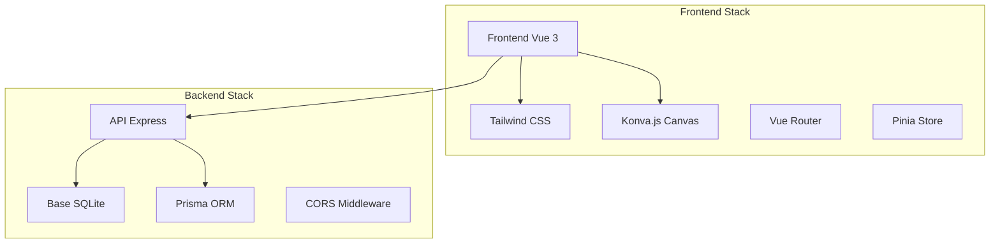

# TrainPing - Documentation Complète

## 🎯 Qu'est-ce que ce projet ?

TrainPing est une application web moderne permettant aux entraîneurs de tennis de table de créer et gérer leurs entraînements de manière interactive et visuelle.

### Fonctionnalités principales
- **✏️ Création d'exercices visuellement** : Dessinez les trajectoires directement sur une table de tennis de table virtuelle
- **📅 Planification de sessions** : Organisez vos entraînements avec des exercices personnalisés
- **⏱️ Mode entraînement** : Lancez vos sessions avec un timer intégré
- **📊 Suivi des performances** : Statistiques et historique des sessions

## 🏗️ Architecture technique

### Stack technique
- **Frontend** : Vue 3 + Vite + Tailwind CSS + Konva.js
- **Backend** : Node.js + Express + Prisma ORM
- **Base de données** : SQLite (développement)
- **Canvas** : Konva.js pour l'éditeur visuel

## 📁 Structure de la Documentation

- **📘 [00-Fundamentals](./00-Fundamentals/)** - Les bases du développement web
- **🔧 [01-Setup](./01-Setup/)** - Configuration et installation
- **⚙️ [02-Backend](./02-Backend/)** - Architecture serveur et API
- **🎨 [03-Frontend](./03-Frontend/)** - Interface utilisateur Vue.js
- **✨ [04-Features](./04-Features/)** - Fonctionnalités détaillées
- **🏗️ [05-Architecture](./05-Architecture/)** - Patterns et structure
- **🧪 [06-Testing](./06-Testing/)** - Tests et qualité
- **🚀 [07-Deployment](./07-Deployment/)** - Déploiement et production
- **💡 [08-Exercises](./08-Exercises/)** - Exercices pratiques
- **📋 [09-Best-Practices](./09-Best-Practices/)** - Bonnes pratiques

## 🆕 Dernières Mises à Jour

### REFONTE COMPLÈTE - Création d'Exercices par Type (Janvier 2025)
Révolution de l'interface de création avec une approche **par type d'exercice** :
- **Sélection guidée** : 4 types d'exercices clairement définis
- **Formulaires spécialisés** : Interface adaptée à chaque besoin pédagogique
- **Patterns prédéfinis** : Schémas visuels pour la régularité (diagonal, parallèle, pivot, axe central)
- **Création rapide** : Plus besoin de dessiner, juste choisir et configurer
- **Aperçu animé** : Visualisation en temps réel du schéma choisi
- **Points techniques** : Suggestions contextuelles selon le pattern
- **Simplicité maximale** : Exercice créé en 2-3 minutes

👉 **[Guide de la Nouvelle Création d'Exercices](./04-Features/Exercise-Creation-By-Type.md)**

### Créateur d'Exercices Canvas Avancé (Décembre 2024) - REMPLACÉ
- ~~Interface 2 colonnes avec éditeur Konva.js~~
- ~~Trajectoires réalistes tennis de table~~
- ~~Grille 3x3 de directions~~

👉 **[Historique - Ancien Éditeur Canvas](./04-Features/Exercise-Creator-Advanced.md)**

## 📚 Comment naviguer cette documentation

### 🚀 Pour débuter

#### Installation du projet
- **👨‍💻 Développeur expérimenté ?** → [Démarrage rapide (5 min)](./05-Guides/Quick-Start.md)
- **🆕 Nouveau au développement web ?** → [Installation détaillée](./05-Guides/Installation.md)
- **📥 Premier clone du repo ?** → Suivez les étapes du [README principal](../README.md)

#### Apprentissage des technologies
1. **Nouveau en développement web ?** → [Les Fondamentaux](./00-Fundamentals/Web-Development-Basics.md)
2. **Nouveau en Node.js ?** → [Express Deep Dive](./02-Backend/Express-Deep-Dive.md)
3. **Nouveau en Vue.js ?** → [Vue Ecosystem Deep Dive](./03-Frontend/Vue-Ecosystem-Deep-Dive.md)

### 📖 Documentation pédagogique
- **[Fondamentaux Web](./00-Fundamentals/Web-Development-Basics.md)** - HTTP, JSON, CSS, JavaScript moderne
- **[Express.js Complet](./02-Backend/Express-Deep-Dive.md)** - Middleware, routes, sécurité, performance
- **[Vue.js Écosystème](./03-Frontend/Vue-Ecosystem-Deep-Dive.md)** - Réactivité, Composition API, Pinia
- **[Exercices Pratiques](./08-Exercises/Practical-Exercises.md)** - Défis progressifs pour apprendre
- **[Bonnes Pratiques](./09-Best-Practices/Development-Guidelines.md)** - Conventions et qualité de code

### ⭐ Fonctionnalités avancées
- **[Créateur d'Exercices](./04-Features/Exercise-Creator-Advanced.md)** - Interface moderne et éditeur visuel
- Sessions et entraînements (à venir)
- Mode timer interactif (à venir)

## 🎯 Objectifs pédagogiques

Cette documentation est conçue pour vous apprendre :

### Concepts backend
- Serveur HTTP avec Express.js
- API REST et endpoints
- ORM et gestion de base de données
- Architecture MVC

### Concepts frontend
- Framework réactif Vue.js 3
- Composition API moderne
- Gestion d'état centralisée
- Composants et props
- Canvas et manipulation 2D

### Concepts full-stack
- Communication client-serveur
- Gestion d'erreurs
- Structure de projet
- Workflow de développement

## 🔗 Liens rapides

- [Code source Frontend](../client/)
- [Code source Backend](../server/)
- [[06-Annexes/Glossaire|Glossaire des termes]]
- [[06-Annexes/Ressources|Ressources utiles]]

## 📝 Notes

> 💡 **Conseil** : Cette documentation utilise le format Obsidian avec des liens internes. Ouvrez le dossier `docs/` dans Obsidian pour une meilleure navigation.

> ⚠️ **Important** : Ce projet est en développement actif. Certaines fonctionnalités peuvent évoluer.

---

**Version** : 1.0.0  
**Dernière mise à jour** : Janvier 2024  
**Auteur** : Développement TrainPing  

#documentation #tennis-table #vue3 #nodejs #express #prisma