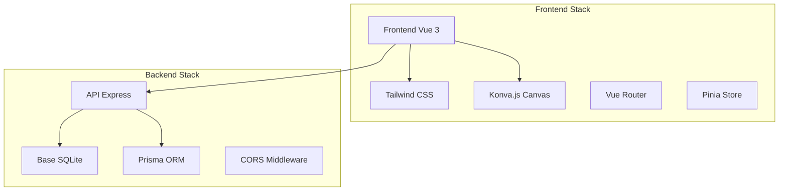

# TrainPing - Documentation Complète

## 🎯 Qu'est-ce que ce projet ?

TrainPing est une application web moderne permettant aux entraîneurs de tennis de table de créer et gérer leurs entraînements de manière interactive et visuelle.

### Fonctionnalités principales
- **✏️ Création d'exercices visuellement** : Dessinez les trajectoires directement sur une table de tennis de table virtuelle
- **📅 Planification de sessions** : Organisez vos entraînements avec des exercices personnalisés
- **⏱️ Mode entraînement** : Lancez vos sessions avec un timer intégré
- **📊 Suivi des performances** : Statistiques et historique des sessions

## 🏗️ Architecture technique

### Stack technique
- **Frontend** : Vue 3 + Vite + Tailwind CSS + Konva.js
- **Backend** : Node.js + Express + Prisma ORM
- **Base de données** : SQLite (développement)
- **Canvas** : Konva.js pour l'éditeur visuel

## 📚 Comment naviguer cette documentation

### 🚀 Pour débuter
1. **Nouveau en développement web ?** Commencez par [[05-Guides/Installation|Guide d'installation]]
2. **Nouveau en Node.js ?** Lisez [[02-Backend/Introduction-NodeJS|Introduction Node.js]]
3. **Nouveau en Vue.js ?** Explorez [[03-Frontend/Introduction-Vue3|Introduction Vue.js 3]]

### 🏗️ Comprendre l'architecture
- [[01-Architecture/Vue-Ensemble|Vue d'ensemble de l'architecture]]
- [[01-Architecture/Stack-Technique|Technologies utilisées]]
- [[01-Architecture/Structure-Dossiers|Organisation des fichiers]]

### 🔧 Backend (Serveur)
- [[02-Backend/Express-Basics|Framework Express expliqué]]
- [[02-Backend/API-Routes|Documentation des endpoints API]]
- [[02-Backend/Prisma-ORM|Base de données avec Prisma]]
- [[02-Backend/Modeles-Donnees|Schémas et relations]]

### 🎨 Frontend (Interface)
- [[03-Frontend/Composition-API|Script setup expliqué]]
- [[03-Frontend/Composants|Architecture des composants]]
- [[03-Frontend/Router|Navigation SPA]]
- [[03-Frontend/Pinia-Store|Gestion d'état avec Pinia]]
- [[03-Frontend/Tailwind-Guide|Guide Tailwind CSS]]

### ⭐ Fonctionnalités détaillées
- [[04-Features/Exercices/Creation-Exercice|Création d'exercices]]
- [[04-Features/Exercices/Canvas-Editor|Éditeur canvas Konva.js]]
- [[04-Features/Sessions/Gestion-Sessions|Gestion des sessions]]
- [[04-Features/Entrainement/Mode-Training|Mode entraînement]]

### 🛠️ Guides pratiques
- [[05-Guides/Installation|Installation et setup]]
- [[05-Guides/Developpement|Workflow de développement]]
- [[05-Guides/Troubleshooting|Résolution de problèmes]]

## 🎯 Objectifs pédagogiques

Cette documentation est conçue pour vous apprendre :

### Concepts backend
- Serveur HTTP avec Express.js
- API REST et endpoints
- ORM et gestion de base de données
- Architecture MVC

### Concepts frontend
- Framework réactif Vue.js 3
- Composition API moderne
- Gestion d'état centralisée
- Composants et props
- Canvas et manipulation 2D

### Concepts full-stack
- Communication client-serveur
- Gestion d'erreurs
- Structure de projet
- Workflow de développement

## 🔗 Liens rapides

- [Code source Frontend](../client/)
- [Code source Backend](../server/)
- [[06-Annexes/Glossaire|Glossaire des termes]]
- [[06-Annexes/Ressources|Ressources utiles]]

## 📝 Notes

> 💡 **Conseil** : Cette documentation utilise le format Obsidian avec des liens internes. Ouvrez le dossier `docs/` dans Obsidian pour une meilleure navigation.

> ⚠️ **Important** : Ce projet est en développement actif. Certaines fonctionnalités peuvent évoluer.

---

**Version** : 1.0.0  
**Dernière mise à jour** : Janvier 2024  
**Auteur** : Développement TrainPing  

#documentation #tennis-table #vue3 #nodejs #express #prisma